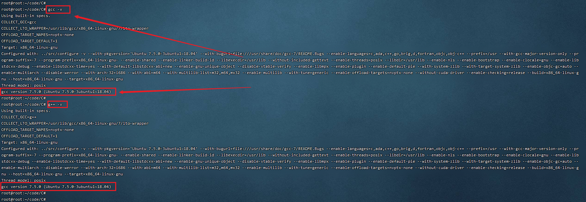

# ubuntu搭建C语言开发环境

# 安装gcc/g++

## 更新apt-get

`sudo apt-get update`

## 安装`GCC/G++`

`sudo apt-get install gcc`
`sudo apt-get install g++`

## 验证

输入`gcc -v` 和 `g++ -v` 进行验证 如下图所示:


- 到此我们的环境就已经配好了, 下一步就是写代码了!

## 选择ninja构建工具

- ninja与makefile相似, 详情请参考
- ninja仓库 <https://github.com/ninja-build/ninja>

- 咱们使用已经构建好的ninja工具

1. 打开Linux编译服务器终端
2. [下载ninja工具](https://repo.huaweicloud.com/harmonyos/compiler/ninja/1.9.0/linux/ninja.1.9.0.tar)
3. 解压ninja安装包至\~/ninja路径下

    ```c
    tar -xvf ninja.1.9.0.tar -C ~/
    ```

4. 设置环境变量

    ```c
    vim ~/.bashrc
    ```

    将以下命令拷贝到.bashrc文件的最后一行，保存并退出

    ```c
    export PATH=~/ninja:$PATH
    ```

5. 生效环境变量

    ```c
    source ~/.bashrc
    ```

6. 验证(输入一下命令显示版本说明安装成功)

    ```c
    ninja --version
    ```

## C语言教程
<https://www.runoob.com/cprogramming/c-tutorial.html>

## C++语言教程
<https://www.runoob.com/cplusplus/cpp-tutorial.html>

## 写代码编译

- 编写`build.ninja`

```c
cflags = -Wall

rule cc
  command = gcc $cflags $in -o $out
build outc : cc main.c

rule cpp
  command = g++ $cflags $in -o $out
build outcpp : cpp helloworld.cpp

rule cleanup
  command = rm -rf out helloworld
build clean : cleanup out

default outc

```

- 编写C语言 `main.c`

```c
#include "stdio.h"
int main()
{
    printf("hello C !!!\n");
    return 0;
}
```

- 在Ubuntu下面输入以下命令编译运行

1. `ninja outc`
2. `./outc`

---

- 编写C++语言 `helloworld.cpp`

```c
#include <iostream>
using namespace std;
int main()
{
    cout << "hello C++ !!" << endl;
    return 0;
}
```

- 在Ubuntu下面输入以下命令编译运行

1. `ninja outc`
2. `./outcpp`

---
