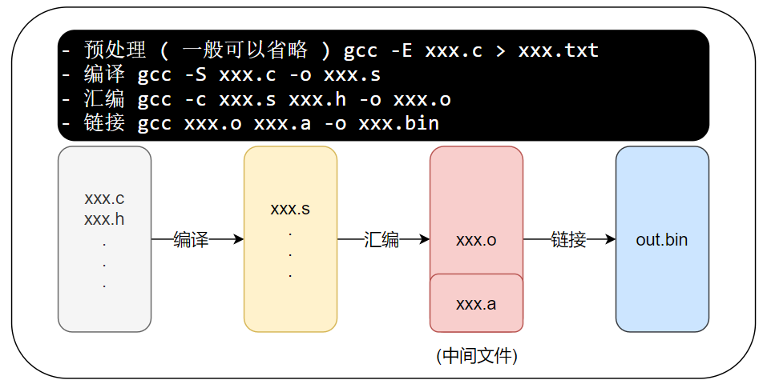

# gcc 语法

## 常见文件类型

- 源文件 `xxx.c` `xxx.cpp` `xxx.h` `...`
- 汇编文件 `xxx.s` `xxx.S`
- 链接文件 `xxx.o` `xxx.O` `xxx.obj`
- 库文件 `xxx.a - (unix)` `xxx.lib - (windows)` `...`
- 可执行文件 `xxx.exe - (unix)` `xxx.bin - (windows) `  `...`

## 符号解释

- 通常包括 预处理 + 编译 + 汇编 + 链接

`-o` 制定目标文件 ( 后接需要生成的文件名 )
`-E` 预处理 ( 直接输出结果, 一般重定向到某个文件里面 `> xxx.txt` )
`-S` 预处理 + 编译
`-c` 预处理 + 编译 + 汇编

### 其他

`-I`      ( 大写的 `i` ) 指定头文件的目录
`-w`      不生成任何警告信息
`-Wall`   生成所有警告信息
`-L dir`  ( 大写的 `L` ) 指定库的路径
`-l file` ( 小写的 `L` ) 指定需链接的库名

## 可执行文件生成过程

- 如下图所示:

- 预处理 `gcc -E xxx.c > xxx.txt`
  - 替换xxx.c中声明的头文件
  - 替换xxx.c中的宏定义
  - 去掉注释

- 编译 `gcc -S xxx.c -o xxx.s`
  - 词法分析:检查关键字,标识符是否正确
  - 语法分析:检查语句语法是否正确
  - 语义分析检查语句逻辑意义是否正确
  - (优化代部分码)

- 汇编 `gcc -c xxx.s xxx.h -o xxx.o`
  - 翻译成CPU可识别的二进制文件
  - (Uinx生成.o文件)
  - (Windows生成.obj)

- 链接 `gcc xxx.o xxx.a -o xxx.bin`
  - 把xxx.o文件和函数库文件链接在一起

## 注意

- 在链接时需要明显地指出中间目标文件名, 这对于编译很不方便. 所以我们要给中间目标文件打个包
- 在 Windows 下叫 Library File, 也就是 `.lib文件`
- 在   UNIX  下叫 Archive File, 也就是 `.a文件`
