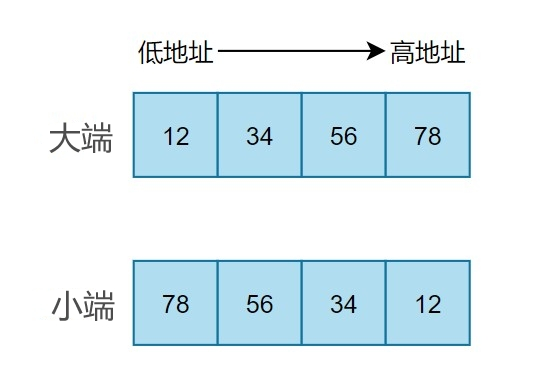

# 判断大端小段

## 定义

**大端:** 低位存放在高地址 ( 高位存放在低地址 )
**小端:** 低位存放在低地址 ( 高位存放在高地址 )

---

## 图解

- 假如 `a =  0x12345678`, 下面是大小端的存储格式
    

---

## 代码判断

```c
union Udata
{
    char c;
    int a;
};

union Udata data = 0x12345678;

if(data.c == 0x12) {
    printf("这是小端\n");
} else if (data.c == 0x78) {
    printf("这是大端\n");
} else{
    printf("无法判断\n");
}
```
