# 可复用链表list.h

<div align=center><a href="https://gitee.com/iotxiaohu/blog">
    
</a></div>

---

## 这种用法惊艳到我了

> - 传统的教科书式的链表有个非常大的缺点: 一句话讲就是 **复用性差**
> - 每种类型的链表我们都需要编写不同的函数去实现增删改查等基本操作
> - 不仅效率低, 而且还容易出错
> - 而 `linux内核` 的 `list.h`  就是为了解决这一痛点而诞生的
> - 我们只需要添加基本的成员, 然后对 `list.h` 中的函数简单封装一下, 就能够实现想要的功能了

## 须知

> 我们使用的 `list` 是一种特殊双向环形链表,
> 双向环形链表 大家可能比较好理解, 那么特殊之处在什么地方呢?
> 我觉得有必要了解一下

### 普通的环形链表

> 为了方便讲解, 这儿我使用了3个节点的链表, 收尾相接组成了一个环形链表 (后同)

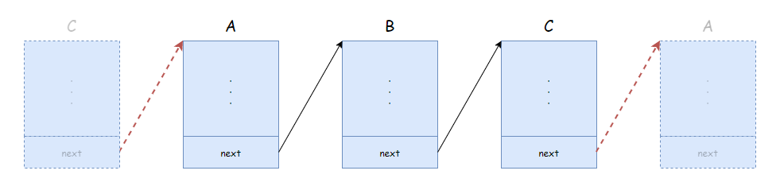

- 如图所示, 除了基本成员, 还会有个结构体指针 `next`
- 结构体中的 `next` 指向了下个 `节点` 的首地址 ( 也就是结构体第一个成员的地址 )
- `结构体C` 的 `next` 指向了 `结构体A` 的首地址

---

### 普通双向环形链表

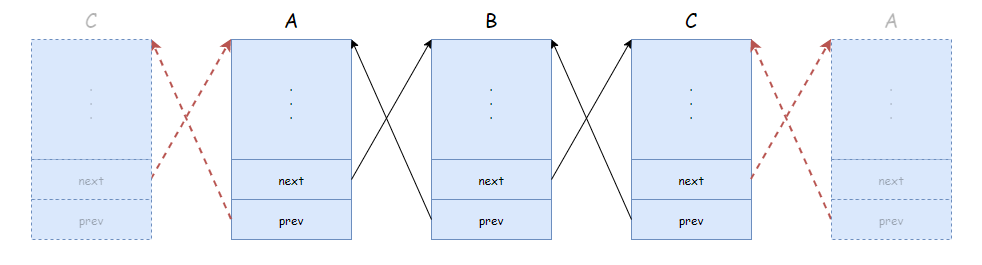

- 如图所示, 除了基本成员, 还会有两个结构体指针 `next` 和 `prev`
- 结构体中的 `next` 指向了下个 `节点` 的首地址
- 结构体中的 `prev` 指向了上个 `节点` 的首地址
- `结构体C` 的 `next` 指向了 `结构体A` 的首地址
- `结构体A` 的 `prev` 指向了 `结构体C` 的首地址

---

### 特殊双向环形链表

- 先看 `list` 类型的结构体

```c
struct list_head {
    struct list_head *next, *prev;
};
```

- 使用它时我们会像下面这样定义

```c
typedef struct {
    int a;
    int b;
    char c;
    ...
    struct list_head list;
    ...
} Queue;
```

> `list` 使用时的结构一般如下图所示

<a name="tu3">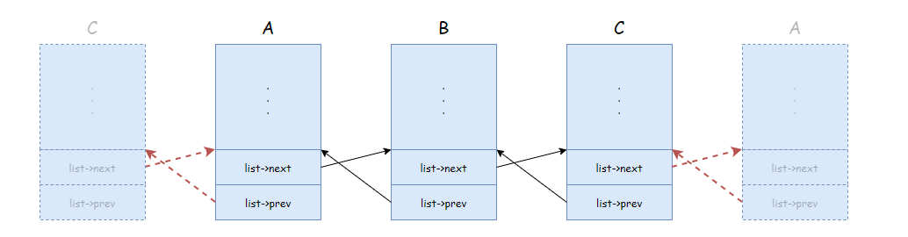</a>
<center>图3</center></br></br>

- 如图所示, 除了基本成员, 还会有1个 `list_head` 类型的成员
- 这个 `list_head` 类型的成员为一个结构体, 这个结构体有两个指针成员 `list->next` 和 `list->prev`
- 结构体中的 `list->next` 指向了下个结构体的 `list` 成员的首地址
- 结构体中的 `list->prev` 指向了上个结构体的 `list` 成员的首地址
- `结构体C` 的 `list->next` 指向了 `结构体A` 的 `list` 成员的地址
- `结构体A` 的 `list->prev` 指向了 `结构体C` 的 `list` 成员的地址

---

## 基本函数

### init_list_head()

```c
static inline void init_list_head(struct list_head * list)
```

> 初始化头结点, 初始化之后如下图所示

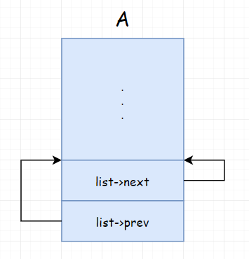

---

### list_add()

```c
static inline void list_add(struct list_head * new, struct list_head * head)
```

[图3](#tu3) 执行 `list_add(X->list, A->list)` 之后如下图所示

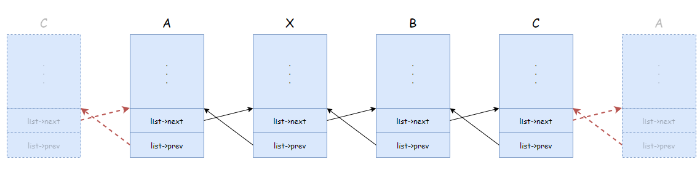

---

### list_add_tail()

```c
static inline void list_add_tail(struct list_head *new, struct list_head *head)
```

> 将 `新节点` 添加到 `指定节点` 之前. 也就是让 `指定节点` 跑到后面去.

[图3](#tu3) 执行 `list_add_tail(X->list, A->list)` 之后如下图所示

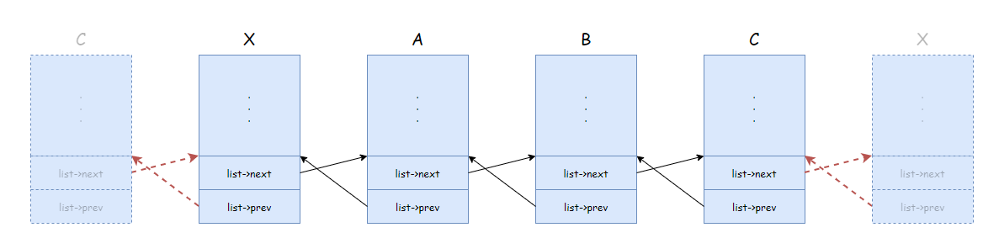

---

### list_del()

```c
static inline void list_del(struct list_head *entry)
```

[图3](#tu3) 执行 `list_del(A->list)` 之后如下图所示

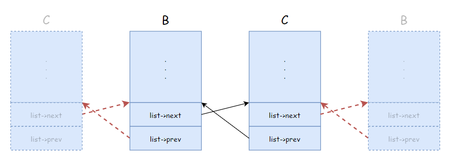

---

### list_move()

```c
static inline void list_move(struct list_head *list, struct list_head *head)
```

> 将 `list` 节点 移动到 `head` 后面.

[图3](#tu3) 执行 `list_move(A->list, B->list)` 之后如下图所示

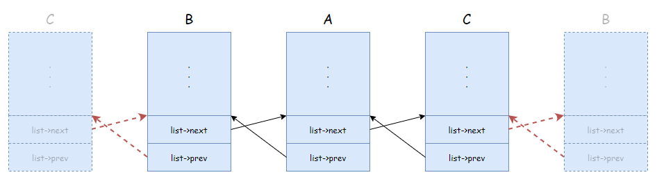

---

### list_move_tail()

```c
static inline void list_move_tail(struct list_head *list, struct list_head *head)
```

> 将 `list` 节点 移动到 `head` 前面.

[图3](#tu3) 执行 `list_move_tail(B->list, A->list)` 之后如下图所示


---

### list_replace()

```c
static inline void list_replace(struct list_head * old, struct list_head * new)
```

> 将 `list` 节点 移动到 `head` 前面.

[图3](#tu3) 执行 `list_replace(X->list, B->list)` 之后如下图所示

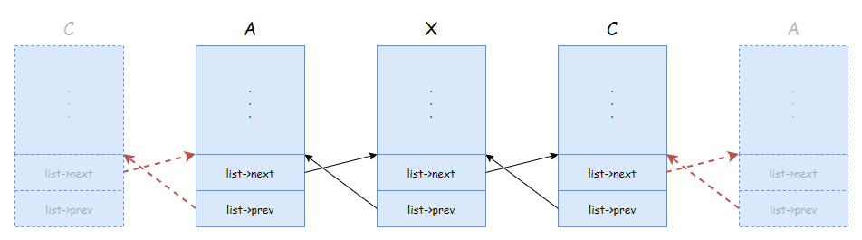

---

> 除了上面列举的接口之外, 还有其它很多接口, 这儿就不一一列举了...有兴趣的话自己去看代码

---

## list_entry() 详解

> 根据 `list` `成员` 得到 `结构体` 的指针
> 这是一个比较重要的宏函数
> 这是个宏定义, 有很多种不同的版本, 不过原理都差不多, 为了方便大家理解我以下面这种为例进行讲解

```c
#define list_entry(ptr, type, member) \
    ((type *)((char *)(ptr)-(unsigned long)(&((type *)0)->member)))
```

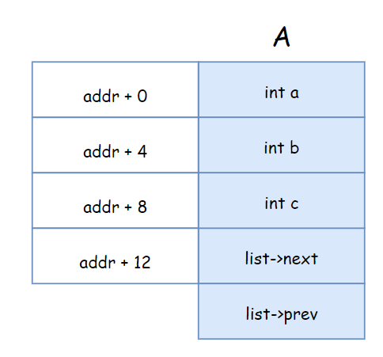

- 由上图可知, 假如 `addr` 的值为 `0`, 那么 `list` 地址就是 它 在结构体重的偏移量.
- 因此 `(unsigned long)(&((type *)0)->member))` 就是 `list` 在结构体中的偏移量.
- 而 `(type *)((char *)(ptr)` 是 实际 使用过程中 `list` 的地址
- 那么 `(type *)((char *)(ptr)` `-` `(unsigned long)(&((type *)0)->member))` 就是 `结构体A` 的地址

> **备注:** 按说来, `0地址` 不能这样用的, 读出来的内容也没有意义, 但如果我们不对 `0地址` 进行写, 也不会对系统造成任何影响.

---

### list_entry() 使用

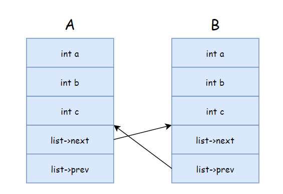

> 如果我们有上图中 `结构体A` 的指针, 该怎么访问 `结构体B` 的其他成员呢 ?

```c
Queue *tmp = list_entry(A->list.next, Queue, list);     // 获取 B 的结构体指针
printf("B->a = %d\n", tmp->a);                          // 访问 a 成员
printf("B->b = %d\n", tmp->b);                          // 访问 b 成员
printf("B->c = %d\n", tmp->c);                          // 访问 c 成员
```

---

## 常见函数

### `list_for_each_entry`

```c
Queue *pos;
list_for_each_entry(pos, &A.list, list) {
    /* 第一次进来 pos 为 B */
    /* 第二次进来 pos 为 C */
}
```

## 实践

> 我在网上找了一个足够小, 但是足以方便大家理解的使用 `list` 实现 `fifo` 的开源代码

链接 : [点击进入](https://gitee.com/ykhumanspider/fifo)

---
