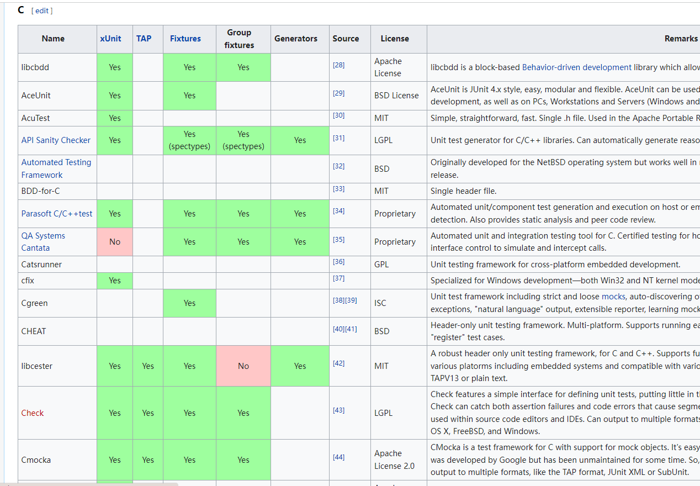

# 自动化测试用例

## 提出问题

假设现在有个函数接口, `add()`

```c
/**
 * @brief   计算两个数的和
 *
 * @param   a            参数1
 * @param   b            参数2
 * @return  int          返回值 和
 */
int add(int a, int b);
```

现在只知道它的功能是计算两个数的和.
具体实现我们不清楚, 但可能是对的, 也可能是错的
我们现在要测试这个函数到底对不对
下面我们一步一步讲解怎么测试和怎么优化

## 传统测试

我们写一个类似这样的函数

```c
void test_add(void)
{
    int value = 0;
    value = add(12, 13);
    printf("value = %d\n", value);
}
```

现在我们通过肉眼判断, 如果输出不是 : `value = 25`, 我们就认为 `add()` 是错误的, 否则我们可以暂定它是正确的

**存在问题**: 我们现在只测试了 `12 + 13` 这种情况, 我们不能保证其他情况是正确的, 所以我们需要多测试几组数据

## 增加测试范围

我们就该写成了下面的函数:

```c
void test_add(void)
{
    int value = 0;
    value = add(12, 13);
    printf("value = %d\n", value);

    value = add(0, 0);
    printf("value = %d\n", value);

    value = add(-1, -8);
    printf("value = %d\n", value);

    value = add(-5, 13);
    printf("value = %d\n", value);

    value = add(0x7FFFFFFF, 1);
    printf("value = %d\n", value);
}
```

现在我们考虑了几个边界值, 如果输出不是下面的值, 说明 `add()` 是错误的. 否则我们可以暂定它是正确的

```s
value = 25
value = 0
value = -9
value = 8
value = -2147483648
```

**备注**: 这儿可能会有人提问, 我们问什么不能从 `0x00000000 - 0xFFFFFFFF` 作为参数都测试一遍呢? 理论上我们是要这样的, 但是考虑到时间成本, 我们没有必要这样测试, 通常我们只需要测试边界值, 然后再使用随机数进行测试.

## 加入随机数

假设有一个函数是 `int rand(int a, int b)` 他会产生 `[a, b]` 的随机数, 这是我们的工具函数不是我们的被测对象, 我们可以认为 `rand()` 是没有问题的.

```c
void test_add(void)
{
    int value = 0;
    value = add(12, 13);
    printf("value = %d\n", value);

    value = add(0, 0);
    printf("value = %d\n", value);

    value = add(-1, -8);
    printf("value = %d\n", value);

    value = add(-5, 13);
    printf("value = %d\n", value);

    value = add(0x7FFFFFFF, 1);
    printf("value = %d\n", value);

    int a = rand(0, 0xFFFFFFFF);
    int b = rand(0, 0xFFFFFFFF);
    printf("a = %d\n", a);
    printf("b = %d\n", b);
    value = add(a, b);
    printf("value = %d\n", value);
}
```

我们就会得到如下结果, 最后一个结果的验证可能需要我们手动算一个, 理论上只要我们测试的次数足够多, 如果 `add()` 有问题, 那么它就一定会在某个时刻出现

```s
value = 25
value = 0
value = -9
value = 8
value = -2147483648
a = -43524
b = 1564132
value = 1520608
```

**存在问题**: 我们需要通过结果来进行对比, 来判断 `add()` 函数是否正确, 但是想最后一个结果 我们可能很难判断它是否正确, 或者判断起来很麻烦, 所以我们需要让整个测试变得智能一点.

## 让程序来判断程序

于是我们有了以下的改进

```c
void test_add(void)
{
    if (add(12, 13) != (12 + 13)) {
        printf("FAIL!\n");
        return;
    }
    if (add(0, 0) != (0 + 0)) {
        printf("FAIL!\n");
        return;
    }
    if (add(-1, -8) != (-1 + -8)) {
        printf("FAIL!\n");
        return;
    }
    if (add(-5, 13) != (-5 + 13)) {
        printf("FAIL!\n");
        return;
    }
    if (add(0x7FFFFFFF, 1) != (0x7FFFFFFF + 1)) {
        printf("FAIL!\n");
        return;
    }

    int a = rand(0, 0xFFFFFFFF);
    int b = rand(0, 0xFFFFFFFF);
    if (add(a, b) != (a, b)) {
        printf("FAIL!\n");
        return;
    }
    printf("SUCCESS!\n");
}
```

从这个版本我们可以看出, 我们不需要再通过自己来计算了
如果输出是 `FAIL!` 就说明 `add()` 有问题
如果输出是 `SUCCESS!` 就说明 `add()` 暂时没问题

**后续**: 现在看来程序已经够简单的了, 但是还是存在许多问题, 下面列举一些存在的问题吧

- 如果输出 `FAIL!`, 我们只知道失败了, 但不知道哪儿失败了, 所以我们还需要知道在哪一行失败, 比如是哪一行打印的 `FAIL!`
- 如果失败了, 我们可能需要执行某些操作, 比如 `free` 一些内存之类的操作
- 可能还需要记录失败时 `a` 和 `b` 的值
- 总而言之, 我们的设计还是会有总总缺陷

## 使用测试框架

从上面可以看出来, 我们的测试设计很难会达到比较完美的状态, 这是某些厂商或者大佬就设计了一套专门用于测试的框架, 我们就成为 `自动化测试框架` 吧, 他就把大多数的问题考虑进去了, 我们只需要直接拿他们的框架就能够让我们的测试更加完美. 使用测试框架同时也会大大减轻测试的负担.

下面可以看看常见的测试框架吧, 修行靠个人, 具体怎么使用只有靠你慢慢摸索了 ( 可能有的打不开, 我就简单截个图吧 )

[https://en.wikipedia.org/wiki/List_of_unit_testing_frameworks#C](https://en.wikipedia.org/wiki/List_of_unit_testing_frameworks#C)

