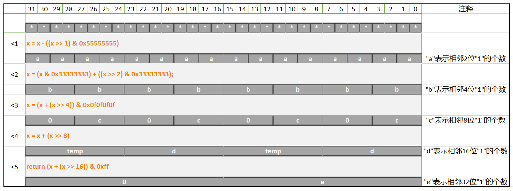

# 计算一个unsigned int中"1"的个数

- 前段时间看到一个神奇的算法, 计算 `unsigned int` 类型中 1 的个数
- 这个算法的厉害之处在于它的运行效率特别高, 下面是代码以及我做的笔记, 大家来讨论讨论.

---

## 代码

```c
int count_bits(unsigned int a)
{
    unsigned int x = a;

    x = x - ((x >> 1) & 0x55555555);                     ///< 1: ->相邻2位  "1" 的个数和
    x = (x & 0x33333333) + ((x >> 2) & 0x33333333);      ///< 2: ->相邻4位  "1" 的个数和
    x = (x + (x >> 4)) & 0x0f0f0f0f;                     ///< 3: ->相邻8位  "1" 的个数和
    x = x + (x >> 8);                                    ///< 4: ->相邻16位 "1" 的个数和
    return (x + (x >> 16)) & 0xff;                       ///< 5: ->相邻32位 "1" 的个数和
}
```

---

## 讲解



---

## 备注

<div align=center><a href="https://gitee.com/iotxiaohu/blog">
    
</a></div>

---
