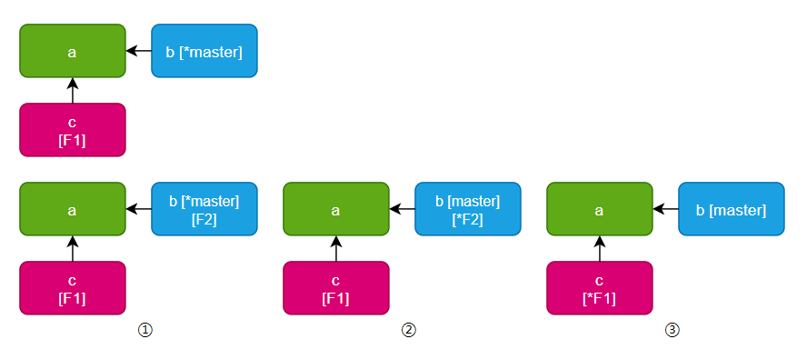

# Git分支相关

---

## 分支操作

| 名称 | 命令                 | 说明                       |
| ---- | -------------------- | -------------------------- |
| ①    | `git branch F2`      | 单纯创建分支               |
| ②    | `git checkout -b F2` | 创建并且移动过去           |
| ③    | `git checkout F1`    | 切换分支到F1并且覆盖工作区 |

---

| 常见操作                   | 命令                                  |
| -------------------------- | ------------------------------------- |
| 查看本地分支               | `git branch`                          |
| 查看远程分支               | `git branch -r`                       |
| 查看所有分支               | `git branch -a`                       |
| 修改本地分支名             | `git branch -m "原分支名" "新分支名"` |
| 在本地生成远程分支         | `git fetch origin`                    |
| 将 `F1分支` 合并到当前分支 | `git merge F1`                        |
| 创建本地分支并关联         | `git checkout -b F1 origin/F1`        |
| 将分支推送到远端           | `git push origin F1`                  |
| ----------------           | -----------------------------         |
| 删除远端分支               | `git push origin --delete F1`         |
| 删除本地分支               | `git branch -d F1`                    |
| 强制删除本地分支           | `git branch -D F1`                    |
| 查看远端分支状态           | `git remote show origin`              |
