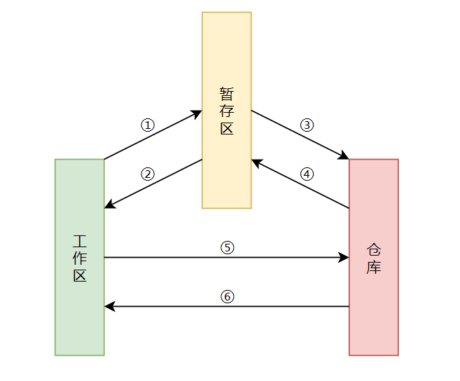

# Git本地操作


## 开始

- `git init` ------------------------------ 新建仓库

---

## `.gitignore` 文件

- 这个文件是用来济洛路不跟踪哪些文件或者目录的
- 如下就是不跟踪.vscode文件 ( 目录 )

```shell
# vscode setting
.vscode
```

---

## 基本操作



- ① `git add .`
- ② `git checkout .`
- ③ `git commit -m "info"`
- ④ `git reset`
- ⑤ `git commit -am "info"` (暂存区也会被覆盖)
- ⑥ `git reset --hard HEAD` (暂存区也会被覆盖)

---

## 常见操作

| 名称             | 命令                           |
| ---------------- | ------------------------------ |
| 回退单个文件     | `git checkout HEAD [文件路径]` |
| 提交补充信息     | `git commit --amend -m "信息"` |
| 比较操作         | `git diff [file]`              |
| 移动或重命名文件 | `git mv README README.md`      |
| 彩色的 git 输出  | `git config color.ui true`     |
|                  |                                |

---

- [git add 菜鸟教程](https://www.runoob.com/git/git-add.html)
- [git commit 菜鸟教程](https://www.runoob.com/git/git-commit.html)

---

- 交互式添加文件到暂存区：
`git add -i`
</br>

---

## 补充提交

```shell
git commit -m 'inital commit'
git add '忘记的文件'
git commit --amend
```

|                                                      |                                |
| ---------------------------------------------------- | ------------------------------ |
| 仅补充提交漏了的文件或者少部分修改, 并不修改提交信息 | `git commit --amend --no-edit` |

## 备注

<div align=center><a href="https://gitee.com/iotxiaohu/blog">
    
</a></div>

---
