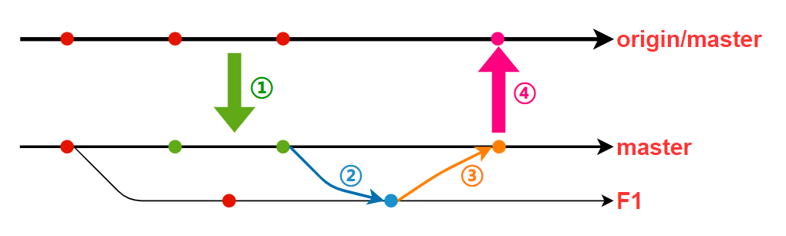

# 工作流程

## `F1`分支合入到远端`master`分支的流程

> - `origin/master` 远端主分支
> - `master` 本地主分支与远端 `origin/master` 关联
> - `F1` 为自己本地创建的临时分支, 用于解决某个 bug
> 以下为我个人推荐的合并流程

|     | 名称                                   | 命令                        |
| --- | :------------------------------------- | :-------------------------- |
|     | 本地提交                               | `git commit -am "提交信息"` |
|     | 切换分支到 `master`                    | `git checkout master`       |
| ①   | 更新`master`分支代码                   | `git pull`                  |
|     | 切换到工作分支`F1`                     | `git checkout F1`           |
| ②   | `master` `合并到` `F1`(如有冲突需解决) | `git merge master`          |
|     | `--检查保证编译没问题--`               | `---`                       |
|     | 切换分支到 `master`                    | `git checkout master`       |
| ③   | `F1` `合并到` `master`                 | `git merge F1`              |
| ④   | 推送到远端                             | `git push master`           |
|     | 切换到工作分支`F1`                     | `git checkout F1`           |
|     | `--进行接下来的工作--`                 | `---`                       |
