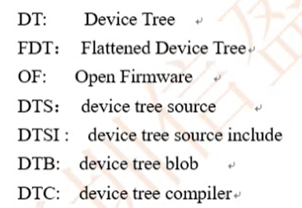
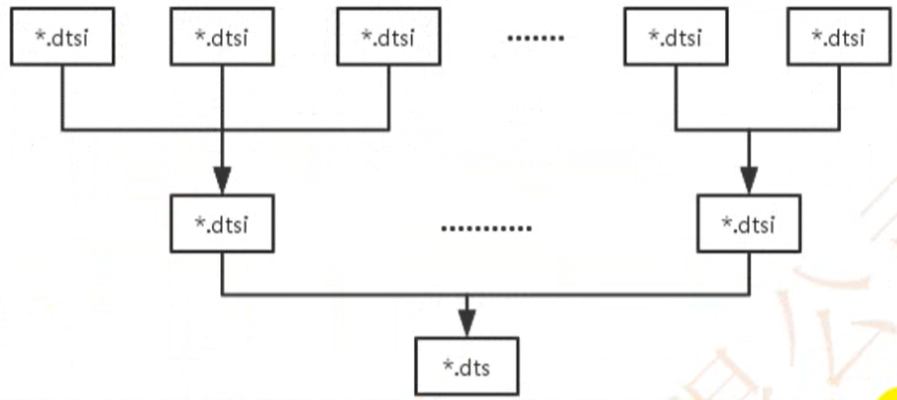

# 设备树

## 格式

```c
/dts-v1/;                                   // 版本号
/ {                                         // `/`表示根节点
    string-property = "xxx";                // string 类型
    string-list-property = "xxx", "yyy";    // string list 类型
    u32-property = <a>, ;                   // u32类型,默认十进制
    u32-property = /bits/ 8 <a>, ;          // u32类型,默认十进制
    u32-array-property = <a,b,c,d>;         // 数组类型,
    byte-property = [a];                    // 数组类型, 默认十六进制
    byte-array-property = [a,b,c,d];        // 数组类型
    a-property;                             // 可以没有值只有名, 表示bool值
    a-property = <@labela>;                 // 取标签地址
    child-node1 {
        ...                                 // 节点中可以什么都没有
    };
    labela : child-node2 {
        ...
    };

};
```

---

### 文件含义

|  文件   | 含义                                               |
| :-----: | -------------------------------------------------- |
| `.dts`  | 设备树的文件格式格式为, 一般为最终某个板子的设备树 |
| `.dtsi` | 设备树的头文件格式, 通常被被人依赖的设备树         |
|  `.h`   | 一般只使用里面的宏定义                             |
| `.dtb`  | 设备树的二进制文件, 打包到resource里面             |

>

---

### 结构

> 层层包含关系, 减少了冗余代码, 增加了可复用代码.



---

## 值

|      写法       | 含义                           |
| :-------------: | ------------------------------ |
|      `<8>`      | 一个值, `<>` 表示u32, 十进制数 |
|  `<8,7,6,8,4>`  | 一个数组                       |
|   `"memory"`    | striong                        |
| `"PowerPC,970"` | string list                    |

---

## `node` 节点

```c
[label:] node-name[@unit-address] {
   [properties definitions]
   [child nodes]
}
```

- `[]`为可选的

---

### `aliases`节点

- 定义一些别名

```c
    aliases {
        serial3 = &uart_3;
    };
```

### memory device 节点

- 设备树文件的必备节点，它定义了系统物理内存的布局

```c
memory@0 {
    device_type = "memory";
    reg = <0x30000000 0x4000000>;
};
```

| `device_type` | `定义了该node的设备类型` |
| :-----------: | ------------------------ |

---

## 属性定义 `(只讲标准属性)`

`根node`必须是 `/`

|      `model`       | 指明了该设备属于哪个设备生产商的哪个model |
| :----------------: | ----------------------------------------- |
| `interrupt-parent` | 统一为下游设备定义interrupt-parent        |

---

|        `compatible`         | 指明了用哪一个driver来驱动该设备 |
| :-------------------------: | -------------------------------- |
| `compatible = "aaa”, "bbb"` | 首选`aaa`, 备选`bbb`             |

---

| `node-name@unit-address` | 节点名字                                                        |
| :----------------------: | --------------------------------------------------------------- |
|           注意           | 如果节点包含`reg` 那么节点名字中必须不能包括`@`和`unit-address` |
|      `unit-address`      | 和具体设备相关                                                  |

---

| `reg` | `该device node的地址信息`                              |
| :---: | ------------------------------------------------------ |
| 注意  | 如果有它 那么节点名字中必须不能包括`@`和`unit-address` |

---

| `phandle` | 节点标识,用于引用(不好用, 一般很少用) |
| :-------: | ------------------------------------- |

---

### 修改`节点属性`

- 通过标签的形式

```c
&label {                // 必须是在节点外
    xxx = xxx;
};
```

- 节点内单独写节点 ( 全路径写节点 )

```c
/{
    ...
    node {                   // 被重写的节点
        ...
    };
    ...
};
```

- 父节点有标签, 被改写的没有标签

```c
&label {
    ...
    node {                   // 被重写的节点
        ...
    };
};
```

### 删除`节点` 或 `属性`

```c
&label {
   /delete-property/ xxx;   // 删除 xxx 属性
   /delete-node/ node;      // 删除 node 节点
};

```

## 编译和反编译

> 支持编译和反编译, 下载方式有以下三种

- 安装工具(推荐) `dtc` `(device-tree-compiler)`
`sudo apt-get install device-tree-compiler`

- `scripts/dtc` 下面有编译的工具, 可以编译
- 自己网上下载编译安装

---

### 编译 `dts` `->` `dtb`

`dtc -I dts -O dtb -o 目标名字.dtb 源文件.dts`

#### 预编译我的dtb

`gcc -E -nostdinc -Ulinux -I./ -I./include -x assembler-with-cpp sun8iw11p1-OKT3_C.dts -o sun8iw11p1-OKT3_C.my.tmp`

#### 生成我的dtb

`dtc -I dts -O dtb sun8iw11p1-OKT3_C.my.tmp -o sun8iw11p1-OKT3_C.my.dtb`

### 反编译 `dtb` `->` `dts`

`dtc -I dtb -O dts -o 目标名字.dts 源文件.dtb`

`dtc -I dtb -O dts -o sun8iw11p1-OKT3_C.fan.yuanchang.dts sun8iw11p1-OKT3_C.dtb`
`dtc -I dtb -O dts -o sun8iw11p1-OKT3_C.fan.my.dts sun8iw11p1-OKT3_C.my.dt`b
