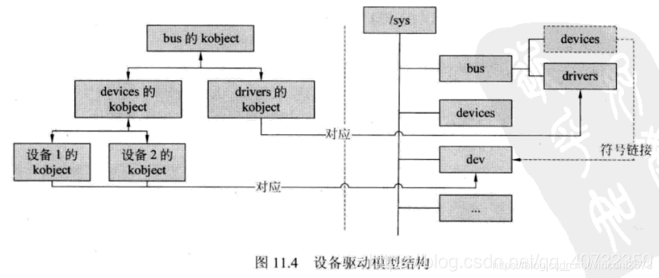

# 设备驱动模型

- 类(class)总线(bus)、设备(device)、驱动(driver)
- kobject (基类) 、 生命周期
- sysfs - 虚拟文件系统
- udev

| 类        | 路径                      |
| --------- | ------------------------- |
| `kobject` | `include\linux\kobject.h` |

#### kobject
> kobject是驱动、总线、设备、各种对象最基本单元。它提供一些公用型服务如：
- 对象引用计数：观察当前这个对象是否仍然有在被使用。
- 维护对象链表：
- 对象上锁：两个进程要访问全局变量的时候，这个时候就需要上锁。
- 对用户空间的表示：
