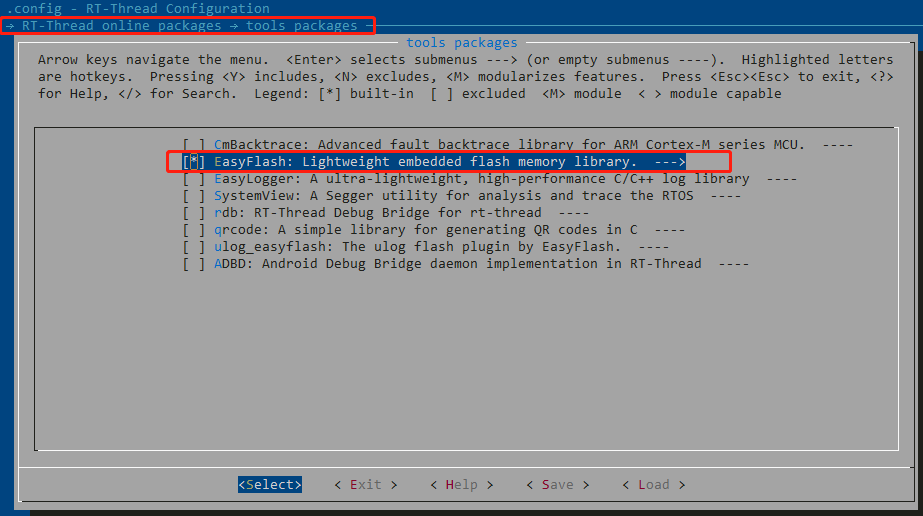
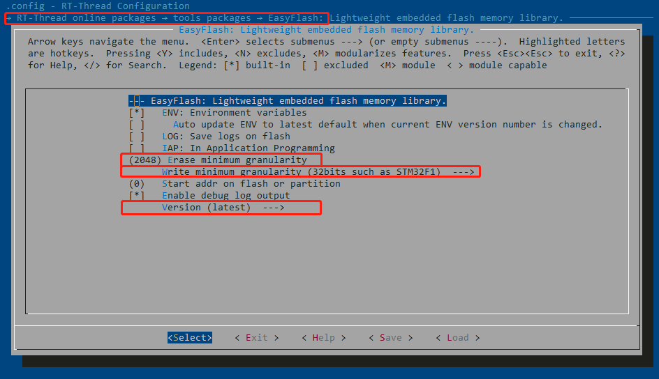
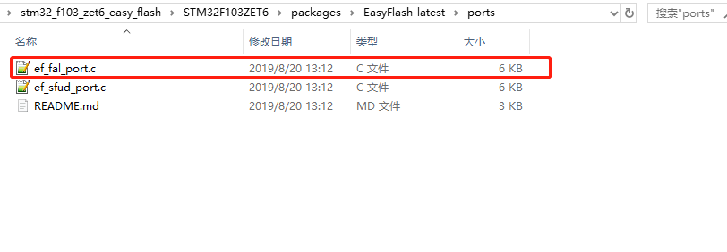
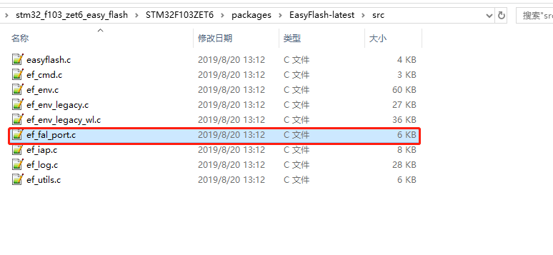
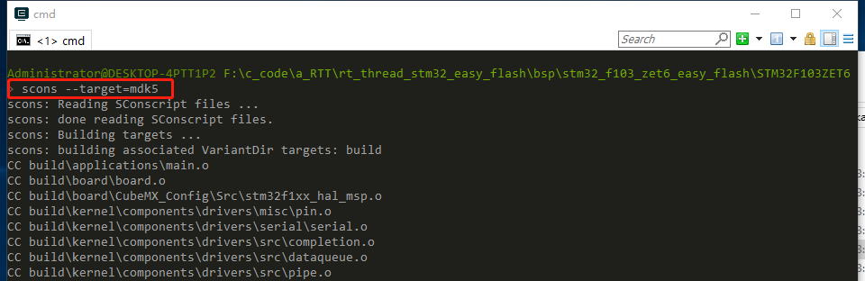
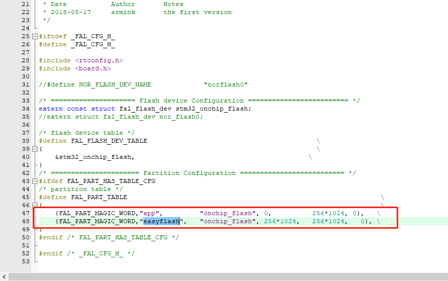
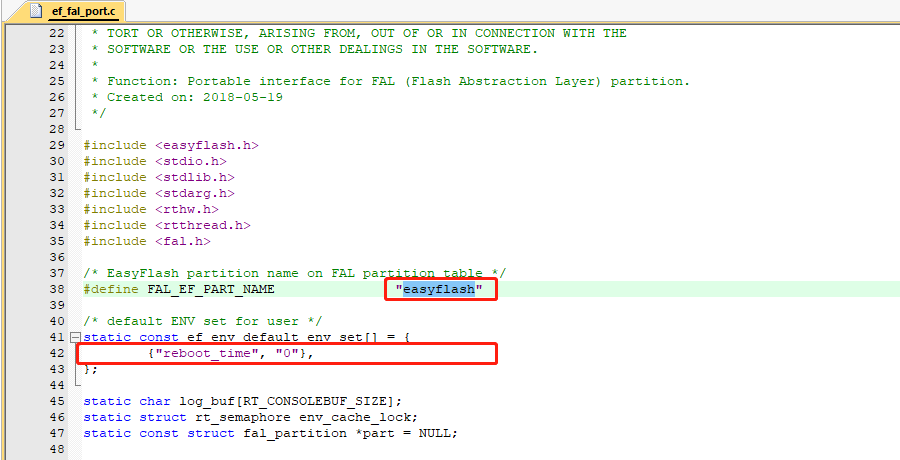
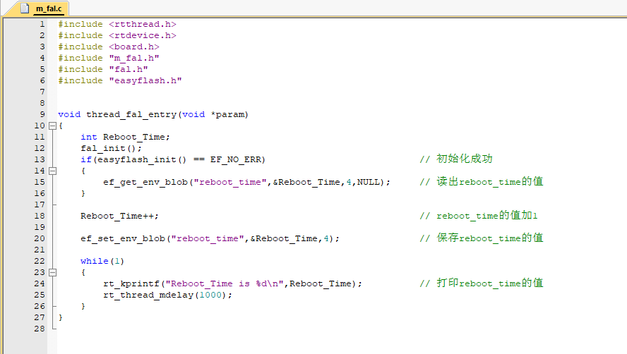
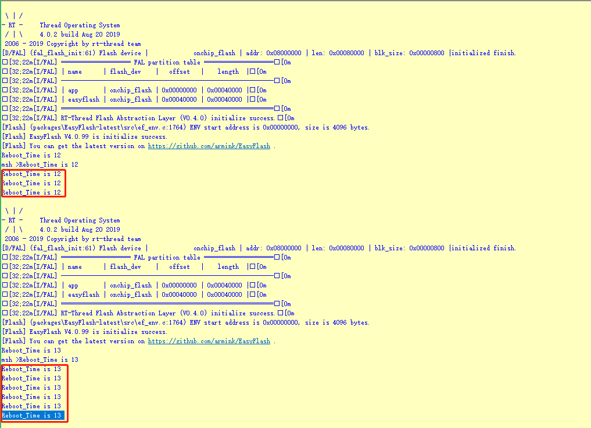

# RT-Thread——STM32——FAL库

---

<div align=center><a href="https://gitee.com/iotxiaohu/blog">
    
</a></div>

---

## 概述

本教程主要根据官方推荐的教程进行改编，详细信息请参考[EasyFlash软件包](http://packages.rt-thread.org/itemDetail.html?package=EasyFlash)
本例程的模板使用通用模板环境搭建里面的模板 `RT-Thread——STM32——FAL库`
文末也有我移植好的例程，不过建议大家从头开始移植，加深印象\^\_\^

---

## 配置

- **打开工程目录，在ENV下输入menuconfig进入图形化配置界面**
- **在RT-Thread online packges->tools packages里选中EasyFlash**


- **打开EasyFlash**
- **Version选择最新的版本**
- **最小擦除粒度设置为2048** (STM32F103ZET6页大小为2K,所以选择2048)
- **最小写入粒度设置为STM32F1** (因为我使用的是STM32F1)


- **在EasyFlash软件包里面，把```ports```里面的```ef_fal_port.h```文件移动到```src```文件夹里面**



- **在ENV里面重新生成工程**


- **保存配置并且退出ENV**

---
## 代码修改
- **在```fal_cfg.h```文件里面的分区表中增加easyflash项，根据flash大小重新分配内存**


- **打开```ef_fal_port.c```文件，修改easyflash的名字，增加需要存储的变量名**如图：


- **使用的时候,添加头文件，和测试代码**如图：


## 测试
- **烧录代码，每次按下复位键都会打印当前的上电次数**如图：


- **如果结果和我一样就说明你已经成功了**

---
## 小结
**easyflash用起来真的很方便，而且大大增加了flash的寿命，用来存储常见的信息基本上就够用了，也不用外界存储芯片**

---

## 源代码获取

**<font size=5 color=#ff0000> 源码已放到码云 ! ! ! ( 请点击文首链接进入仓库 ) </font>**

---

## 备注

<div align=center><a href="https://gitee.com/iotxiaohu/blog">
    
</a></div>

---
