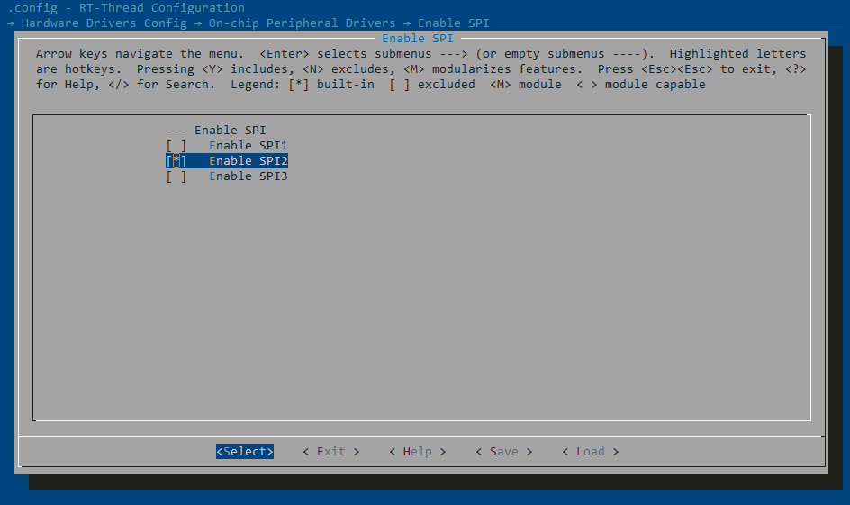
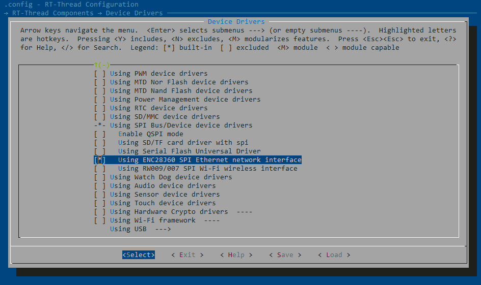
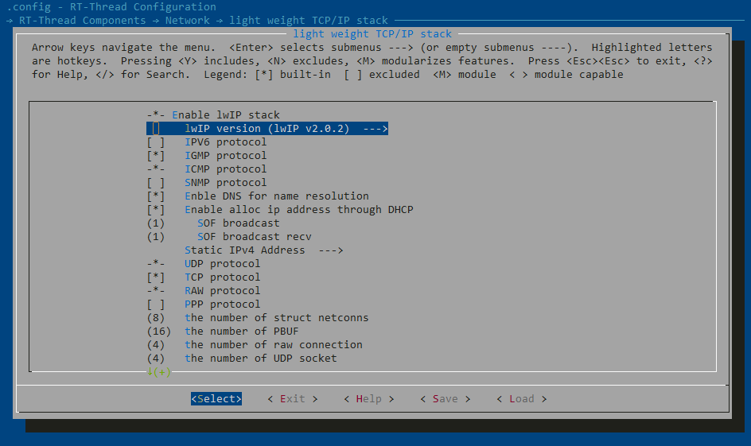
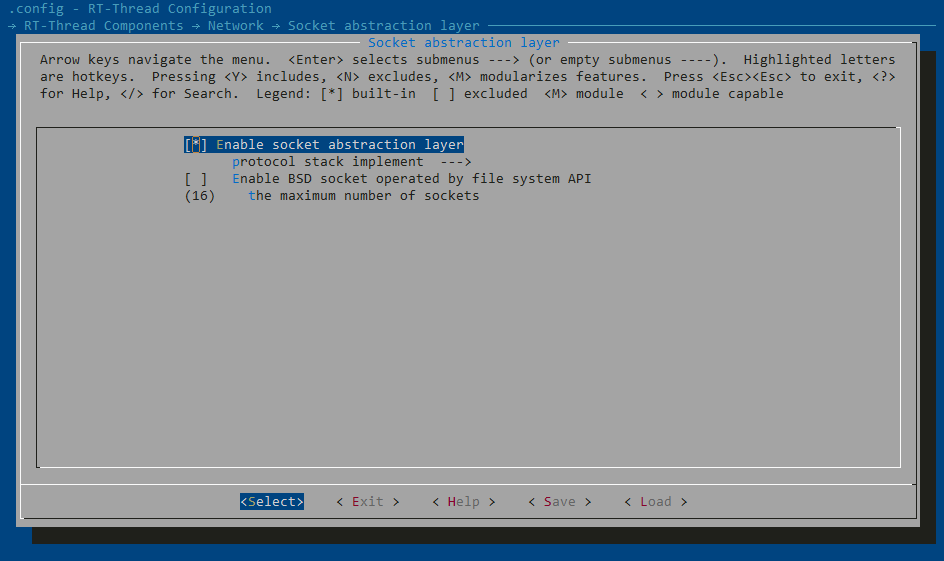
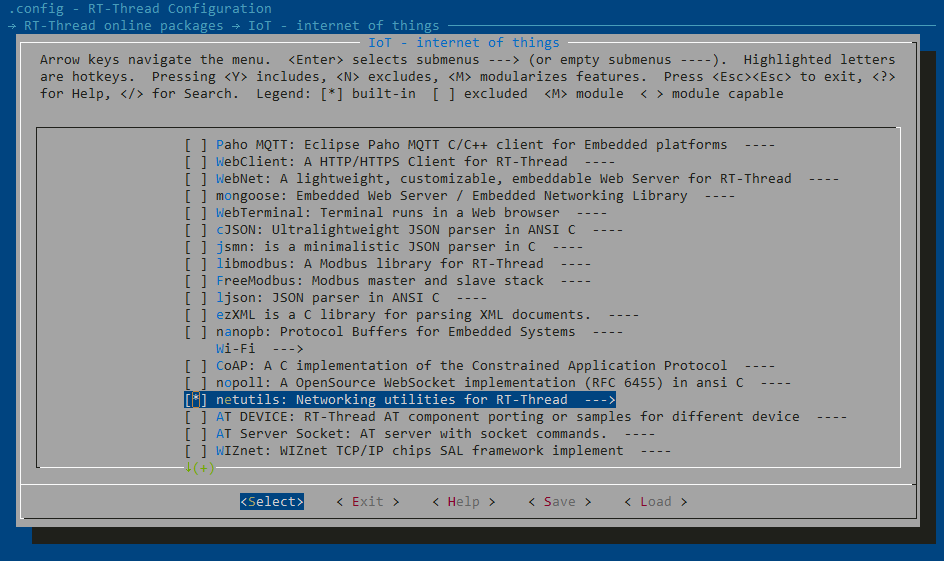
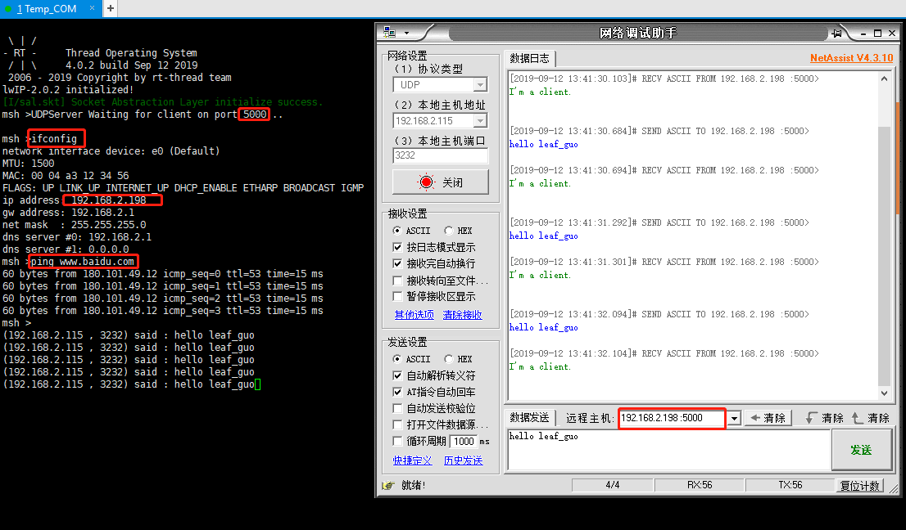

# RT-Thread—STM32—enc28j60

---

<div align=center><a href="https://gitee.com/iotxiaohu/blog">
    
</a></div>

---

## 概述
本教程主要是讲解如何使用ENC28J60模块介入以太网
本例程的模板使用通用模板环境搭建里面的模板[RT-Thread—STM32—环境搭建](https://blog.csdn.net/weixin_41294615/article/details/99416748)
文末也有我移植好的例程，不过建议大家从头开始移植，加深印象\^\_\^

---
## 配置
- **打开工程目录，在ENV下输入menuconfig进入图形化配置界面**
- **配置SPI2**


- **使用ENC28J60软件包**


- **使用lwIP 2.0.2**


- **使能socket**


- **使能network相关组件**


- **保存配置并且退出ENV**

---
## 代码修改
- **添加```drv_enc28j60.c```,```drv_enc28j60.h```,```m_udp.h```,```m_udp.c```文件**
- **在```drv_enc28j60.c```文件中添加ENC28J60和SPI相关的初始化**
```
#include <rtthread.h>
#include <enc28j60.h>
#include <drivers/pin.h>
#include "spi_flash.h"
#include <rtdevice.h>
#include "drv_spi.h"
#include "enc28j60.h"
#include <board.h>


#define ENC28J60_BUS          "spi2"
#define ENC28J60_DEVICE       "qspi20"

#define ENC28J60_CS             GET_PIN(B,8)//14      // PA0 for STM32F103RC defined in drv_gpio.c
#define ENC28J60_INT            GET_PIN(B,9)//15      // PA1 for STM32F103RC defined in drv_gpio.c
#define ENC28J60_RESET      	GET_PIN(B,10)//20      // PA4 for STM32F103RC defined in drv_gpio.c

/* 接线相关
 * GND--------接地
 * VCC--------接电源
 * CS---------PB8(可自定义)
 * INT--------PB9(可自定义)
 * RST--------PB10(可自定义)
 * SCK--------PB13(SPI2的SCK)
 * MOSI(SI)---PB15(SPI2的MOSI)
 * MISO(SO)---PB14(SPI2的MISO)
 *
 */


void enc28j60_int_handler(void *args)
{
    /* enter interrupt */
    rt_interrupt_enter();

    enc28j60_isr();

    /* leave interrupt */
    rt_interrupt_leave();
}

/* 设备初始化 */
static int rt_hw_enc28j60_init(void)
{
    /* Configure SPI */
	rt_hw_spi_device_attach("spi2", "qspi20", GPIOB, GPIO_PIN_8);

    /* Configure Reset */
    rt_pin_mode(ENC28J60_RESET, PIN_MODE_INPUT_PULLUP);
    rt_pin_write(ENC28J60_RESET,0);
    rt_thread_delay(1);
    rt_pin_write(ENC28J60_RESET,1);

    enc28j60_attach(ENC28J60_DEVICE);

    /* Configure Interrupt */
    rt_pin_mode(ENC28J60_INT, PIN_MODE_INPUT_PULLUP);
    rt_pin_attach_irq(ENC28J60_INT, PIN_IRQ_MODE_FALLING, enc28j60_int_handler, (void*)"callbackargs");
    rt_pin_irq_enable(ENC28J60_INT, PIN_IRQ_ENABLE);

    return RT_EOK;
}
INIT_DEVICE_EXPORT(rt_hw_enc28j60_init);


```

- **在```m_udp.c```文件里面添加了通过代码实现UDP server的简单功能**
```
#include <rtthread.h>
#include <rtdevice.h>
#include <board.h>
#include "m_udp.h"

#include <sys/socket.h> //使用BSD socket，需要包含sockets.h头文件
#include <netdb.h>
#include <string.h>
#include <finsh.h>

#define BUFSZ   1024
const char send_data1[] = "I'm a client.\n"; /* 发送用到的数据 */

void thread_udp_entry(void *param)
{
    int sock;
    int bytes_read;
    char *recv_data;
    socklen_t addr_len;
    struct sockaddr_in server_addr, client_addr;

    /* 分配接收用的数据缓冲 */
    recv_data = rt_malloc(BUFSZ);
    if (recv_data == RT_NULL)
    {
        /* 分配内存失败，返回 */
        rt_kprintf("No memory\n");
        return;
    }

    /* 创建一个socket，类型是SOCK_DGRAM，UDP类型 */
    if ((sock = socket(AF_INET, SOCK_DGRAM, 0)) == -1)
    {
        rt_kprintf("Socket error\n");

        /* 释放接收用的数据缓冲 */
        rt_free(recv_data);
        return;
    }

    /* 初始化服务端地址 */
    server_addr.sin_family = AF_INET;
    server_addr.sin_port = htons(5000);				//设置自己的端口号
    server_addr.sin_addr.s_addr = INADDR_ANY;
    rt_memset(&(server_addr.sin_zero), 0, sizeof(server_addr.sin_zero));

    /* 绑定socket到服务端地址 */
    if (bind(sock, (struct sockaddr *)&server_addr, sizeof(struct sockaddr)) == -1)
    {
        /* 绑定地址失败 */
        rt_kprintf("Bind error\n");

        /* 释放接收用的数据缓冲 */
        rt_free(recv_data);
        return;
    }

    addr_len = sizeof(struct sockaddr);
	rt_kprintf("UDPServer Waiting for client on port 5000...\n");

	while(1)
	{
        bytes_read = recvfrom(sock, recv_data, BUFSZ - 1, 0,(struct sockaddr *)&client_addr, &addr_len);
        recv_data[bytes_read] = '\0';

        /* 输出接收的数据 */
        rt_kprintf("\n(%s , %d) said : ", inet_ntoa(client_addr.sin_addr),ntohs(client_addr.sin_port));
        rt_kprintf("%s", recv_data);

		/* 发送数据 */
		sendto(sock, send_data1, strlen(send_data1), 0,(struct sockaddr *)&client_addr, sizeof(struct sockaddr));

		rt_thread_mdelay(500);
	}
}

/* 初始化任务 */
static int m_udp_sample(void)
{
    rt_thread_t tid_udp = rt_thread_create("m_udp",
                            thread_udp_entry,
                            RT_NULL,
                            1024,
                            20, 5);
    if (tid_udp != RT_NULL)
    {
        rt_thread_startup(tid_udp);
    }
}

INIT_APP_EXPORT(m_udp_sample);

```

## 测试
- **烧录代码，连接上网线，通过Xshell调试**
- **查看自己IP**
- **使用 DNS Ping 百度的服务器**
- **在同一个路由下面,模拟UDP client发数据** 如图：


- **如果结果和我一样就说明你已经成功了**

---

## 小结

**很多智能设备都需要接入互联网,本节就通过ENC28J60模块让单片机通过有线网接入了互联网,大家可能会问，如何通过无线WIFI接入互联网,这里推荐一个乐鑫的ESP8266WIF模块.[乐鑫官网](https://www.espressif.com/)**

---

## 源代码获取

**<font size=5 color=#ff0000> 源码已放到码云 ! ! ! ( 请点击文首链接进入仓库 ) </font>**

---

## 备注

<div align=center><a href="https://gitee.com/iotxiaohu/blog">
    
</a></div>

---
