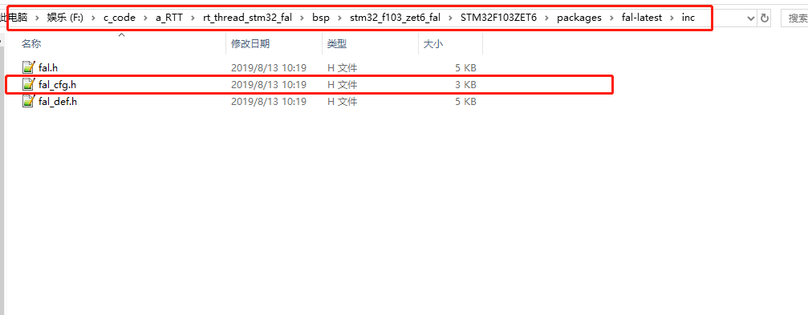

# RT-Thread——STM32——FAL库

---

<div align=center><a href="https://gitee.com/iotxiaohu/blog">
    
</a></div>

---

## 概述

本教程主要根据官方推荐的教程进行改编，详细信息请参考[FAL软件包](http://packages.rt-thread.org/itemDetail.html?package=fal)
本例程的模板使用通用模板环境搭建里面的模板 `RT-Thread——STM32——环境搭建`
文末也有我一直好的例程，不过建议大家从头开始移植，加深印象

---

## 配置

- **打开board目录下的Kconfig文件**


- **因为FAL需要Flash支持，所以要添加如下代码**

```
    config BSP_USING_ON_CHIP_FLASH
        bool "Enable ON_CHIP_FLASH"
        default y
```


- **在ENV下输入menuconfig进入图形化配置界面**


- **在On-chip Peripheral Drivers下确认使能了刚刚配置的Enable ON_CHIp_FLASH**


- **在如图所示的目录下打开fal软件包**


- **使用最新版本**


- **保存配置并且退出ENV**
## 工程修改
- **你会发现这个目录下有这样一个软件包**


- **将sample/porting目录下的fal_cfg.h文件复制到inc目录下**



- **在ENV下输入如下信息重新生成工程**


## 代码修改
- **在drv_flash_f1.c文件里面你会看到对fal的支持，着重知道这两个划横线的信息，下一步会用，如下图所示**


- **将打开fal_cfg.h文件，原来是这样的**


- **修改之后见下图**
- **我是512K的我全部用来做APP使用，所以把分区修改成这样，你们可以根据具体芯片大小进行划分**
- **后续会升级或者使用easyflash,到时候再具体分区**


- **在m_test.h文件下 引用头文件，加入初始化，屏蔽测试输出以免测试干扰**


---

## 测试

- 按下复位你会看到如下打印信息


- 输入 fal 会看到提示怎么使用，根据提示进行操作就好了，也可以参考[FAL软件包](http://packages.rt-thread.org/itemDetail.html?package=fal)里面的操作


- 如果结果和我一样就说明你已经成功了

---
## 小结
**大家也可以参考官方的教程进行使用，fal的移植是easyflash和ota升级的基础，后续的这两个都会用到本例程的fal库，所以fal库还是相当重要的**

---

## 源代码获取

**<font size=5 color=#ff0000> 源码已放到码云 ! ! ! ( 请点击文首链接进入仓库 ) </font>**

---

## 备注

<div align=center><a href="https://gitee.com/iotxiaohu/blog">
    
</a></div>

---
