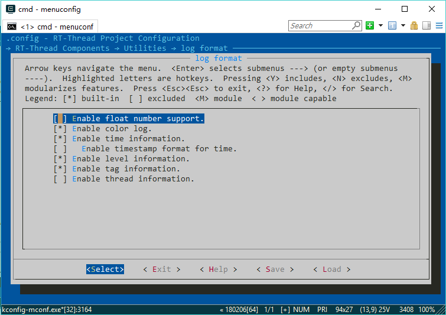
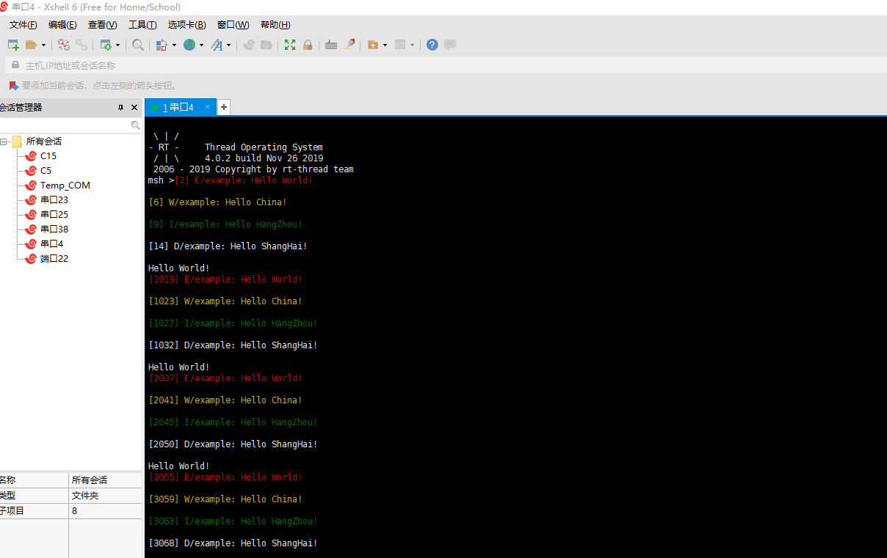

# RT-Thread—STM32—ulog

---

<div align=center><a href="https://gitee.com/iotxiaohu/blog">
    
</a></div>

---

## 概述

之前有人让我,发一篇关于ulog的文章,于是乎,接下来讲一下`RT-Thread`如何使用`ulog`,因为整体比较简单,所以接下来概括性的提示一下怎么使用.
详情请参考 [ulog 日志使用](https://www.rt-thread.org/document/site/programming-manual/ulog/ulog/)

---

## 配置

- 在ENV下输入menuconfig进入图形化配置界面, 如图所示



## 在自己的程序文件中添加如下修改


```
#define LOG_TAG     "leaf"        // 标签
#define LOG_LVL     LOG_LVL_DBG    // 默认调试级别
#include <ulog.h>


/* 线程函数 */
void thread_ulog_entry(void *param)
{
    while(1)
    {
        LOG_E("Hello World!\n");
        LOG_W("Hello China!\n");
        LOG_I("Hello HangZhou!\n");
        LOG_D("Hello ShangHai!\n");
        rt_kprintf("Hello World!\n");
        rt_thread_mdelay(1000);
    }
}


/* 创建函数 */
static char ulog_stack[512];
static struct rt_thread tid_ulog;
static int m_ulog_sample(void)
{
    /* 初始化 */
    rt_thread_init(&tid_ulog,
                   "thread_ulog",
                   thread_ulog_entry,
                   RT_NULL,
                   &ulog_stack[0],
                   sizeof(ulog_stack),
                   22, 5);
    rt_thread_startup(&tid_ulog);
    return RT_EOK;
}

INIT_APP_EXPORT(m_ulog_sample);            //应用初始化
```

---

## 测试

- 烧录复位后,测试结果如下,说明测试成功
- **注意: 普通的串口调试助手可能不能打印颜色等信息,建议使用Xshell**



---

## 源代码获取

**<font size=5 color=#ff0000> 源码已放到码云 ! ! ! ( 请点击文首链接进入仓库 ) </font>**


## 备注

<div align=center><a href="https://gitee.com/iotxiaohu/blog">
    
</a></div>

---
