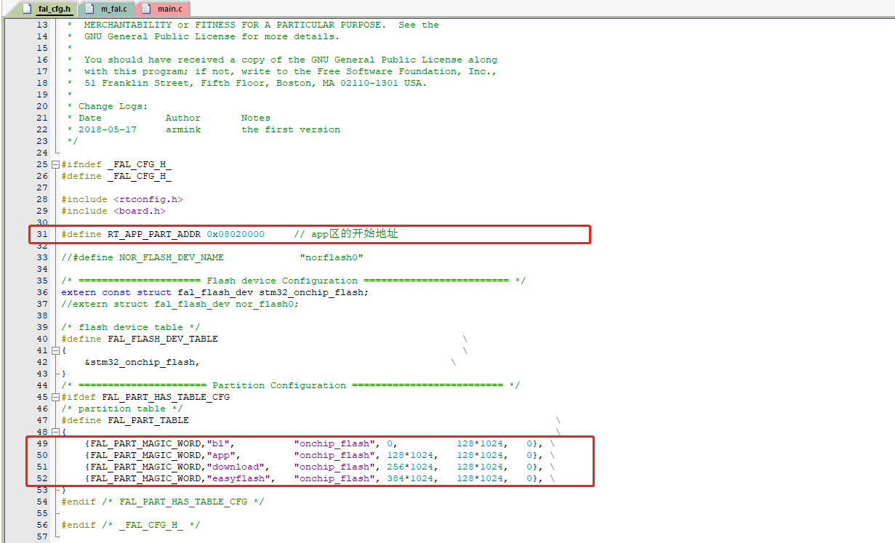

# RT-Thread—STM32—在线升级(Ymodem_OTA)

---

<div align=center><a href="https://gitee.com/iotxiaohu/blog">
    
</a></div>

---

## 概述

本教程主要根据官方推荐的教程进行改编，详细信息请参考
[OTA Downloader软件包](http://packages.rt-thread.org/itemDetail.html?package=ota_downloader)
[STM32 通用 Bootloader](https://www.rt-thread.org/document/site/application-note/system/rtboot/an0028-rtboot/)

本例程的模板使用通用模板环境搭建里面的模板`RT-Thread—STM32—FAL库`
文末也有我移植好的例程，不过建议大家从头开始移植，加深印象\^\_\^

---

## bootloader的制作

<font color=#ff0000> 文末有我已经做好的Bootloader文件,可供参考</font>

- 打开bootloader制作的网址[Bootloader在线获取地址](http://iot.rt-thread.com)
- 其他步骤按照[STM32 通用 Bootloader](https://www.rt-thread.org/document/site/application-note/system/rtboot/an0028-rtboot/)制作
- 这里我提供一下我制作的相关配置


- 点击生成Bootloader
- 可以选择邮箱下载，或者手动下载


## 烧录Bootloader

- 选择合适的工具烧录BootLoader
- 这里我选择的是STM32CubeProgrammer(使用的是ST-Link/V2)
- 连接之后下载刚刚生成的Bootloader文件(xxxx.bin)


- 连接串口，测试打印信息
- 能看到我们之前制作Bootloader时，相关的参数以及logo,说明Bootloader烧录成功,如下图所示
- 博主使用的是Xshell软件(建议使用Xshell软件)
- [Xhell官网](]https://www.netsarang.com/zh/xshell/)


## 制作APP程序

### ENV配置

- 选择ota功能


- 使能Ymodem OTA
- 然后更新配置保存退出


### 代码修改

- 打开fal_cfg.h文件(此过程一定要和Bootloader制作是保持地址对应，否者没法升级)
- 更改app的开始地址

```c
#define RT_APP_PART_ADDR 0x08020000        // app区的开始地址
```

- 更改分区表

```c
#define FAL_PART_TABLE                                                               \
{                                                                                    \
    {FAL_PART_MAGIC_WORD,"bl",            "onchip_flash",    0,            128*1024,    0}, \
    {FAL_PART_MAGIC_WORD,"app",            "onchip_flash",    128*1024,    128*1024,    0}, \
    {FAL_PART_MAGIC_WORD,"download",    "onchip_flash",    256*1024,    128*1024,    0}, \
    {FAL_PART_MAGIC_WORD,"easyflash",    "onchip_flash",    384*1024,    128*1024,    0}, \
}
```

- 修改后如下图所示


- 打开Option for Target...
- 在Linker中点击Edit...修改link.sct文件，使开始地址为Bootloader设置的地址，如下图所示


- 打开fal_cfg.h文件
- 添加打印版本信息的代码

```c
    rt_kprintf("/****************************************************/\n");
    rt_kprintf("/*************Version : 2.0.0\n");
    rt_kprintf("/****************************************************/\n");
```

- 添加更改中断向量表相关的参数

```c
/**
 * Function    ota_app_vtor_reconfig
 * Description Set Vector Table base location to the start addr of app(RT_APP_PART_ADDR).
*/
static int ota_app_vtor_reconfig(void)
{
    #define NVIC_VTOR_MASK   0x3FFFFF80
    /* Set the Vector Table base location by user application firmware definition */
    SCB->VTOR = RT_APP_PART_ADDR & NVIC_VTOR_MASK;

    return 0;
}
INIT_BOARD_EXPORT(ota_app_vtor_reconfig);
```


- 查看烧录设置
- ```Option for Target...```-->```Debug```-->```Settings```-->```FlashDownload```
- 确保```Download Function```选择```Erase Sectors```


- 编译并且烧录程序


- 打开串口会看到Bootloader已经成功跳转到我们的程序并且正常运行了


- 修改版本号，只编译编译
- 千万不要烧录!!!
- 千万不要烧录!!!
- 千万不要烧录!!!


- 打开目录`packages` \ `ota_downloader-latest` \ `tools` \ `ota_packager`
- 找到如下所示的生成软件包生成工具，并且打开


- 点击`选择固件`找到主目录下的`rtthread.bin`文件
- 添加`固件区名`和`固件版本```然后打包
- 成功后会在`rtthread.bin`文件的同一目录下生成`rtthread.rbl`文件


- 打开串口输入`help`会打印帮助信息
- 输入`ymodem_ota`执行升级命令


- 在黑窗口点击`鼠标右键`-->`传输`-->`YMODEM(Y)`
- 选择刚刚生成的```rtthread.rbl```文件，打开进行升级，如下图所示


- 成功之后，会看到版本变化了，说明升级成功，如下图所示


---
