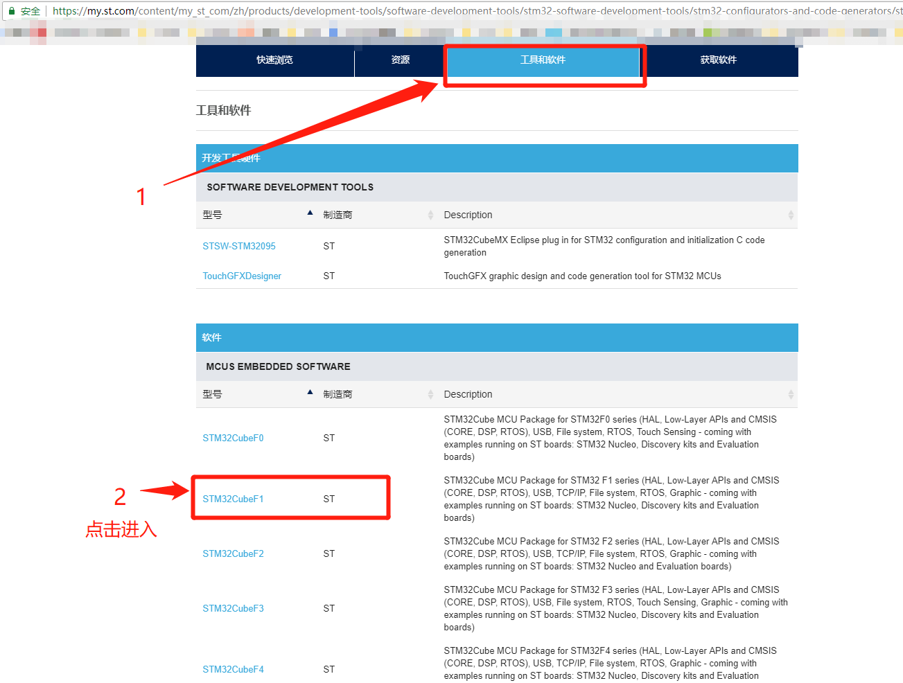

# STM32CubeMx 环境准备

---

## 软件准备

- STM32CubeMx
- STM32CubeMx的支持包
- Keil5

---

## STM32CubeMx下载

登录ST官网 [点击进入](https://www.st.com)

注册账户，并且搜索 stm32cubemx 软件,如下图所示

---

点击STM32CubeMX

---

在获取软件栏里面点击 "获取软件"

---

### STM32CubeMx的支持包下载

回到上一个获取软件的页面

在 工具和软件栏 里面，选择想要下载的软件包（如STM32CubeF1）

---
在获取软件栏里面点击 "获取软件"

---

### Keil5下载

进入官网 [点击进入](https://www.keil.com)

选择Download

---
选择 Product Downloads

---

选择MDK-Arm

---

加下来你可能需要填写一些个人信息，按照要求填一下（免费的请放心）

进入下载页面，点击MDKxxx.EXE下载

到此为止软件就下载好了

---

### 备注

软件安装我就不详细说明，推荐几个教程

[STM32CubeMX安装与导入支持包](https://blog.csdn.net/sudaroot/article/details/79364484)
[MDK5安装与注册](https://blog.csdn.net/k1ang/article/details/79439891)

---
