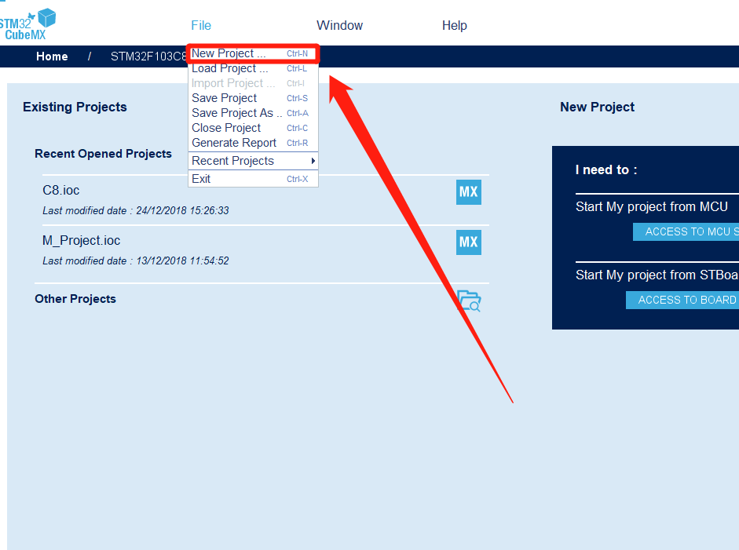
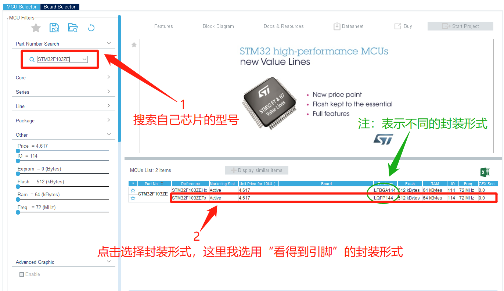
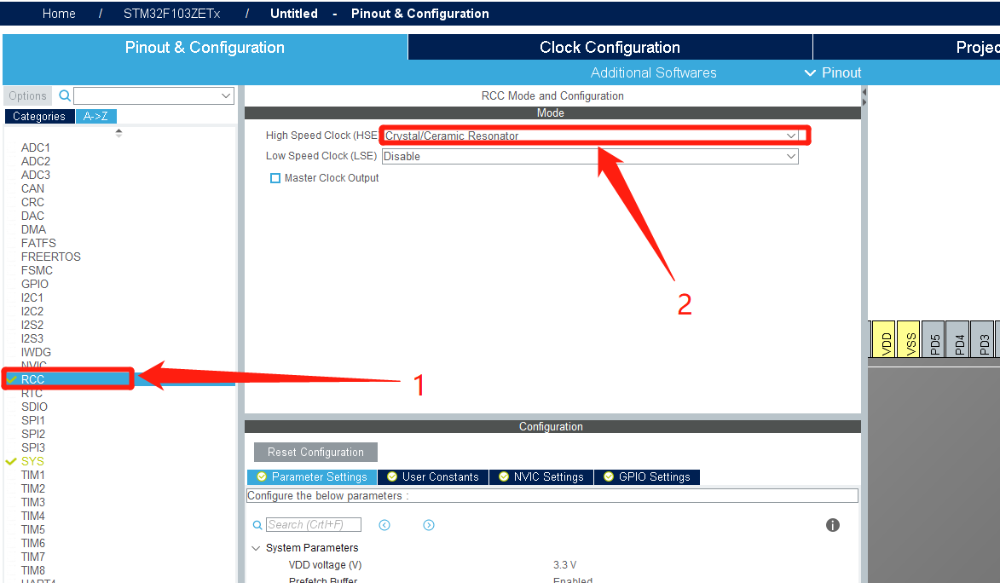
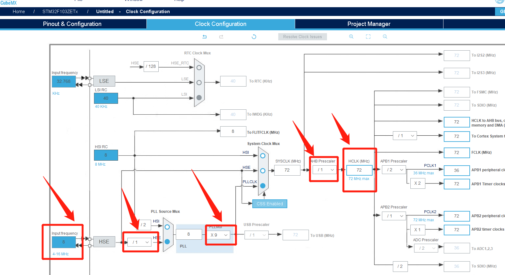
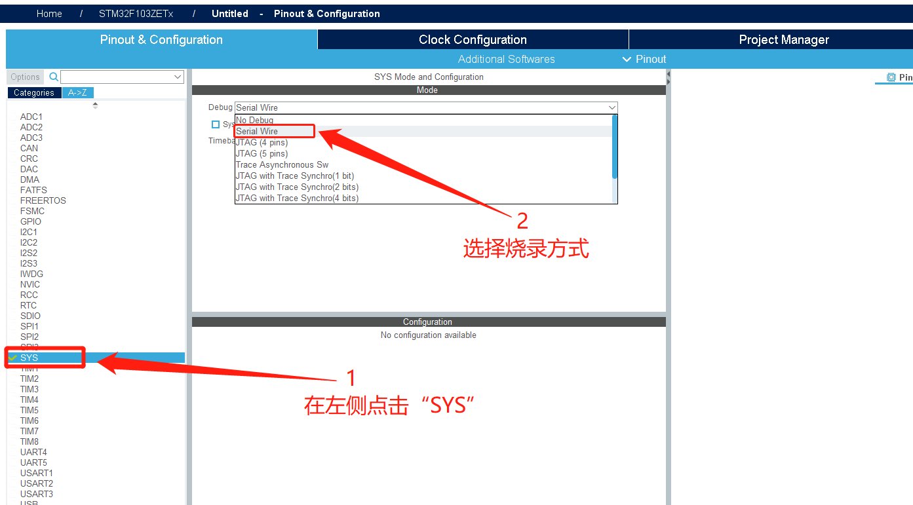
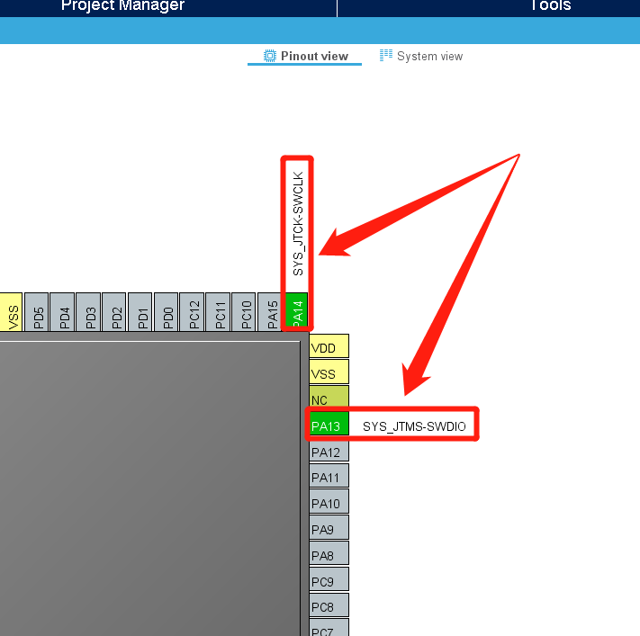
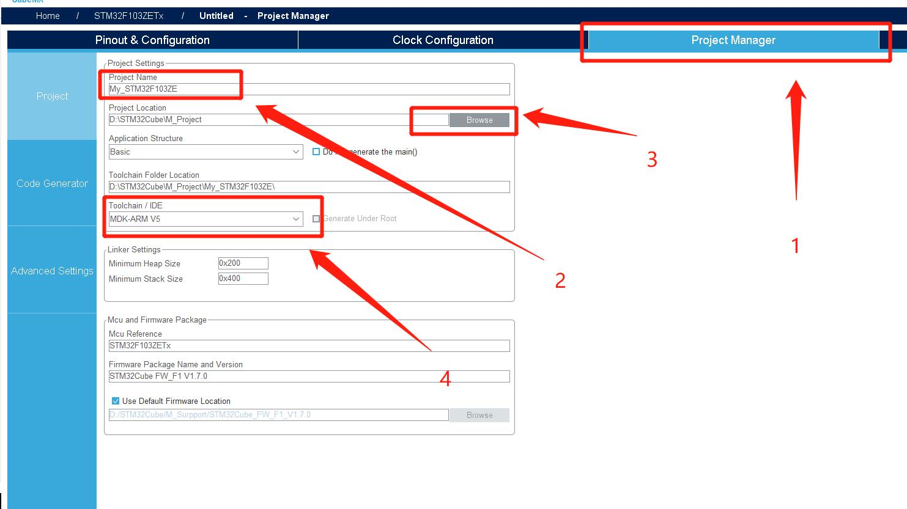
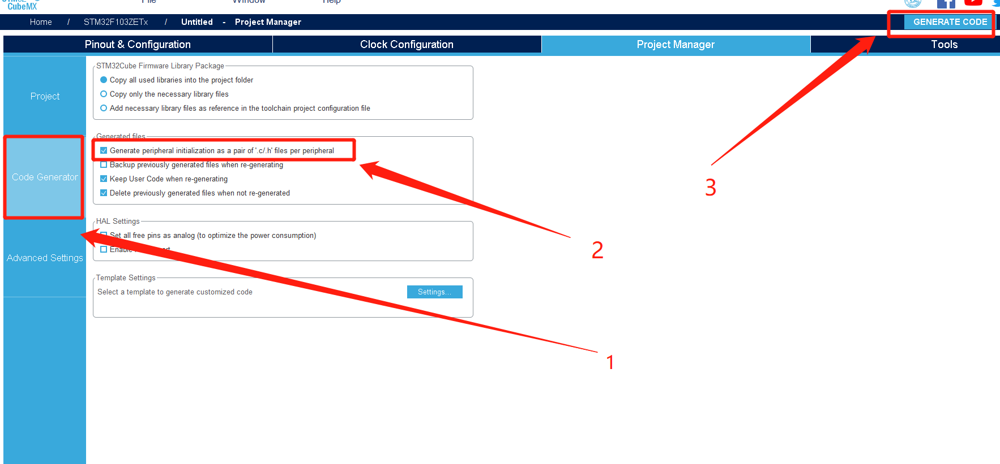
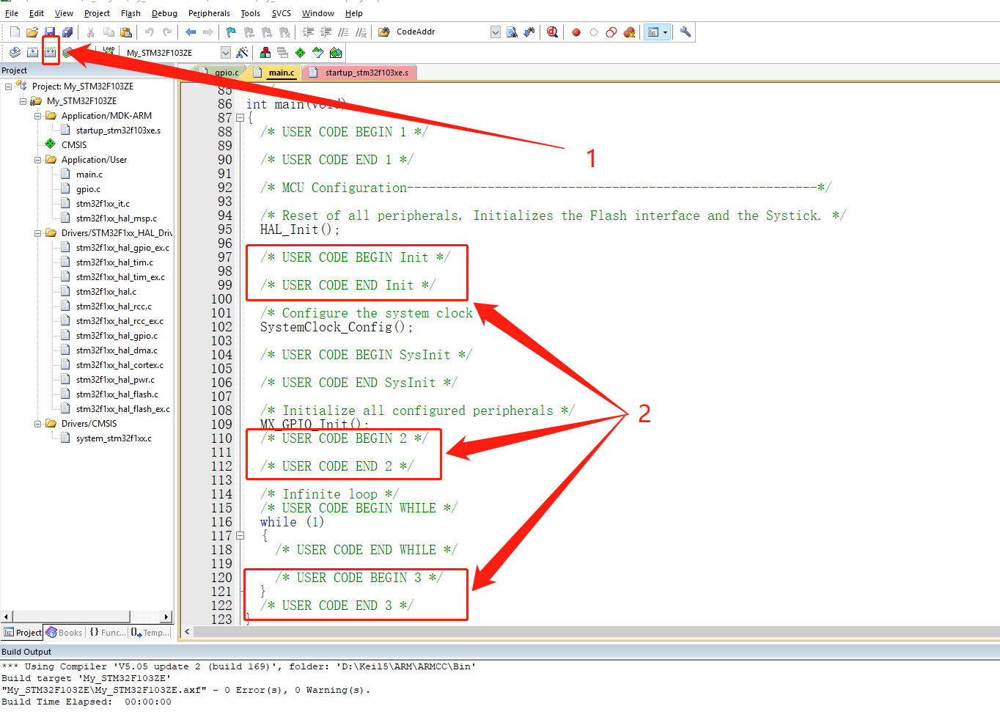

# STM32CubeMx开发之路—配置第一个项目

---

## 运行环境

| 工具          | 版本     | 说明       |
| ------------- | -------- | ---------- |
| `STM32CubeMX` | `V5.0.0` | `建议相同` |
| `Keil5`       | `V5.1.5` | `建议相同` |

## 简介

本例程主要搭建第一个项目，并且完成最基本的项目所需配置，后续的教程都基于这篇教程。

---

## STM32CubeMx配置

---

- 新建项目

---

- 搜索自己芯片的型号, F103ZE或者F103RB等
- 点击选择封装形式

---

- 选择外部晶振

---

- 可以根据需求调节各个总线的时钟频率（就具体情况而定）

---

- DEBUG选项选择"Serial Wire"（4线烧录，CLK，DIO，VCC，GND)

---

- 你会看到芯片引脚会占用这几个引脚，就是烧录用的CLK和DIO

---

- 点击"Project Manager"
- 修改项目名称
- 修改项目保存路径
- 选择编写工具（我使用Keil5,所以选择"MDK-ARM V5"）

---

- 选择"Code Generator"
- .c 和 .h文件分开
- 点击"GENERATE CODE"生成项目代码

---

- 打开生成的项目代码，如下图所示，进行简要说明
- 点击编译项目文件（通常"0 Error(s) , 0 Warnning(s)"
- 请写在USER代码的"\*\*\*BEGIN***" 和 "\*\*\*END***"之间写自己的代码，这样修改参数就不会被覆盖自己的代码

