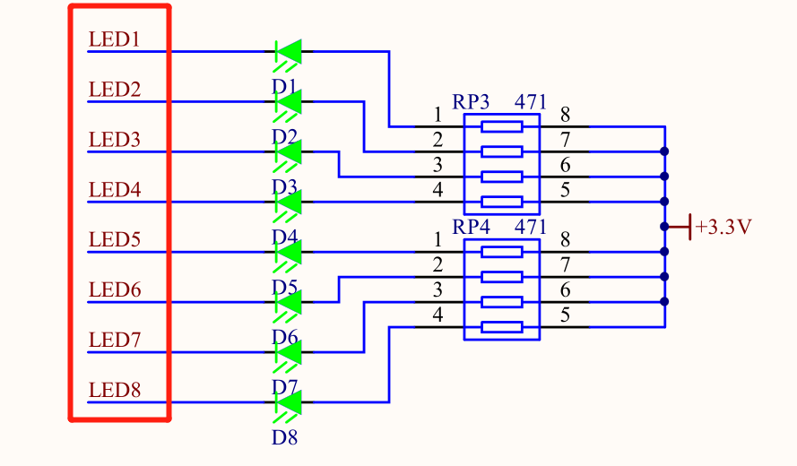
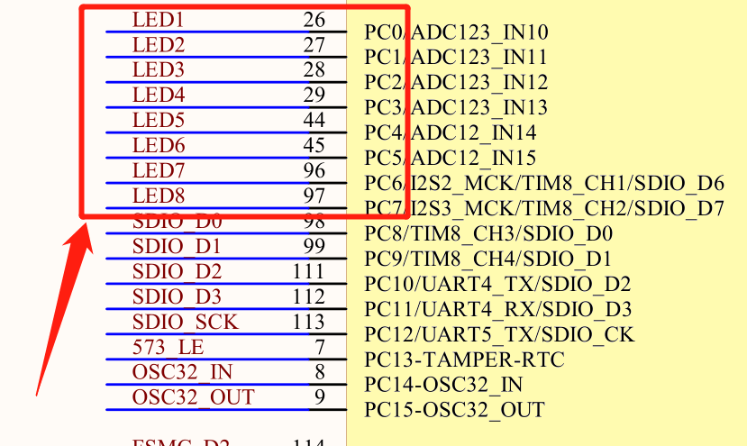
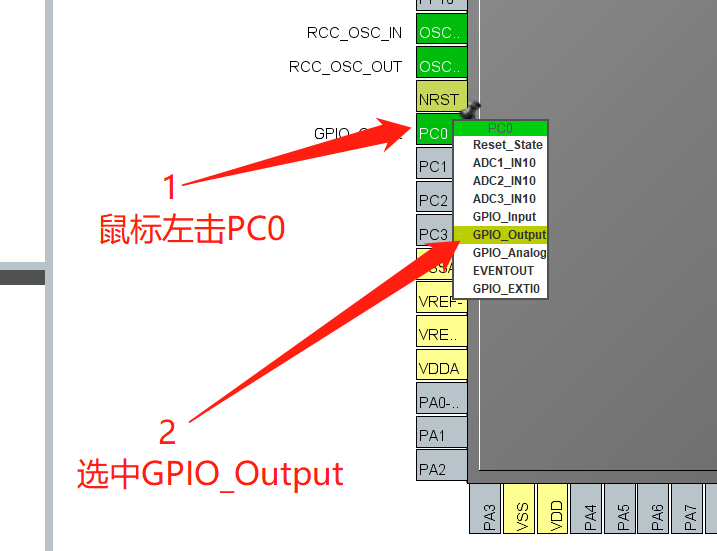
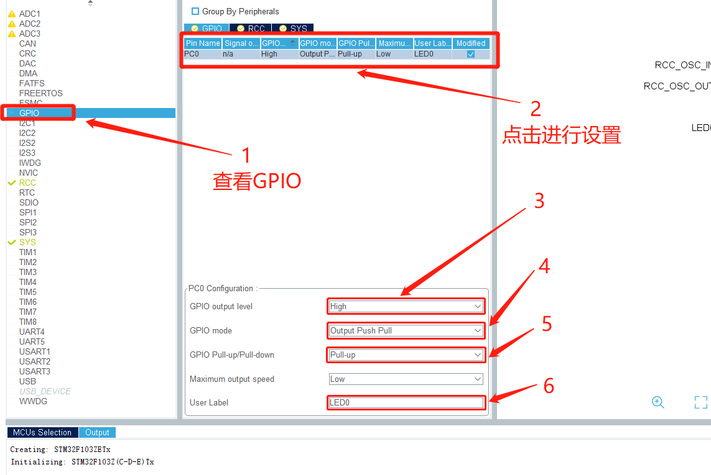
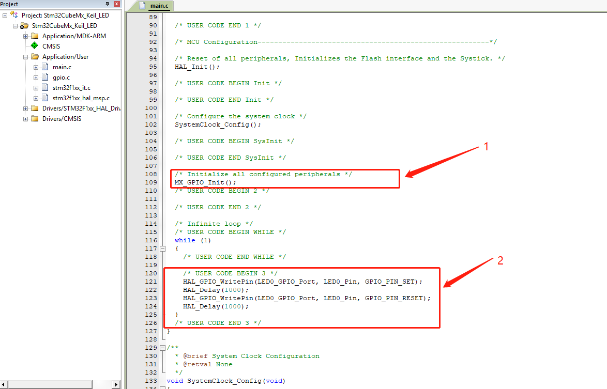

# STM32CubeMx开发之路—2点亮第一个LED灯

---

## 运行环境

| 工具          | 版本     | 说明       |
| ------------- | -------- | ---------- |
| `STM32CubeMX` | `V5.0.0` | `建议相同` |
| `Keil5`       | `V5.1.5` | `建议相同` |

## 简介

本例程主要讲解如何通过IO的输出高低电平实现LED灯的亮灭

---

## STM32CubeMx基本配置

  基础配置过程请参考 [STM32CubeMx(Keil5)开发之路—1配置第一个项目](https://blog.csdn.net/weixin_41294615/article/details/85235905)

---

## STM32CubeMx GPIO配置

- 查看电路图
- PC0---PC7为LED管脚，并且低电平点亮LED灯，这里只对PC0进行配置

|  |  |
| -------------- | -------------- |

---

- 1——在STM32CubeMx的芯片中鼠标左键点击选择PC0
- 2——点击选择GPIO_Output

---

- 1——点击选择GPIO
- 2——点击进行更细节的设置
- 3——选择默认输出的高低电平
- 4——选择输出的模式
- 5——选择拉高或者拉低
- 6——给这个管脚取一个别名（程序员要习惯从0开始计数，所以我取名为LED0）

---

## 代码修改

- 1——是对GPIO进行的相关配置
- 2——对GPIO管脚高低电平输出和延时操作，实现LED灯的亮灭变化

---

## 小结

GPIO的操作在很多场合都能够用得上。常用场合

- LED灯开关操作
- 模拟IIC，红外等通讯
- 对继电器的控制
- 常见扩展芯片的使能 / 失能
总体来说，GPIO管脚高低电平操作是实现比较简单，且效果比较直观的例程，因此作为第一个例程进行讲解。如果有什么疑问，欢迎在评论区进行评论，互相交流学习。

---
