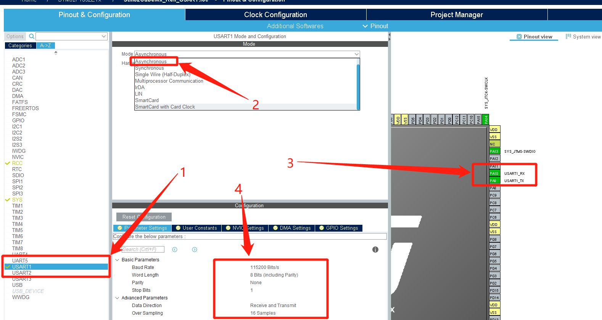
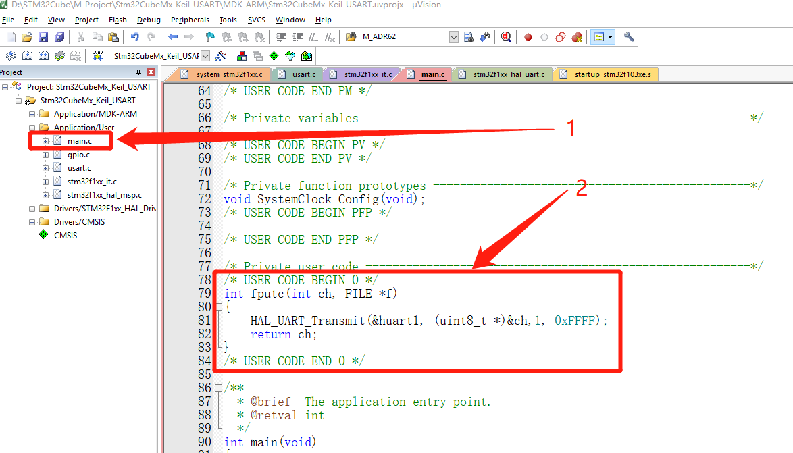
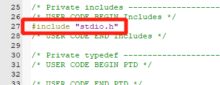
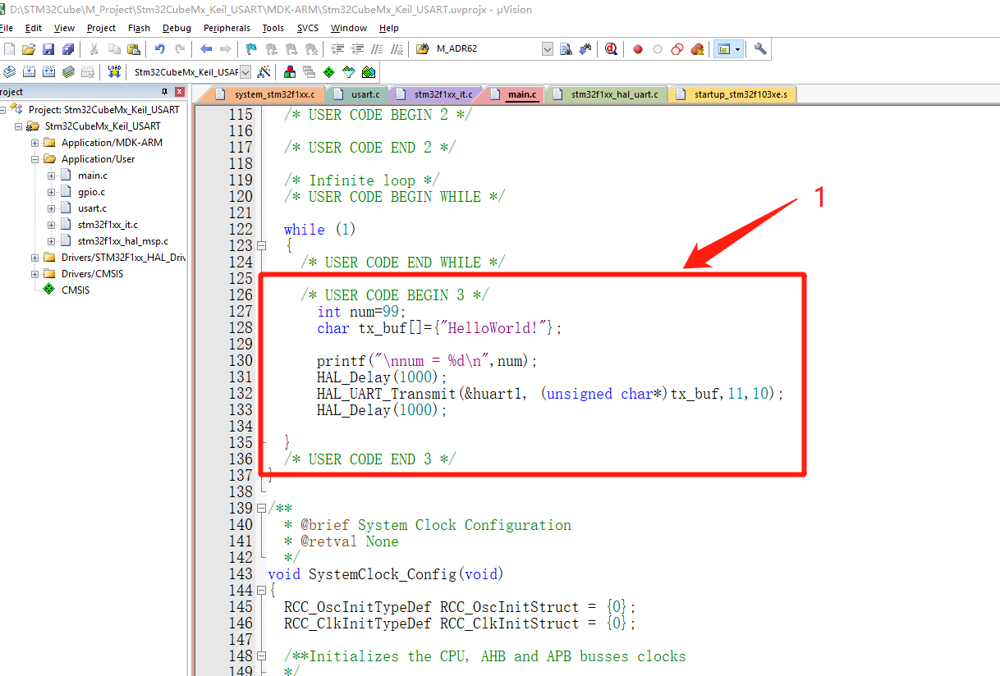
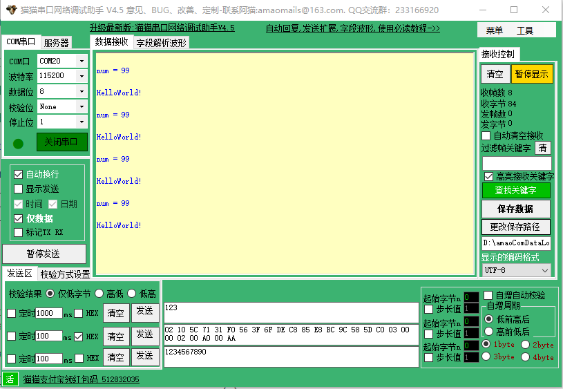
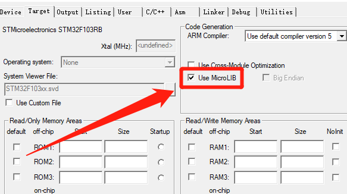

# STM32CubeMx开发之路—3发送USART数据和printf重定向

<div align=center><a href="https://iotxiaohu.gitee.io/">
    
</a></div>

---

## 运行环境

| 工具          | 版本     | 说明       |
| ------------- | -------- | ---------- |
| `STM32CubeMX` | `V5.0.0` | `建议相同` |
| `Keil5`       | `V5.1.5` | `建议相同` |

## 简介

本例程主要讲解如何通过串口发送数据和重定向printf

---

## STM32CubeMx基本配置

  基础配置过程请参考 [STM32CubeMx(Keil5)开发之路—1配置第一个项目](https://blog.csdn.net/weixin_41294615/article/details/85235905)

---

## STM32CubeMx USART1配置

- 点击USART1进行设置
- 模式选择Asynchronous异步传输
- 可以看到右边自动出现了Tx和Rx
- 可以自行设置波特率，停止位，校验位等参数


---

## 代码修改

- 选择 `main.c` 文件
- 在 USER CODE 中添加如下代码，重定向 `printf()`
- 如果报错的话加上头文件的引用 `#include "stdio.h"`

```c
int fputc(int ch, FILE *f)
{
    HAL_UART_Transmit(&huart1, (uint8_t *)&ch,1, 0xFFFF);
    return ch;
}
```



---

- 加上头文件的引用 `#include "stdio.h"`



---

在主循环中添加如下代码

```c
   int num=99;
   char tx_buf[]={"HelloWorld!"};

   printf("\nnum = %d\n",num);
   HAL_Delay(1000);
   HAL_UART_Transmit(&huart1, (unsigned char*)tx_buf,11,10);
   HAL_Delay(1000);
```



---


---

## 常见问题

- 需要勾选上 `Use Micro LIB`



---
