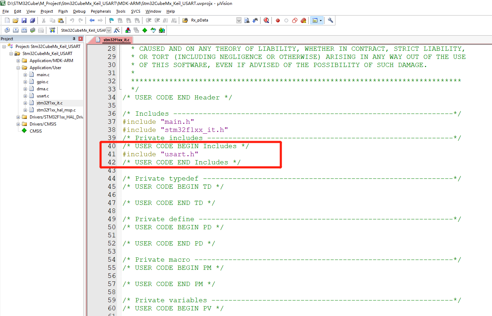

# STM32CubeMx开发之路—4采用DMA方式收发数据

<div align=center><a href="https://iotxiaohu.gitee.io/">
    
</a></div>

---

## 运行环境

| 工具          | 版本     | 说明       |
| ------------- | -------- | ---------- |
| `STM32CubeMX` | `V5.0.0` | `建议相同` |
| `Keil5`       | `V5.1.5` | `建议相同` |

## 简介

本例程主要讲解如何通过串口发送数据和重定向printf

---

## STM32CubeMx基本配置

  基础配置过程请参考 [STM32CubeMx(Keil5)开发之路—配置第一个项目](https://blog.csdn.net/weixin_41294615/article/details/85235905)

---

## STM32CubeMx USART1配置

---

- 点击USART1进行设置
- 模式选择Asynchronous异步传输
- 可以看到右边自动出现了Tx和Rx
- 可以自行设置波特率，停止位，校验位等参数


---

- 选择DMA设置
- 添加DMA
- 添加DMA的Tx和Rx通道


---

- 选择NVIC设置
- 打开USART1全局中断
- 随便设置一个优先级


---

## 代码修改

---

- 在usart.c文件中添加如下代码，定义全局变量

```c
uint8_t   Rx_Flag = 0;
uint16_t  Rx_Len = 0;
uint8_t   Rx_Buf[Rx_Max] = {0};
```


---

- 在usart.h文件中添加如下代码，声明全局变量

```c
#define Rx_Max 1024
extern uint8_t  Rx_Flag;
extern uint16_t  Rx_Len;
extern uint8_t  Rx_Buf[Rx_Max];
```


---

- 在stm32f1xx_it.c文件中添加对usart.h的声明
- 在stm32f1xx_it.c文件中添加如下代码，对中断的处理

```c
 uint32_t temp;
 if((__HAL_UART_GET_FLAG(&huart1,UART_FLAG_IDLE) != RESET))
 {
  /*清除状态寄存器和串口数据寄存器*/
  __HAL_UART_CLEAR_IDLEFLAG(&huart1);

  /*失能DMA接收*/
  HAL_UART_DMAStop(&huart1);

  /*读取接收长度，总大小-剩余大小*/
  temp = huart1.hdmarx->Instance->CNDTR;
  Rx_Len = Rx_Max - temp;

  /*接收标志位置1*/
  Rx_Flag=1;

  /*使能接收DMA接收*/
  HAL_UART_Receive_DMA(&huart1,Rx_Buf,Rx_Max);
 }
```




---

- 在main.c文件中添加如下代码

```c
 /*Enable DMA IRQ*/
 HAL_UART_Receive_DMA(&huart1, Rx_Buf, Rx_Max);
 __HAL_UART_ENABLE_IT(&huart1, UART_IT_IDLE);

...

 if(Rx_Flag)     // Receive flag
 {
  Rx_Flag=0; // clean flag
  HAL_UART_Transmit_DMA(&huart1, Rx_Buf, Rx_Len);
 }
```


---

- 烧录代码后打开出口调试助手
- 正确的话会看到如下输出


---

## 小结

DMA常用场合

- 对接收和发送数据量比较大的时候，减轻CPU工作
- 对嵌入式系统实时性要求比较高的时候建议使用

本节主要讲如何采用DMA的方式进行串口数据的接收和发送，使用DMA主要就是减轻CPU的工作，让CPU有更多的时间去处理其他的工作。

---
