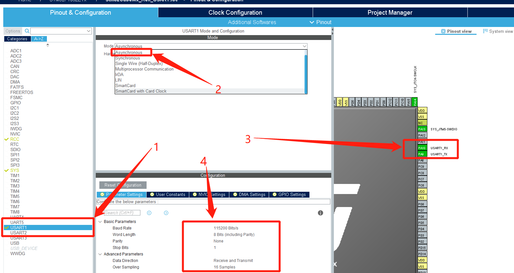

# STM32CubeMX开发之路—5定时器中断TIM

<div align=center><a href="https://iotxiaohu.gitee.io/">
    
</a></div>

---

## 运行环境

| 工具          | 版本     | 说明       |
| ------------- | -------- | ---------- |
| `STM32CubeMX` | `V5.0.0` | `建议相同` |
| `Keil5`       | `V5.1.5` | `建议相同` |

---

## 简介

本例程主要讲解如何使用定时器实现一个定时器中断，每秒打印一串数据

---

## STM32CubeMx基本配置

  基础配置过程请参考 [STM32CubeMx(Keil5)开发之路—配置第一个项目](https://blog.csdn.net/weixin_41294615/article/details/85235905)

---
为了方便调试，重定向printf，进行usart设置

- 点击USART1进行设置
- 模式选择Asynchronous异步传输
- 可以看到右边自动出现了Tx和Rx
- 可以自行设置波特率，停止位，校验位等参数


---

- 点击Clock Configuration进行设置
- 注意这几个地方的时钟（后面进行分频设置的时候需要）


---
点击TIM1进行设置

- 时钟源Clock Source选择Intemal Clock
- 预分频选择36000-1也就是35999（注意16位最大只能表示65535）
- 自动重装载值设置为2000-1也就是1999

> 定时器更新中断的频率=时钟频率/(预分频+1)/(自动重装载值+1)
> 72000000/36000/2000=1(HZ)，也就是每秒进一次中断


---
在NVIC Setting里面勾选TIM1 update interrupt


---

## 代码修改

---
1——选择main.c文件
2——在USER CODE中添加如下代码，重定向printf

```c
int fputc(int ch, FILE *f)
{
    HAL_UART_Transmit(&huart1, (uint8_t *)&ch,1, 0xFFFF);
    return ch;
}
```


---
在主函数中添加如下代码启动定时器


---
重写中断函数，打印"123456"，即每秒打印一次


---
烧录代码后打开出口调试助手，正确的话会看到如下输出


---
