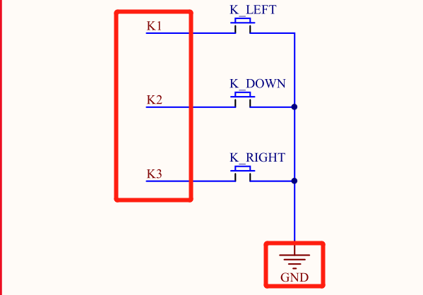
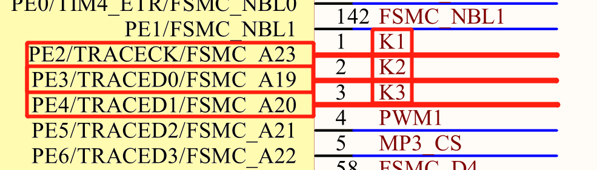
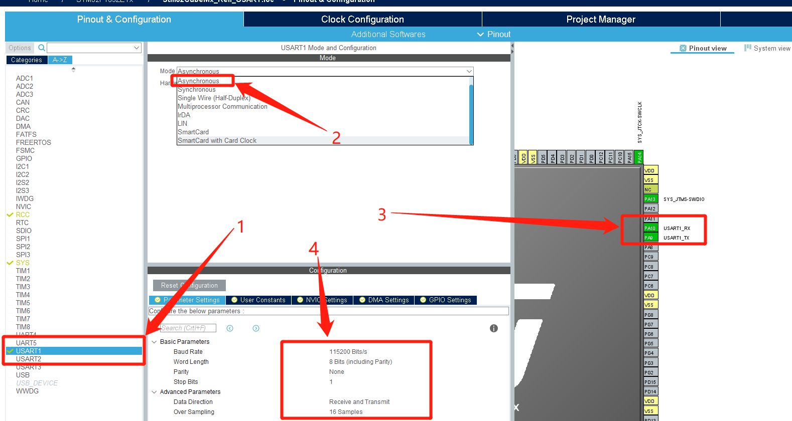
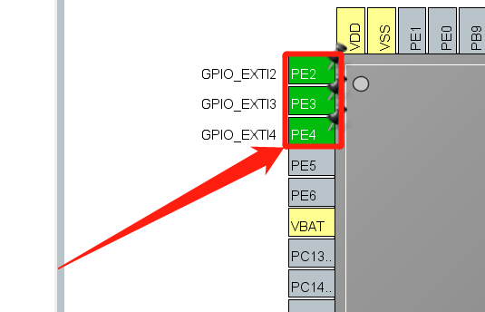
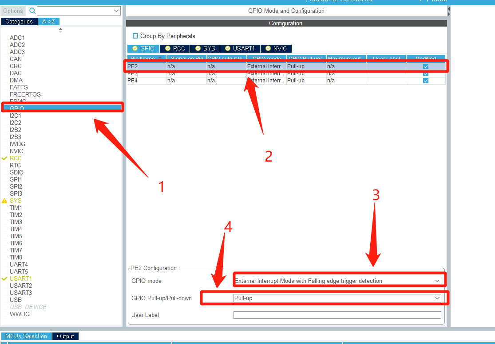
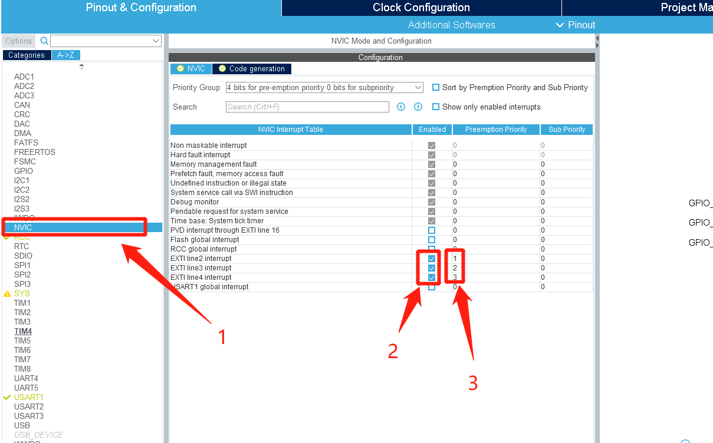
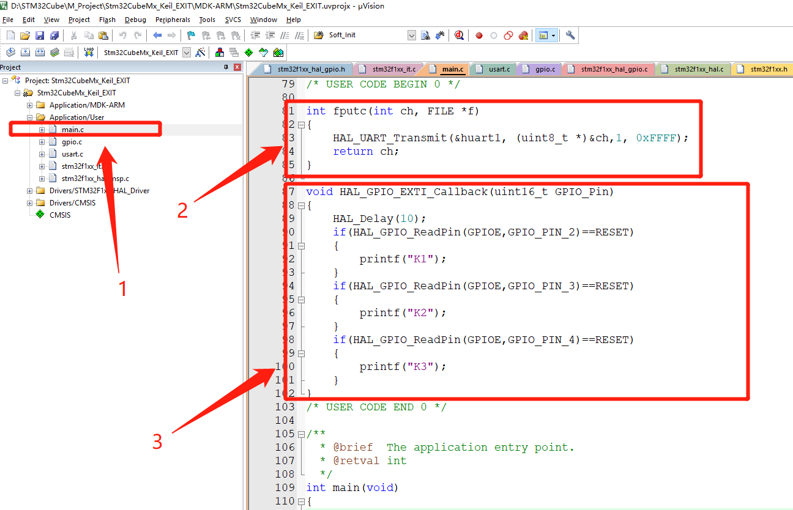
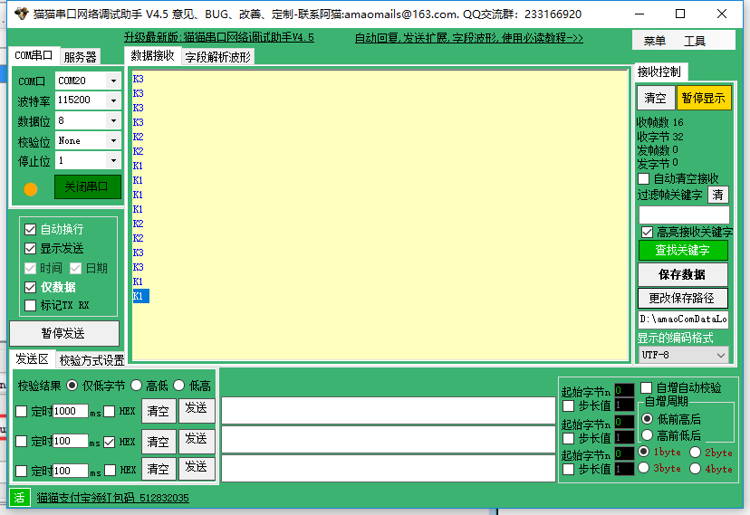

# STM32CubeMX开发之路—6外部中断

<div align=center><a href="https://iotxiaohu.gitee.io/">
    
</a></div>

---

## 运行环境

| 工具          | 版本     | 说明       |
| ------------- | -------- | ---------- |
| `STM32CubeMX` | `V5.0.0` | `建议相同` |
| `Keil5`       | `V5.1.5` | `建议相同` |

---

## 简介

本例程主要讲解如何设置外部中断，采用中断的方式按键是否按下，在中断中进行打印数据。

---

## STM32CubeMx基本配置

  基础配置过程请参考 [STM32CubeMx(Keil5)开发之路—配置第一个项目](https://blog.csdn.net/weixin_41294615/article/details/85235905)

---

## STM32CubeMx 外部中断配置

查看电路图，如下图所示
K1——K3为外部输入引脚，连接PE2——PE4，并且按下按键时为低电平，因此待会儿需要设置为下降沿触发

|  |  |
| -------------- | -------------- |

---
为了方便调试，重定向printf，进行usart设置

- 点击USART1进行设置
- 模式选择Asynchronous异步传输
- 可以看到右边自动出现了Tx和Rx
- 可以自行设置波特率，停止位，校验位等参数


---

- 在芯片图上面找到PE2，PE3，PE4，鼠标左击，分别选择GPIO_EXTI2，GPIO_EXTI3，GPIO_EXTI4，如下图所示
- 

---

- 点击选择GPIO
- 点击PE2进行更细节的设置
- GPIO mode选择 "****** edge Falling ****" 选项
- 选择默认拉高
PE3，PE4也进行类似设置，如下图所示


---

- 点击选择NVIC
- 将3个中断进行勾选上
- 分别设置优先级
如下图所示


---

## 代码修改

---
1——选中main.c
2——重定向printf
3——添加中断响应函数进行状态打印（进行10ms的消抖处理）
如下图所示

```c
/* USER CODE BEGIN 0 */

int fputc(int ch, FILE *f)
{
    HAL_UART_Transmit(&huart1, (uint8_t *)&ch,1, 0xFFFF);
    return ch;
}

void HAL_GPIO_EXTI_Callback(uint16_t GPIO_Pin)
{
 HAL_Delay(10);
 if(HAL_GPIO_ReadPin(GPIOE,GPIO_PIN_2)==RESET)
 {
  printf("K1");
 }
 if(HAL_GPIO_ReadPin(GPIOE,GPIO_PIN_3)==RESET)
 {
  printf("K2");
 }
 if(HAL_GPIO_ReadPin(GPIOE,GPIO_PIN_4)==RESET)
 {
  printf("K3");
 }
}
/* USER CODE END 0 */
```



---
烧录代码后打开出口调试助手，分别按下对应按键，正确的话会看到如下输出


---
