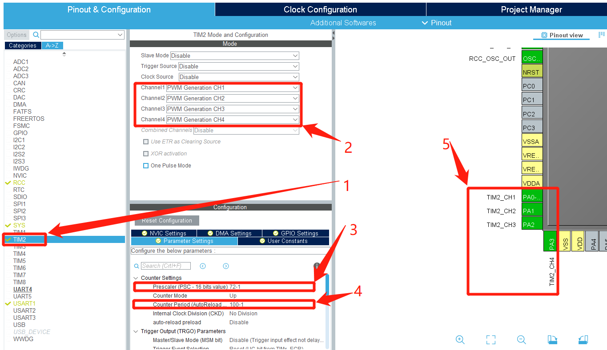
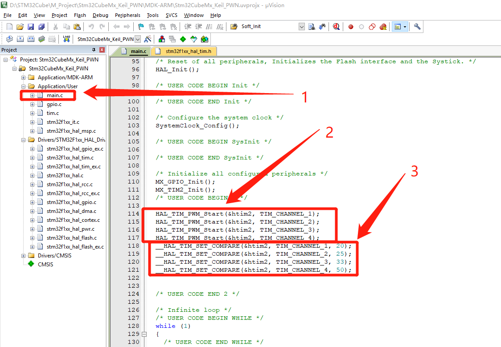
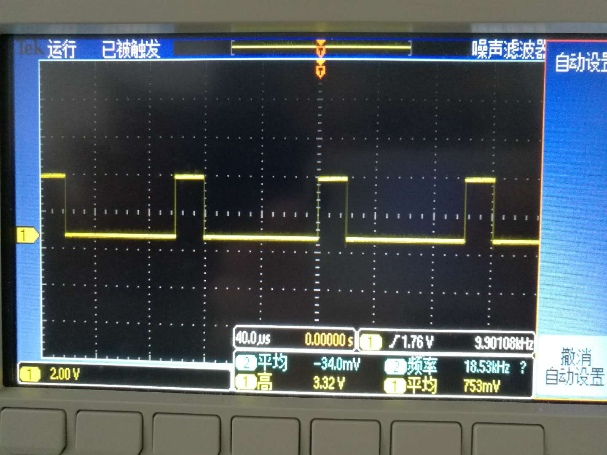
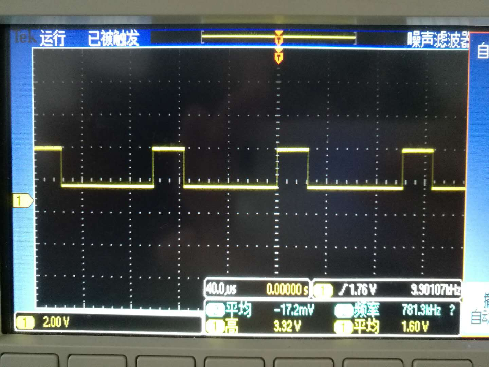
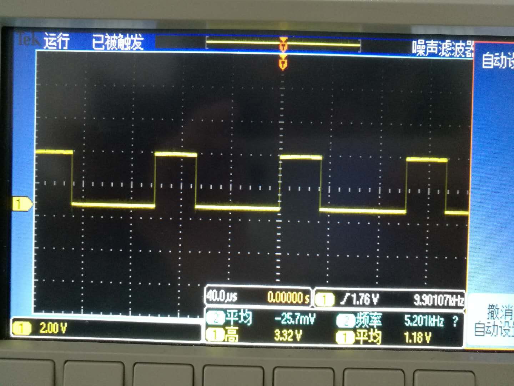
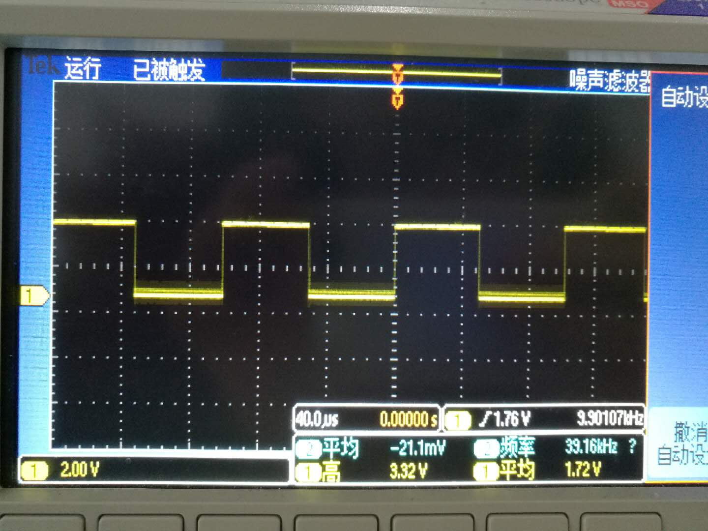

# STM32CubeMX开发之路—7输出PWM

<div align=center><a href="https://iotxiaohu.gitee.io/">
    
</a></div>

---

## 运行环境

| 工具          | 版本     | 说明       |
| ------------- | -------- | ---------- |
| `STM32CubeMX` | `V5.0.0` | `建议相同` |
| `Keil5`       | `V5.1.5` | `建议相同` |

---

## 简介

本例程主要讲解如何设置PWM这只输出4路PWM信号

---

## STM32CubeMx基本配置

  基础配置过程请参考 [STM32CubeMx(Keil5)开发之路—配置第一个项目](https://blog.csdn.net/weixin_41294615/article/details/85235905)

---

## STM32CubeMx PWM配置

1——点击TIM2进行设置
2——4个Channel都选择 "PWM Generation CHx" 选项
3——预分频值填72-1即71
4——自动重装载值设置为100-1也就是99
5——会看到相应的输出管脚PA0——PA3就是PWM的输出管脚

$$PWM波的频率 =  \frac{时钟频率}{(预分频+1)*(自动重装载值+1)}=\frac{72000000}{72*100}=10000(HZ)$$

---

$$每秒计数的个数= \frac{时钟频率}{(预分频+1)}=\frac{72000000}{72} = 1000000(个),也就说计一个数要1us$$

---

$$(自动重装载值+1)=100(个),也就是说计完一组就要100*1us=100us,即10000(HZ)$$

---



---

## 代码修改

---
1——选择main.c文件
2——在USER CODE中添加如下代码，打开PWM定时器
3——在USER CODE中接着添加如下代码，设置占空比
占空比分别为:PA1——20/100 ，PA2——25/100， PA3——33/100， PA4——50/100

```c
  /* USER CODE BEGIN 2 */

  HAL_TIM_PWM_Start(&htim2, TIM_CHANNEL_1);
  HAL_TIM_PWM_Start(&htim2, TIM_CHANNEL_2);
  HAL_TIM_PWM_Start(&htim2, TIM_CHANNEL_3);
  HAL_TIM_PWM_Start(&htim2, TIM_CHANNEL_4);

  __HAL_TIM_SET_COMPARE(&htim2, TIM_CHANNEL_1, 20);
  __HAL_TIM_SET_COMPARE(&htim2, TIM_CHANNEL_2, 25);
  __HAL_TIM_SET_COMPARE(&htim2, TIM_CHANNEL_3, 33);
  __HAL_TIM_SET_COMPARE(&htim2, TIM_CHANNEL_4, 50);


  /* USER CODE END 2 */
```



---

烧录代码后用示波器测试PA0——PA3这四个管脚，正确的话会看到如下波形

|  |  |  |  |
| ------------ | ------------ | ------------ | ------------ |

---
