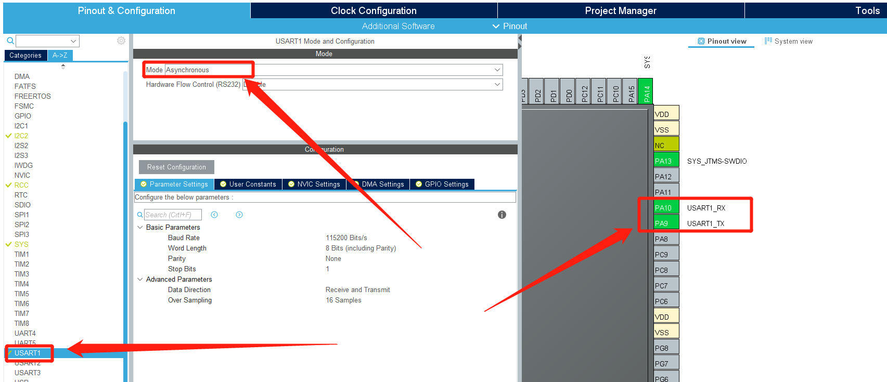

# STM32CubeMx开发之路 --- 使用ADC和DAC

---

<div align=center><a href="https://gitee.com/iotxiaohu/blog">
    
</a></div>

---

## 运行环境

* `Windows10`
* `STM32CubeMX` `Version 5.2.0`
* `Keil5(MDK5)` `Version 5.28.0.0`
* `芯片` `STM32F103ZE`

---

## 简介

本例程主要讲解如何使用ADC和DAC

---

## STM32CubeMx基本配置

  基础配置过程请参考 `STM32CubeMx(Keil5)开发之路—配置第一个项目`

---

## CubeMX配置

* ### 调试打印配置



* ### ADC配置

* 1.选择ADC
* 2.选择IN0
* 3.选择好了会发现相应的输入管脚


* ### DAC配置
* 1.选择DAC
* 2.选择OUT1 Configuration
* 3.选择好了会发现相应的输出管脚


---

## 代码修改

* **添加代码**(讲解写在代码里面)

```
/* USER CODE BEGIN 0 */

/* 使用printf功能 */
int fputc(int ch, FILE *f)
{
    HAL_UART_Transmit(&huart1, (uint8_t *)&ch,1, 0xFFFF);
    return ch;
}

/* USER CODE END 0 */
```

* main函数

```
int main(void)
{
  /* USER CODE BEGIN 1 */

  /* USER CODE END 1 */


  /* MCU Configuration--------------------------------------------------------*/

  /* Reset of all peripherals, Initializes the Flash interface and the Systick. */
  HAL_Init();

  /* USER CODE BEGIN Init */

  /* USER CODE END Init */

  /* Configure the system clock */
  SystemClock_Config();

  /* USER CODE BEGIN SysInit */

  /* USER CODE END SysInit */

  /* Initialize all configured peripherals */
  MX_GPIO_Init();
  MX_USART1_UART_Init();
  MX_ADC1_Init();
  MX_DAC_Init();
  /* USER CODE BEGIN 2 */

  /* USER CODE END 2 */

  /* Infinite loop */
  /* USER CODE BEGIN WHILE */
  while (1)
  {
	static double SetVcc = 0;
	static uint16_t ReadVcc;
	SetVcc = SetVcc + 0.5;
	if(SetVcc > 3.3)
	{
		SetVcc = 0;
	}

	/* 设置DAC输出的电压 */
	HAL_DAC_SetValue(&hdac, DAC_CHANNEL_1, DAC_ALIGN_12B_R, (SetVcc / 3.3 * 4096));
	HAL_DAC_Start(&hdac, DAC_CHANNEL_1);

	/* 打印 */
	printf("PA0 set voltage:%.4f\n", SetVcc);

    /* USER CODE END WHILE */

    /* USER CODE BEGIN 3 */

	HAL_ADC_Start(&hadc1);
	HAL_ADC_PollForConversion(&hadc1, 50);
	if(HAL_IS_BIT_SET(HAL_ADC_GetState(&hadc1), HAL_ADC_STATE_REG_EOC))
	{
		/* 读取ADC的电压 */
		ReadVcc = HAL_ADC_GetValue(&hadc1);

		/* 打印 */
		printf("PA4 read voltage:%.4f\n", ReadVcc * 3.3f / 4096);
	}
	HAL_Delay(1000);
  }
  /* USER CODE END 3 */
}
```
## 测试运行

* 这儿我们将PA0和PA4管脚短接起来,ADC读取我们DAC的输出
* 烧录程序,复位之后,使用串口调试助手查看打印信息
* 发现设置的值和读取到的值相差很小说明测试没问题


## 源码

[STM32F103ze_ADC_DAC.rar](https://gitee.com/iotxiaohu/Leaf_Public_Code/blob/master/STM32_CubeMX/STM32F103ze_ADC_DAC.rar)

## 小结

很多地方都会用到`ADC`和`DAC`,比如`音频`,`温度计`,`示波器`等

---

## 源代码获取

**<font size=5 color=#ff0000> 源码已放到码云 ! ! ! ( 请点击文首链接进入仓库 ) </font>**

---

## 备注

<div align=center><a href="https://gitee.com/iotxiaohu/blog">
    
</a></div>

---
