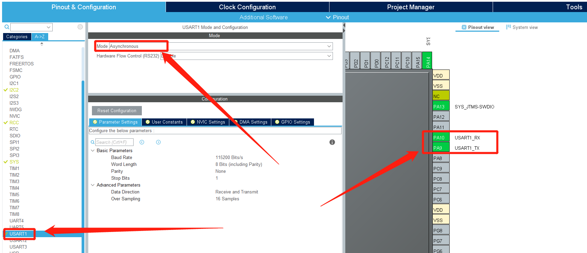
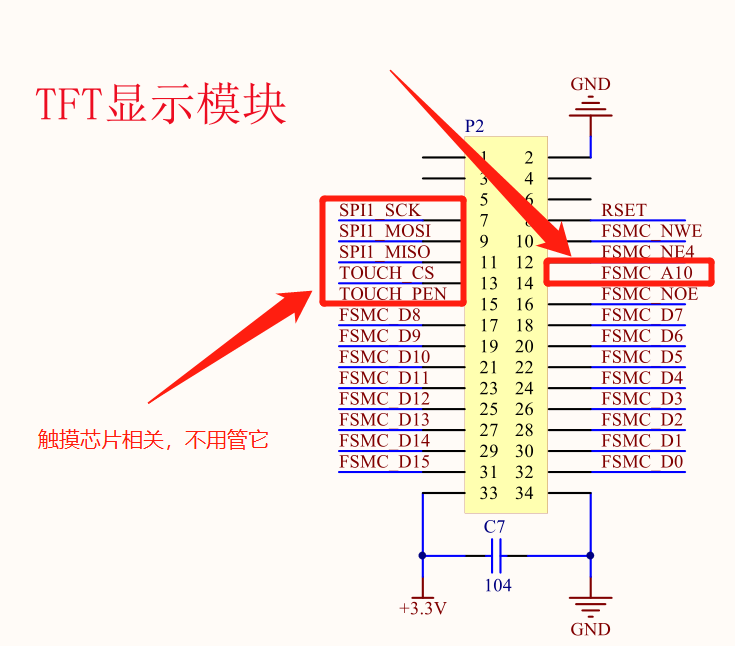
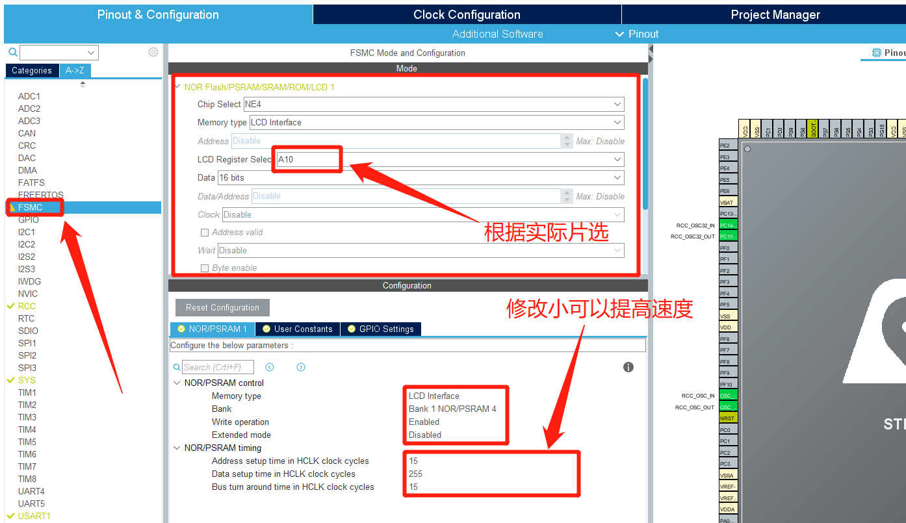
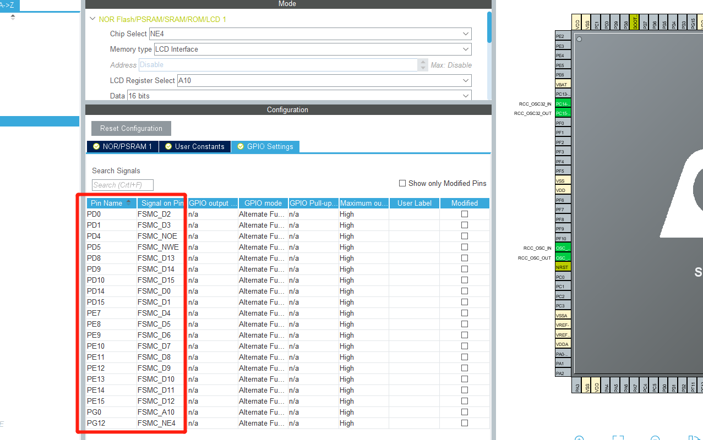
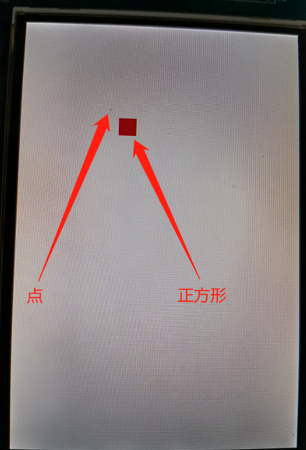

# STM32CubeMx开发之路—11使用FSMC操作LCD

---

<div align=center><a href="https://gitee.com/iotxiaohu/blog">
    
</a></div>

---

## 运行环境

* `Windows10`
* `STM32CubeMX` `Version 5.2.0`
* `Keil5(MDK5)` `Version 5.28.0.0`

---

## 简介

本例程主要讲解如何使用FSMC操作LCD

---

## STM32CubeMx基本配置

  基础配置过程请参考 `STM32CubeMx(Keil5)开发之路—配置第一个项目`

---

## CubeMX配置

* ### 调试打印配置



* ### FSMC配置

* 根据原理图可知需要的配置的管脚
* SPI是与触摸芯片相关的,先不用管
* A10是用来作为片选的,记住,配置的时候需要用到



* 设置FSMC
* 选择专门的LCD接口
* 选择上面原理图的A10
* 设置下面的参数,如果嫌太慢就把`NOR/PSRAM timing`设置小一点


* 对应管脚和原理图一致，原理图部分就不展示出来了


---

## 代码修改

* **添加代码**(讲解写在代码里面)

```
/* USER CODE BEGIN 0 */

/* 使用printf功能 */
int fputc(int ch, FILE *f)
{
    HAL_UART_Transmit(&huart1, (uint8_t *)&ch,1, 0xFFFF);
    return ch;
}

#define TFT_XMAX 319        //设置TFT屏的x
#define TFT_YMAX 479        //设置TFT屏的y

#define WHITE          0xFFFF
#define BLACK          0x0000
#define BLUE           0x001F
#define RED            0xF800
#define MAGENTA        0xF81F
#define GREEN          0x07E0
#define CYAN           0x7FFF
#define YELLOW         0xFFE0         //定义颜色的宏


/*********************************************************************************
 * 不同的LCD的资料文件里面都有各自初始化的命令和参数，请根据各自的参数进行初始化，
 * 我这边使用的是TFTHX8357，初始化是这样的。你们的可能会不同
 * 详细的资料我就不仔细说明了，有兴趣可以私聊
 *********************************************************************************
 */

/* 写命令
 * 一些人可能在这儿会懵，这里主要是使用指针对地址进行操作，这里是C语言的知识
 * FSMC对把显示屏当做SRAM在操作，所以采用的是对地址的操作， 下面读命令也是一样
 */
void TFT_WriteCmd(uint16_t cmd)
{
    *(__IO uint16_t *)(0x6C0007FE) = cmd;
}

/* 写数据 */
void TFT_WriteData(uint16_t dat)
{
    *(__IO uint16_t *)(0x6C000800) = dat;
}

/* 初始化TFT */
void TFT_Init(void)
{
    uint16_t i;

    TFT_WriteCmd(0xE9);
    TFT_WriteData(0x20);

    TFT_WriteCmd(0x11); //Exit Sleep
    for(i=500; i>0; i--);

    TFT_WriteCmd(0x3A);
    TFT_WriteData(0x55);  //16Bit colors

    TFT_WriteCmd(0xD1);
    TFT_WriteData(0x00);
    TFT_WriteData(0x65); //调试此值改善水纹
    TFT_WriteData(0x1F);

    TFT_WriteCmd(0xD0);
    TFT_WriteData(0x07);
    TFT_WriteData(0x07);
    TFT_WriteData(0x80);

    TFT_WriteCmd(0x36);      //Set_address_mode
    TFT_WriteData(0x48);       //48

    TFT_WriteCmd(0xC1);
    TFT_WriteData(0x10);
    TFT_WriteData(0x10);
    TFT_WriteData(0x02);
    TFT_WriteData(0x02);

    TFT_WriteCmd(0xC0); //Set Default Gamma
    TFT_WriteData(0x00);
    TFT_WriteData(0x35);
    TFT_WriteData(0x00);
    TFT_WriteData(0x00);
    TFT_WriteData(0x01);
    TFT_WriteData(0x02);

    TFT_WriteCmd(0xC4);
    TFT_WriteData(0x03);

    TFT_WriteCmd(0xC5); //Set frame rate
    TFT_WriteData(0x01);

    TFT_WriteCmd(0xD2); //power setting
    TFT_WriteData(0x01);
    TFT_WriteData(0x22);

    TFT_WriteCmd(0xE7);
    TFT_WriteData(0x38);

    TFT_WriteCmd(0xF3);
    TFT_WriteData(0x08);
    TFT_WriteData(0x12);
    TFT_WriteData(0x12);
    TFT_WriteData(0x08);

    TFT_WriteCmd(0xC8); //Set Gamma
    TFT_WriteData(0x01);
    TFT_WriteData(0x52);
    TFT_WriteData(0x37);
    TFT_WriteData(0x10);
    TFT_WriteData(0x0d);
    TFT_WriteData(0x01);
    TFT_WriteData(0x04);
    TFT_WriteData(0x51);
    TFT_WriteData(0x77);
    TFT_WriteData(0x01);
    TFT_WriteData(0x01);
    TFT_WriteData(0x0d);
    TFT_WriteData(0x08);
    TFT_WriteData(0x80);
    TFT_WriteData(0x00);

    TFT_WriteCmd(0x29); //display on

}

/* 设置读写的范围 */
void TFT_SetWindow(uint16_t xStart, uint16_t yStart, uint16_t xEnd, uint16_t yEnd)
{
    TFT_WriteCmd(0x2A);

    TFT_WriteData(xStart>>8);
    TFT_WriteData(xStart&0XFF);
    TFT_WriteData(xEnd>>8);
    TFT_WriteData(xEnd&0XFF);

    TFT_WriteCmd(0x2b);
    TFT_WriteData(yStart>>8);
    TFT_WriteData(yStart&0XFF);
    TFT_WriteData(yEnd>>8);
    TFT_WriteData(yEnd&0XFF);
    TFT_WriteCmd(0x2c);
}

/* 清屏函数 */
void TFT_ClearScreen(uint16_t color)
{
    uint16_t i, j ;

    TFT_SetWindow(0, 0, TFT_XMAX, TFT_YMAX);     //作用区域
    for(i=0; i<TFT_XMAX+1; i++)
    {
        for (j=0; j<TFT_YMAX+1; j++)
        {
            TFT_WriteData(color);
        }
    }
}

/* USER CODE END 0 */
```

* main函数

```
int main(void)
{
  /* USER CODE BEGIN 1 */

  /* USER CODE END 1 */


  /* MCU Configuration--------------------------------------------------------*/

  /* Reset of all peripherals, Initializes the Flash interface and the Systick. */
  HAL_Init();

  /* USER CODE BEGIN Init */

  /* USER CODE END Init */

  /* Configure the system clock */
  SystemClock_Config();

  /* USER CODE BEGIN SysInit */

  /* USER CODE END SysInit */

  /* Initialize all configured peripherals */
  MX_GPIO_Init();
  MX_FSMC_Init();
  MX_USART1_UART_Init();
  /* USER CODE BEGIN 2 */

    TFT_Init();
    TFT_ClearScreen(RED);
    TFT_ClearScreen(WHITE);

    /* 画一个点:坐标(100,100),颜色:黑色 */
    TFT_SetWindow(100,100,100,100);                    // 设置操作的区域
    TFT_WriteData(BLACK);

    /* 画一个正方形:坐标(110,110,129,129),颜色:红色 */
    TFT_SetWindow(110,110,129,129);
      for(int i=110; i<130; i++)
    {
        for (int j=110; j<130; j++)
        {
            TFT_WriteData(RED);
        }
    }


  /* USER CODE END 2 */

  /* Infinite loop */
  /* USER CODE BEGIN WHILE */
  while (1)
  {
    /* USER CODE END WHILE */

    /* USER CODE BEGIN 3 */
  }
  /* USER CODE END 3 */
}
```

---

## 运行结果

* 烧录进去,复位之后,查看显示屏
* 如果输出我的类似,说明测试成功



---

## 小结

如果使用GUI库，就会用到，画点，划线等函数接口，如果使用触摸屏还会用到读点的函数，结合GUI使用屏幕才是最终的选择。

---

## 源代码获取

**<font size=5 color=#ff0000> 源码已放到码云 ! ! ! ( 请点击文首链接进入仓库 ) </font>**

---

## 备注

<div align=center><a href="https://gitee.com/iotxiaohu/blog">
    
</a></div>

---
