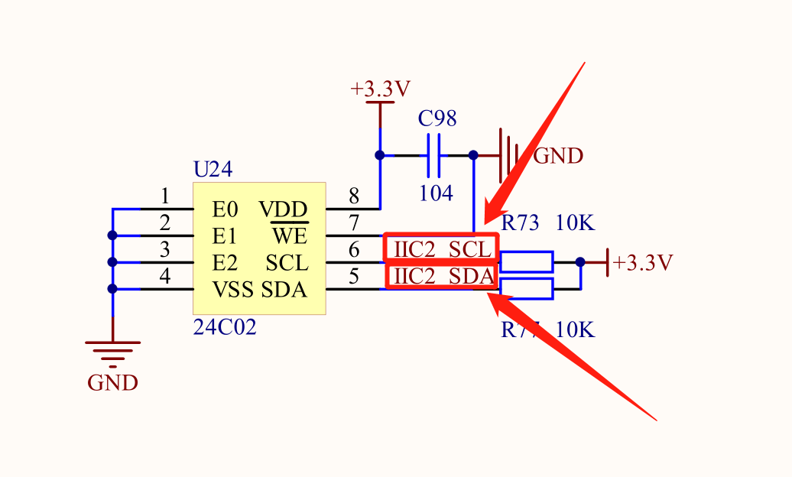
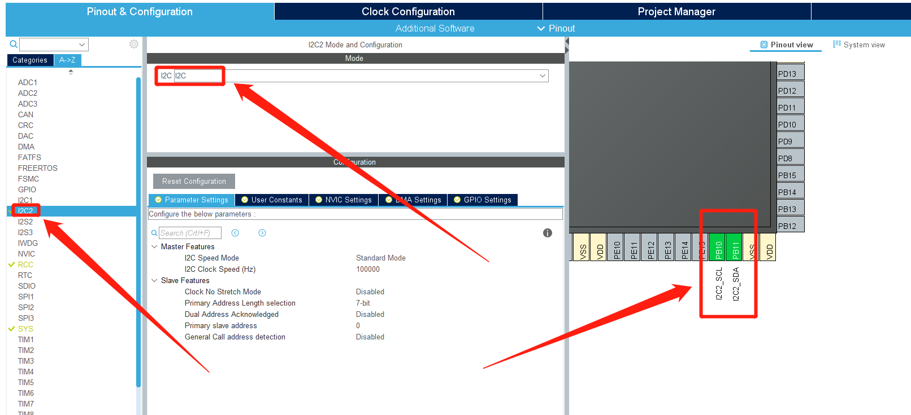
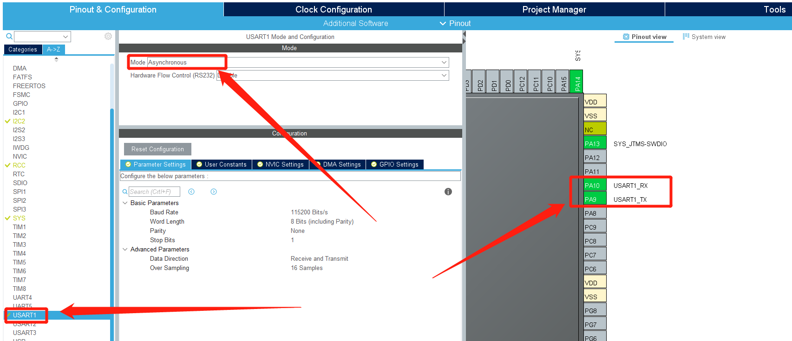
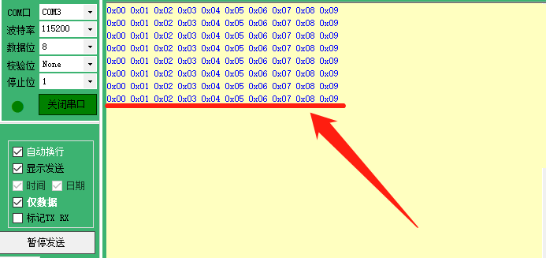

# STM32CubeMx开发之路—10使用IIC读写24C02

---

<div align=center><a href="https://gitee.com/iotxiaohu/blog">
    
</a></div>

---

## 附件

**<font size=5 color=#ff0000> 源码已放到码云 ! ! ! ( 请点击文首链接进入仓库 ) </font>**

---

## 运行环境

* `Windows10`
* `STM32CubeMX` `Version 5.2.0`
* `Keil5(MDK5)` `Version 5.28.0.0`

---

## 简介

本例程主要讲解如何使用硬件IIC读写24C02

---

## STM32CubeMx基本配置

  基础配置过程请参考 `STM32CubeMx(Keil5)开发之路—配置第一个项目`

---

## CubeMX配置

* ### IIC配置

* 根据原理图可知需要的配置的是IIC2





* ### 调试打印配置



---

## 代码修改

* **添加代码**(讲解写在代码里面)

```
/* Private user code ---------------------------------------------------------*/
/* USER CODE BEGIN 0 */

#define EE_TYPE  255               //类型
#define ADDR_24LCxx_Write  0xA0    //写指令IIC地址
#define ADDR_24LCxx_Read   0xA1    //读指令IIC地址
#define BufferSize 10              //读写大小(注意不要设置太大)

uint8_t WriteBuffer[BufferSize] = {0,1,2,3,4,5,6,7,8,9};  //需要写的数据在WriteBuffer当中
uint8_t ReadBuffer[BufferSize];                           //读出来的数据放进ReadBuffer当中

int i = 0;

/* 调试打印 */
int fputc(int ch, FILE *f)
{
    HAL_UART_Transmit(&huart1, (uint8_t *)&ch,1, 0xFFFF);
    return ch;
}

/* USER CODE END 0 */
```

* main函数

```
int main(void)
{
  /* USER CODE BEGIN 1 */

  /* USER CODE END 1 */


  /* MCU Configuration--------------------------------------------------------*/

  /* Reset of all peripherals, Initializes the Flash interface and the Systick. */
  HAL_Init();

  /* USER CODE BEGIN Init */

  /* USER CODE END Init */

  /* Configure the system clock */
  SystemClock_Config();

  /* USER CODE BEGIN SysInit */

  /* USER CODE END SysInit */

  /* Initialize all configured peripherals */
  MX_GPIO_Init();
  MX_USART1_UART_Init();
  MX_I2C2_Init();

  /* USER CODE BEGIN 2 */

  /* 写数据 */
  HAL_Delay(5);
  if(HAL_I2C_Mem_Write(&hi2c2, ADDR_24LCxx_Write, 0, I2C_MEMADD_SIZE_8BIT,WriteBuffer,BufferSize, 0x10) != HAL_OK)
  {
    printf("Write fail!\n");
  }

  /* 读数据 */
  HAL_Delay(5);
  if(HAL_I2C_Mem_Read(&hi2c2, ADDR_24LCxx_Read, 0, I2C_MEMADD_SIZE_8BIT,ReadBuffer,BufferSize, 0x10) != HAL_OK)
  {
    printf("Read fail!\n");
  }

  /* 测试输出 */
  for(i=0; i<BufferSize; i++)
  {
    printf("0x%02X ",ReadBuffer[i]);
  }


  /* USER CODE END 2 */

  /* Infinite loop */
  /* USER CODE BEGIN WHILE */
  while (1)
  {
    /* USER CODE END WHILE */

    /* USER CODE BEGIN 3 */
  }
  /* USER CODE END 3 */
}
```

## 运行结果

* 烧录进去,用串口调试助手
* 发现输出的就是我们存进的数据,说明测试成功



---

## 小结

IIC在实际应用过程非常广泛,是嵌入式需了解的协议之一,所以一定要好好理解!

---

## 备注

<div align=center><a href="https://gitee.com/iotxiaohu/blog">
    
</a></div>

---
