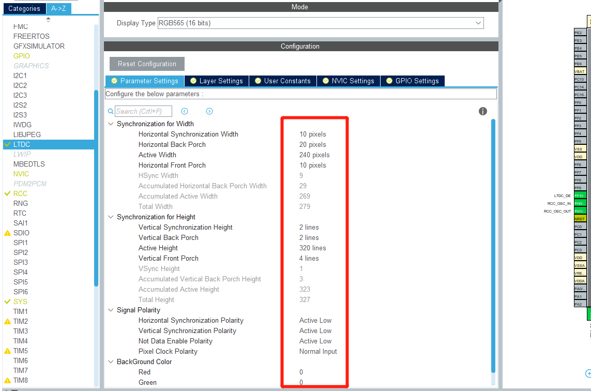

# STM32CubeMx开发之路—LTDC驱动STM32F429I-Discover上的显示屏

---

<div align=center><a href="https://gitee.com/iotxiaohu/blog">
    
</a></div>

---

## 附件

**<font size=5 color=#ff0000> 源码已放到码云 ! ! ! ( 请点击文首链接进入仓库 ) </font>**

---

## 运行环境

* `Windows10`
* `STM32CubeMX` `Version 5.4.0`
* `Keil5(MDK5)` `Version 5.28.0.0`
* `开发板` `STM32F429I-Discover`

---

## 简介

本例程主要讲解如何自己配置实现官方的例程效果

---

## 先看官方例程的效果


---

## 分析官方例程的代码

用STM32CubeMX的都能在库党章找到官方的代码, 我的路径是在下面这个位置

```
D:\STM32Cube\M_Surpport\STM32Cube_FW_F4_V1.24.2\Projects\STM32F429I-Discovery\Examples\LTDC\LTDC_Display_2Layers\MDK-ARM
```
找不到的可能没有下载软件包或者放位置不对,自己慢慢找就好了,我先认为你们都已经找到了

### 分析代码

主函数`main.c`, 为了方便, 方便大家观看, 我直接截图在图中做解释


#### 分析`LCD_Config()`


#### 分析`ili9341_Init()`


官方例程的思路理清楚了就可以开始自己的配置编写了

---

## 开始自己配置代码

### 配置

#### 选择芯片


#### 选择时钟


#### 选择烧录方式


#### 选择LTDC


#### 配置时钟树


#### 设置LTDC的Parameter Settings



#### 设置LTDC的Layer Settings


#### 打开全局中断


#### 配置管脚

* 因为默认的管脚和STM32F429I-Discove的实际管脚不符合,需要根据原理图配置管脚,为了节约时间我已经根据原理图,把管脚分配好了, 大家只需要跟我一样就行了


#### 配置SPI5

* 为什么配置SPI5?
* 因为看原理图, 实际是接在SPI5上面的, 为了节约时间, 我先告诉大家, 如果有兴趣自己可以翻阅原理图


#### 设置PC2为使能管脚

* 配置为输出模式, 给一个标签`LCD_NCS`


#### PD13和PD12为读写控制管脚

* 也配置为输出模式, 给定标签`LCD_WRX`,`LCD_RDX`


#### 保存配置

* 修改项目名
* 选择编译环境
* 生成代码


## 选择时钟

## 修改代码

* 在原文件中新建文件夹取名`m_app`


* 添加这几个文件


* 工程中加入刚刚文件夹里面的文件, 并且在Option中添加路径, 具体的自己去百度


* 主函数我的例程和官方的差不多,我下面贴出来关键的一些代码

```
/* Includes ------------------------------------------------------------------*/
#include "main.h"

/* Private includes ----------------------------------------------------------*/
/* USER CODE BEGIN Includes */
#include "st_logo1.h"
#include "st_logo2.h"
/* USER CODE END Includes */

/* Private typedef -----------------------------------------------------------*/
/* USER CODE BEGIN PTD */
#include "ili9341.h"
/* USER CODE END PTD */

/* Private define ------------------------------------------------------------*/
/* USER CODE BEGIN PD */
/* USER CODE END PD */

/* Private macro -------------------------------------------------------------*/
/* USER CODE BEGIN PM */

/* USER CODE END PM */

/* Private variables ---------------------------------------------------------*/
LTDC_HandleTypeDef hltdc;

SPI_HandleTypeDef hspi5;

/* USER CODE BEGIN PV */

/* USER CODE END PV */

/* Private function prototypes -----------------------------------------------*/
void SystemClock_Config(void);
static void MX_GPIO_Init(void);
static void MX_LTDC_Init(void);
static void MX_SPI5_Init(void);
/* USER CODE BEGIN PFP */

/* USER CODE END PFP */

/* Private user code ---------------------------------------------------------*/
/* USER CODE BEGIN 0 */

__IO uint32_t ReloadFlag = 0;


/* 计算新图片的位置 */
static void PicturesPosition(uint32_t* x1, uint32_t* y1, uint32_t* x2, uint32_t* y2, uint32_t index)
{
  /* picture1 position */
  *x1 = 0;
  *y1 = index*4;

  /* picture2 position */
  *x2 = 0;
  *y2 = 160 - index*4;
}


/* Reload Event callback */
void HAL_LTDC_ReloadEventCallback(LTDC_HandleTypeDef *hltdc)
{
  ReloadFlag = 1;
}


/* SPI5 Error */
void SPI5_Error(void)
{
  HAL_SPI_DeInit(&hspi5);
  MX_SPI5_Init();
}
/* USER CODE END 0 */

/**
  * @brief  The application entry point.
  * @retval int
  */
int main(void)
{
  /* USER CODE BEGIN 1 */

  /* USER CODE END 1 */


  /* MCU Configuration--------------------------------------------------------*/

  /* Reset of all peripherals, Initializes the Flash interface and the Systick. */
  HAL_Init();

  /* USER CODE BEGIN Init */

  /* USER CODE END Init */

  /* Configure the system clock */
  SystemClock_Config();

  /* USER CODE BEGIN SysInit */

  /* USER CODE END SysInit */

  /* Initialize all configured peripherals */
  MX_GPIO_Init();
  MX_LTDC_Init();
  MX_SPI5_Init();
  /* USER CODE BEGIN 2 */
  ili9341_Init();
  /* USER CODE END 2 */

  /* Infinite loop */
  /* USER CODE BEGIN WHILE */
  while (1)
  {
  static uint32_t Xpos1 = 0;
  static uint32_t Xpos2 = 0;
  static uint32_t Ypos1 = 0;
  static uint32_t Ypos2 = 160;
  static uint32_t index = 0;
    /* USER CODE END WHILE */

    /* USER CODE BEGIN 3 */
  for(index = 0; index < 40; index++)
  {
    PicturesPosition(&Xpos1, &Ypos1, &Xpos2, &Ypos2, (index+1));//计算新图片的位置
    HAL_LTDC_SetWindowPosition_NoReload(&hltdc, Xpos1, Ypos1, 0);//重新配置layer1位置而无需重新加载
    HAL_LTDC_SetWindowPosition_NoReload(&hltdc, Xpos2, Ypos2, 1);//重新配置layer2位置而无需重新加载

    ReloadFlag = 0;
    HAL_LTDC_Reload(&hltdc,LTDC_SRCR_VBR);  //Reload

    while(ReloadFlag == 0);//Wait for reload to complete
  }
  HAL_Delay(500);

  for(index = 0; index < 40; index++)
  {
    PicturesPosition(&Xpos2, &Ypos2, &Xpos1, &Ypos1, (index+1));
    HAL_LTDC_SetWindowPosition_NoReload(&hltdc, Xpos1, Ypos1, 0);
    HAL_LTDC_SetWindowPosition_NoReload(&hltdc, Xpos2, Ypos2, 1);

    ReloadFlag = 0;
    HAL_LTDC_Reload(&hltdc,LTDC_SRCR_VBR);
    while(ReloadFlag == 0);
  }
  HAL_Delay(500);
  }
  /* USER CODE END 3 */
}
```

* 运行效果和官方代码的效果差不多, 为了方便大家学习, 给大家提供一下源码

---

## 备注

<div align=center><a href="https://gitee.com/iotxiaohu/blog">
    
</a></div>

---
