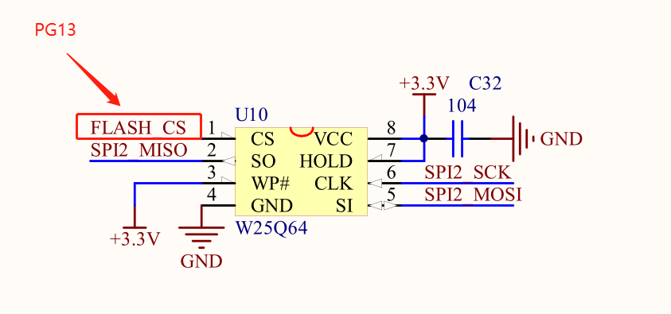
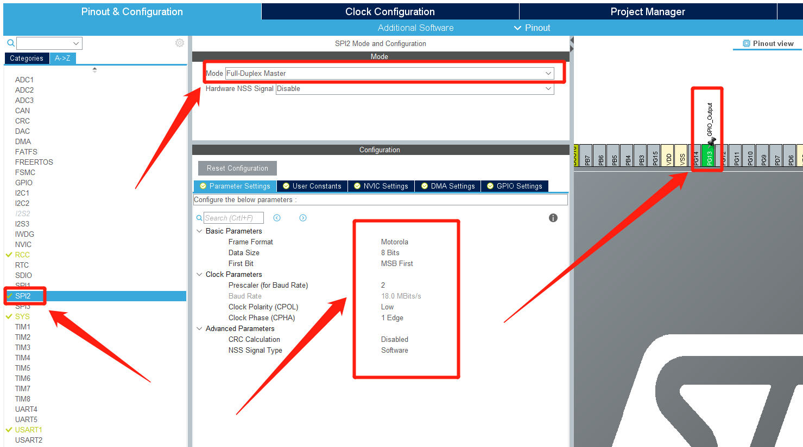
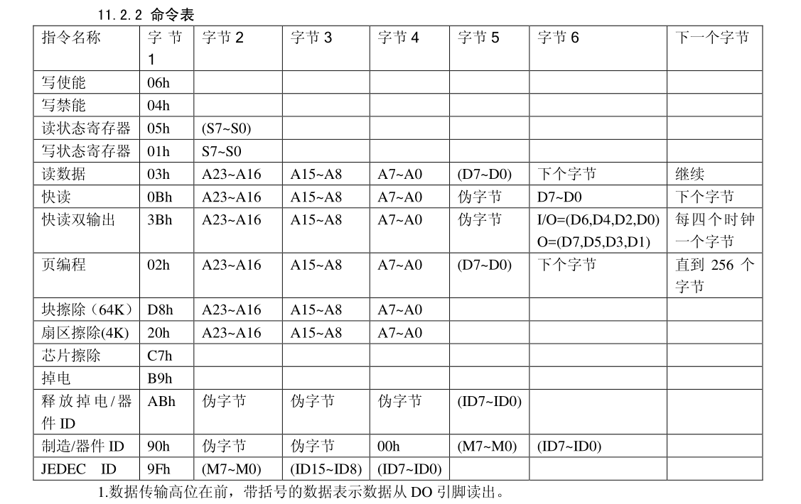
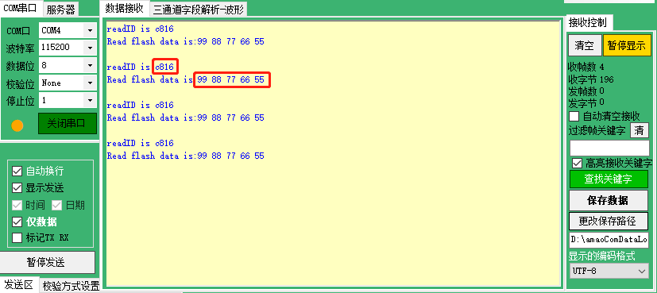

# STM32CubeMx开发之路—13使用SPI读写W25Q64

---

<div align=center><a href="https://gitee.com/iotxiaohu/blog">
    
</a></div>

---

## 附件

**<font size=5 color=#ff0000> 源码已放到码云 ! ! ! ( 请点击文首链接进入仓库 ) </font>**

---

## 运行环境

* `Windows10`
* `STM32CubeMX` `Version 5.2.0`
* `Keil5(MDK5)` `Version 5.28.0.0`

---

## 简介

本例程主要讲解如何使用硬件IIC读写24C02

---

## STM32CubeMx基本配置

  基础配置过程请参考 `STM32CubeMx开发之路—配置第一个项目`

---

## 使用`printf`功能

  重定向`printf`的过程请参考 `STM32CubeMx开发之路—3发送USART数据和printf重定向`

---

## CubeMX配置

* ### SPI配置

* 根据原理图可知需要的配置的是`SPI2`
* 同时配置CS引脚, 本例CS引脚是`PG13`





## 代码修改

* 查看W25Q64的手册(后面配置时需要用的命令都在里面)



---

* **封装功能函数的代码**(讲解写在代码里面)


```
/* W25Q64的指令 */
uint8_t w25x_read_id = 0x90;                    // 读ID
uint8_t m_addr[3]    = {0,0,0};                 // 测试地址0x000000
uint8_t check_addr   = 0x05;                    // 检查线路是否繁忙
uint8_t enable_write = 0x06;                    // 使能了才能改变芯片数据
uint8_t erase_addr   = 0x20;                    // 擦除命令
uint8_t write_addr   = 0x02;                    // 写数据命令
uint8_t read_addr    = 0x03;                    // 读数据命令

/* 读ID */
void ReadID(void)
{
    uint8_t temp_ID[5] = {0,0,0,0,0};                        // 接收缓存

    HAL_GPIO_WritePin(GPIOG, GPIO_PIN_13, GPIO_PIN_RESET);    // 使能CS
    HAL_SPI_Transmit(&hspi2, &w25x_read_id, 1, 100);        // 读ID发送指令
    HAL_SPI_Receive(&hspi2, temp_ID, 5, 100);                // 读取ID
    HAL_GPIO_WritePin(GPIOG, GPIO_PIN_13, GPIO_PIN_SET);    // 失能CS

    /* 测试打印 */
    printf("readID is %x%x\n",temp_ID[3],temp_ID[4]);
}

/* 检查是否繁忙 */
void CheckBusy(void)
{
    uint8_t status=1;
    uint32_t timeCount=0;
    do
    {
        timeCount++;
        if(timeCount > 0xEFFFFFFF) //等待超时
        {
            return ;
        }

        HAL_GPIO_WritePin(GPIOG, GPIO_PIN_13, GPIO_PIN_RESET);    // 使能CS
        HAL_SPI_Transmit(&hspi2, &check_addr, 1, 100);            // 发送指令
        HAL_SPI_Receive(&hspi2, &status, 1, 100);                // 读取
        HAL_GPIO_WritePin(GPIOG, GPIO_PIN_13, GPIO_PIN_SET);    // 失能CS

    }while((status&0x01)==0x01);
}


/* 写入数据 */
void ReadData(void)
{
    uint8_t temp_wdata[5] = {0x99,0x88,0x77,0x66,0x55};        // 需要写入的数据

    /* 检查是否繁忙 */
    CheckBusy();

    /* 写使能 */
    HAL_GPIO_WritePin(GPIOG, GPIO_PIN_13, GPIO_PIN_RESET);    // 使能CS
    HAL_SPI_Transmit(&hspi2, &enable_write, 1, 100);        // 发送指令
    HAL_GPIO_WritePin(GPIOG, GPIO_PIN_13, GPIO_PIN_SET);    // 失能CS

    /* 擦除 */
    HAL_GPIO_WritePin(GPIOG, GPIO_PIN_13, GPIO_PIN_RESET);    // 使能CS
    HAL_SPI_Transmit(&hspi2, &erase_addr, 1, 100);            // 发送指令
    HAL_SPI_Transmit(&hspi2, m_addr, 3, 100);                // 发送地址
    HAL_GPIO_WritePin(GPIOG, GPIO_PIN_13, GPIO_PIN_SET);    // 失能CS

    /* 再次检查是否繁忙 */
    CheckBusy();

    /* 写使能 */
    HAL_GPIO_WritePin(GPIOG, GPIO_PIN_13, GPIO_PIN_RESET);    // 使能CS
    HAL_SPI_Transmit(&hspi2, &enable_write, 1, 100);        // 发送指令
    HAL_GPIO_WritePin(GPIOG, GPIO_PIN_13, GPIO_PIN_SET);    // 失能CS

    /* 写数据 */
    HAL_GPIO_WritePin(GPIOG, GPIO_PIN_13, GPIO_PIN_RESET);    // 使能CS
    HAL_SPI_Transmit(&hspi2, &write_addr, 1, 100);            // 发送指令
    HAL_SPI_Transmit(&hspi2, m_addr, 3, 100);                // 地址
    HAL_SPI_Transmit(&hspi2, temp_wdata, 5, 100);            // 写入数据
    HAL_GPIO_WritePin(GPIOG, GPIO_PIN_13, GPIO_PIN_SET);    // 失能CS
}

/* 读取数据 */
void WriteData(void)
{
    uint8_t temp_rdata[5] = {0,0,0,0,0};                    // 读出数据保存的buff


    /* 检查是否繁忙 */
    CheckBusy();

    /* 开始读数据 */
    HAL_GPIO_WritePin(GPIOG, GPIO_PIN_13, GPIO_PIN_RESET);    // 使能CS
    HAL_SPI_Transmit(&hspi2, &read_addr, 1, 100);            // 读发送指令
    HAL_SPI_Transmit(&hspi2, m_addr, 3, 100);                // 地址
    HAL_SPI_Receive(&hspi2, temp_rdata, 5, 100);            // 拿到数据
    HAL_GPIO_WritePin(GPIOG, GPIO_PIN_13, GPIO_PIN_SET);    // 失能CS

    /* 测试打印 */
    printf("Read flash data is:%x %x %x %x %x\n",temp_rdata[0],temp_rdata[1],temp_rdata[2],temp_rdata[3],temp_rdata[4]);
}
```

* main函数

```
int main(void)
{
  /* USER CODE BEGIN 1 */

  /* USER CODE END 1 */


  /* MCU Configuration--------------------------------------------------------*/

  /* Reset of all peripherals, Initializes the Flash interface and the Systick. */
  HAL_Init();

  /* USER CODE BEGIN Init */

  /* USER CODE END Init */

  /* Configure the system clock */
  SystemClock_Config();

  /* USER CODE BEGIN SysInit */

  /* USER CODE END SysInit */

  /* Initialize all configured peripherals */
  MX_GPIO_Init();
  MX_SPI2_Init();
  MX_USART1_UART_Init();
  /* USER CODE BEGIN 2 */

  /* USER CODE END 2 */

  /* Infinite loop */
  /* USER CODE BEGIN WHILE */
  ReadID();
  WriteData();
  ReadData();
  while (1)
  {
    /* USER CODE END WHILE */

    /* USER CODE BEGIN 3 */
  }
  /* USER CODE END 3 */
}
```

## 运行结果

* 烧录进去,用串口调试助手
* 发现输出的就是我们存进的数据,说明测试成功



---

## 小结
SPI在实际应用过程非常广泛,而且速度也是比较快的,也是嵌入式需了解的协议之一,所以一定要好好理解!

---

## 备注

<div align=center><a href="https://gitee.com/iotxiaohu/blog">
    
</a></div>

---
