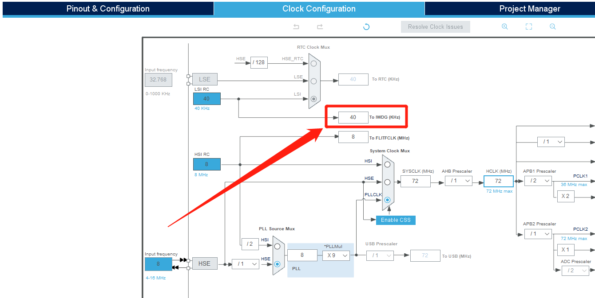
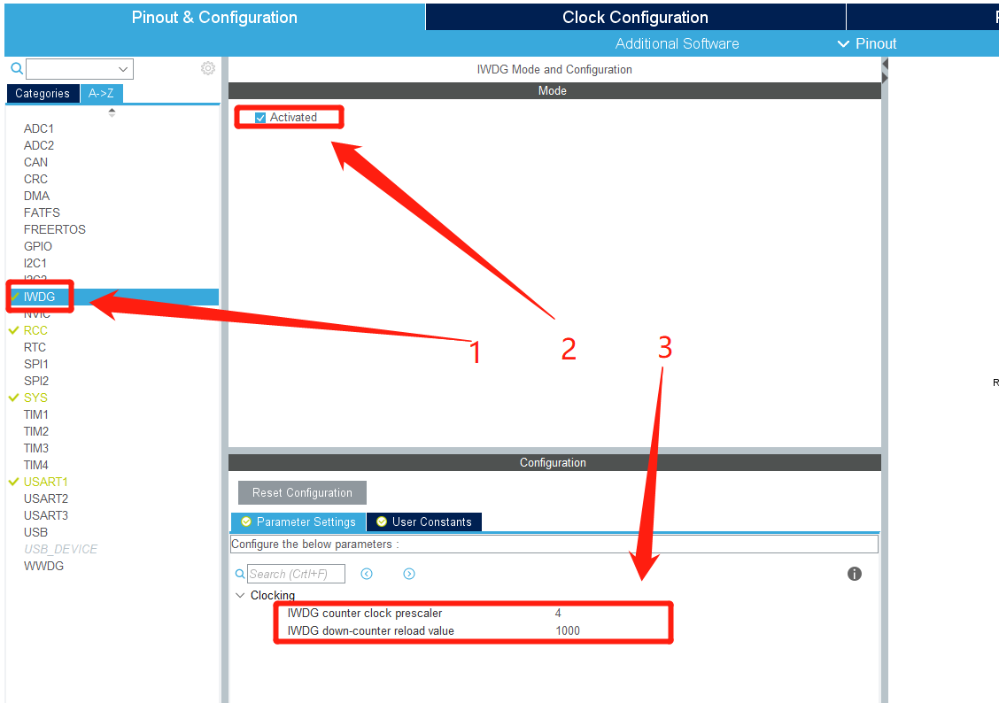
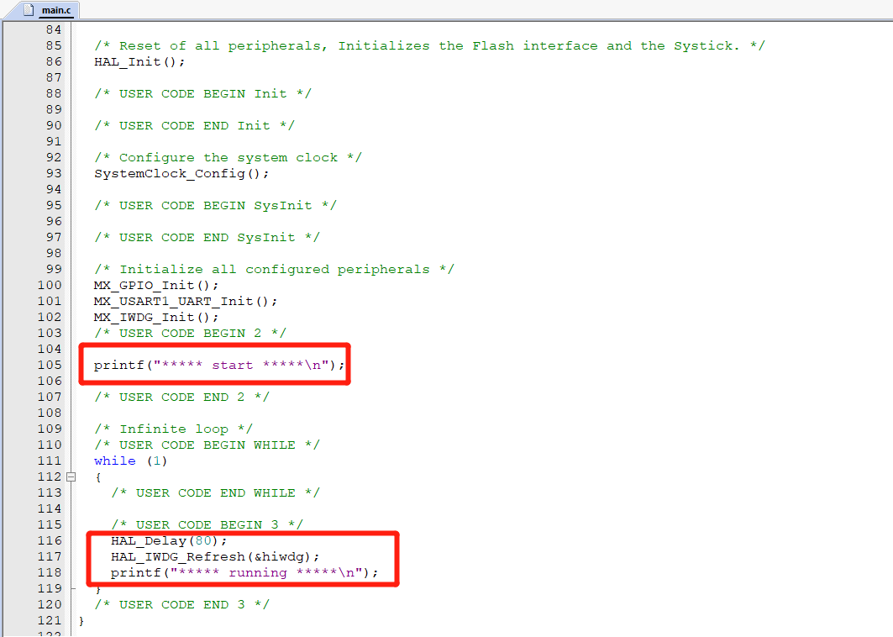
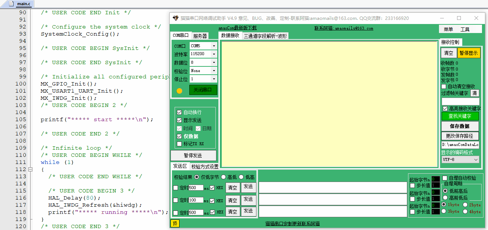
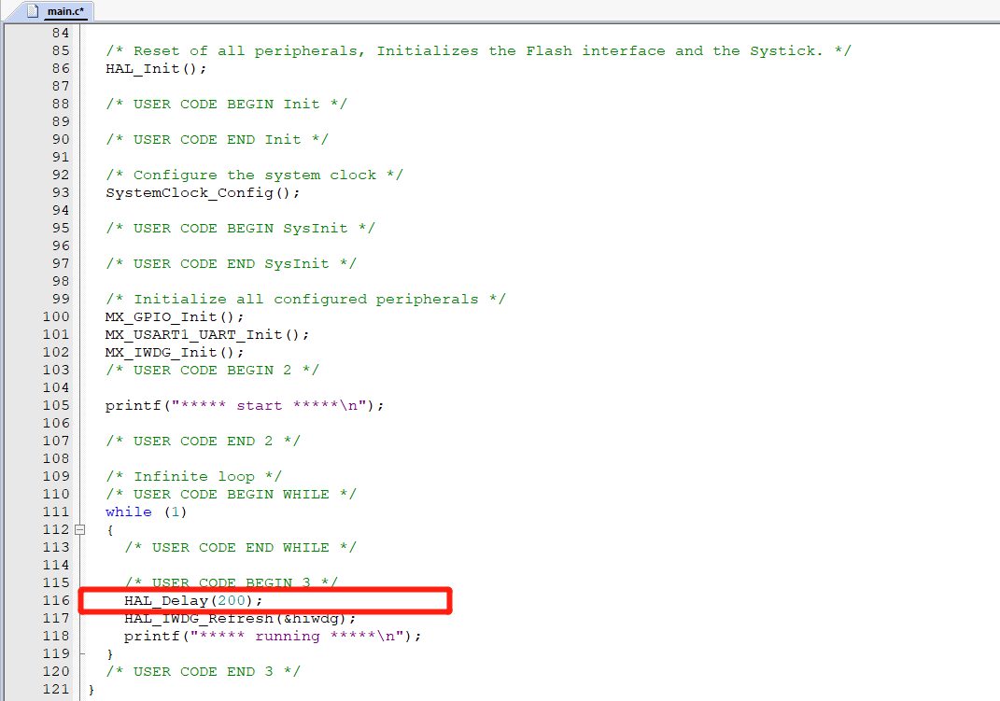
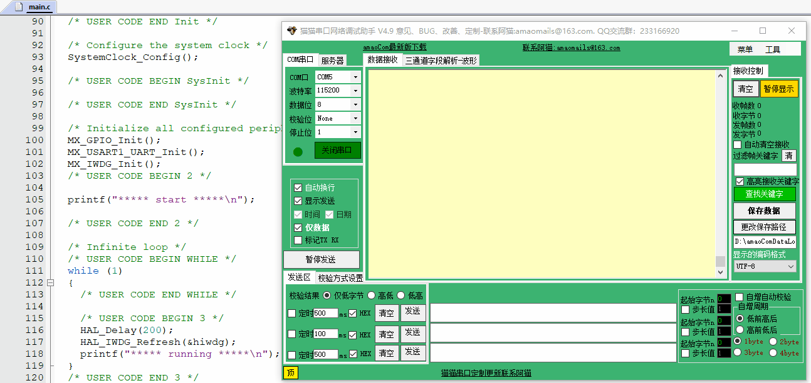

# STM32CubeMx开发之路—独立看门狗

---

---

## 附件

** 源码已放到码云 ! ! ! ( 请点击文首链接进入仓库 ) **

---

## 运行环境

* `Windows10`
* `STM32CubeMX` `Version 5.2.0`
* `Keil5(MDK5)` `Version 5.28.0.0`

---

## 简介

本例程主要讲解如何使用STM32的独立看门狗, 详情请参考官方的参考文档, 本教程教大家如何使用它.

---

## STM32CubeMx基本配置

  基础配置过程请参考 `STM32CubeMx开发之路—配置第一个项目`

---

## 使用`printf`功能

  重定向`printf`的过程请参考 `STM32CubeMx开发之路—3发送USART数据和printf重定向`

## CubeMX配置

### 查看时钟

* 独立看门狗有自己的时钟,如下图:我的时钟是40KHZ

### 修改配置

* `1` 选择独立看门狗
* `2` 选中`Activated`
* `3` 设置分频值`psc`和重装载值`reload`
---

---

$$
计数频率 = \frac{40000}{psc} = \frac{40000}{4} = 10000HZ(记一次数需要时间100us)
$$
$$
不喂狗就会重启的时间 = 记一次数需要时间 * reload = 100us * 1000 = 100ms
$$

---

## 代码修改

* **喂狗时间80ms(低于100ms)**

* **运行结果(运行正常)**

---
* **喂狗时间200ms(高于100ms)**

* **运行结果(无限重启)**

---

## 备注

---
