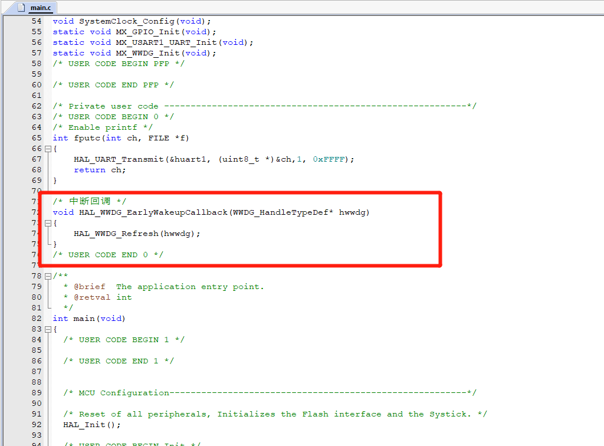

# STM32CubeMx开发之路—窗口看门狗

---

---

## 附件

** 源码已放到码云 ! ! ! ( 请点击文首链接进入仓库 ) **

---

## 运行环境

* `Windows10`
* `STM32CubeMX` `Version 5.2.0`
* `Keil5(MDK5)` `Version 5.28.0.0`

---

## 简介

本例程主要讲解如何使用STM32的窗口看门狗, 详情请参考官方的参考文档, 本教程教大家如何使用它.

---

## STM32CubeMx基本配置

  基础配置过程请参考 `STM32CubeMx开发之路—配置第一个项目`

---

## 使用`printf`功能

  重定向`printf`的过程请参考 `STM32CubeMx开发之路—3发送USART数据和printf重定向`

---

## CubeMX配置

### 查看时钟

* 窗口看门狗挂载到PCLK1上面的:我的时钟是36MHZ

### 修改配置

* **原理** 下面是官方的图,你有两种喂狗方式
* 在刷新窗口喂狗
* 打开窗口看门狗中断,在中断中喂狗(这是最后的喂狗机会)

---

* `1` 选择窗口看门狗
* `2` 选中`Activated`
* `3` 设置分频值`psc`、窗口寄存器的值`window value`、递减计数器刷新值`counter`

---

$$
计数频率 = \frac{36000000}{psc*4096} = \frac{36000000}{8*4096} = 1098.6HZ(记一次数需要时间约910us)
$$
$$
超时时间 = 记一次数需要时间 * (counter - 64) = 910us * (127 - 64) ≈ 58ms
$$

---

* 打开中断

---

## 代码修改

* **修改主函数**

---

* **在中断中喂狗(运行正常)**

---

* **在中断中不喂狗(无限重启)**

---

## 备注

---
