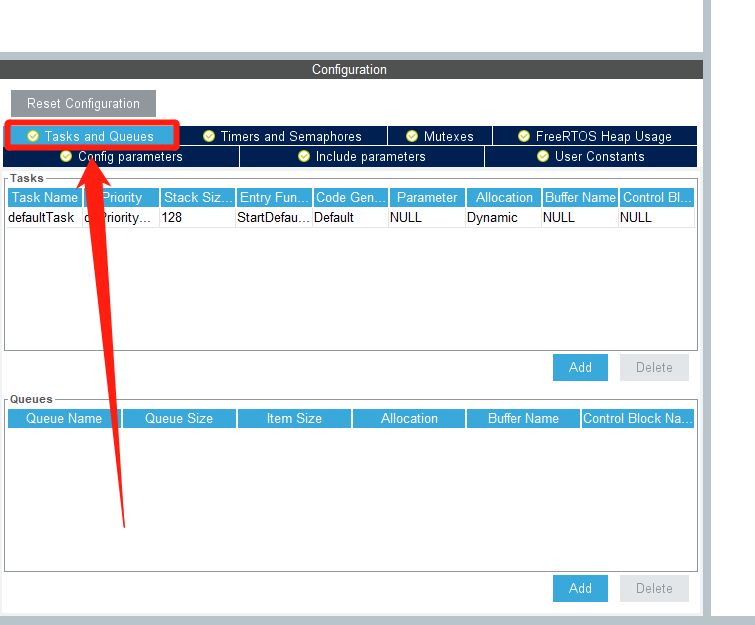
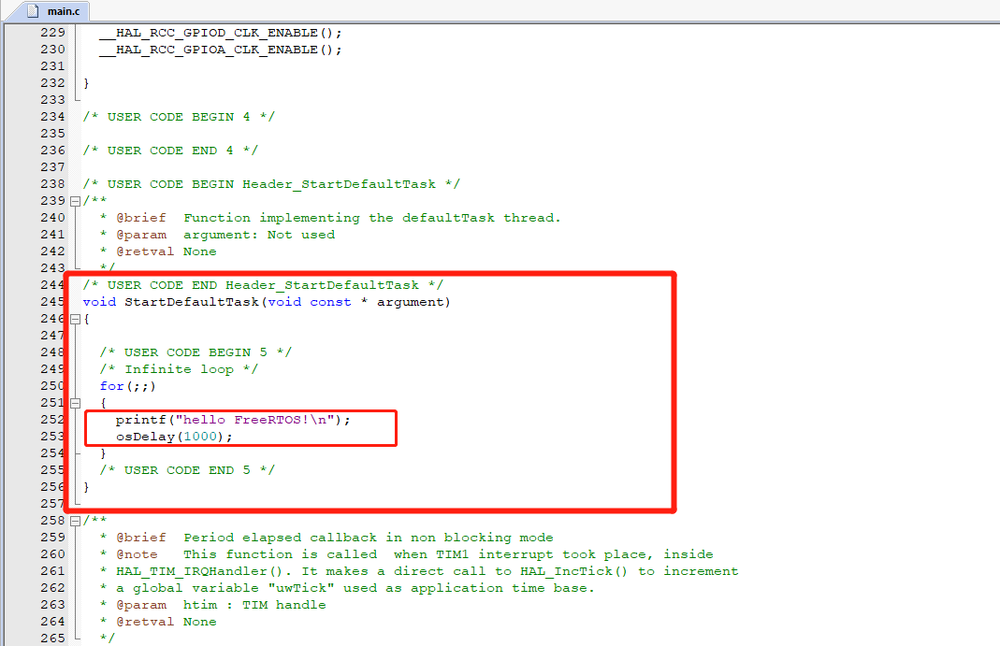

# STM32CubeMX_FreeRTOS环境搭建

---

<div align=center><a href="https://gitee.com/iotxiaohu/blog">
    
</a></div>

---

## 概述

> FreeRTOS在嵌入式实时操作系统中有着很重要的地位, 同时STM32CubeMX中也加入了FreeRTOS的支持使用图形化的配置让FreeRTOS使用起来更加简单了. 接下来我将和大家分享一下我使用STM32CubeMX和FreeRTOS的心得. 本教程主要讲环境搭建. 后续教程都基于本教程的配置模板.

## 开发环境

`Windows10`
`STM32CubeMX 5.2.0`
`Keil V5.28.0.0`
`NUCLEO-STM32F103RB开发板`

## 配置

* 新建项目


---

* 选择自己的芯片


---

* `1` 配置SYS
* `2` 选择`Seria lWire`
* `3` 选择TIM1 (因为FreeRTOS要用SysTick)


https://gitee.com/iotxiaohu/blog/blob/master/Ubuntu/%E6%89%93%E5%BC%80Samba%E6%9C%8D%E5%8A%A1/README.md
---

* `1` 配置RCC
* `2` 选择`Cystal/Ceramic...`


---

* `1` 配置Clock
* `2` 修改为72MHZ, 然后回车
* `3` ok


---

* `1` 配置串口1 (主要用来配置`printf`)
* `2` 选择模式


---

* `1` 配置FreeRTOS
* `2` 选择`CMSIS_V1`


---

## 讲解一下这些参数

* 进行FreeRTOS的参数配置


---

* 配置要使用的函数功能


---

* 定义一些宏定义


---

* 任务或者消息队列的添加(系统已经默认添加了一个任务)



---

* 定时器和信号量的一些配置


---

* 配置互斥量


---

* 查看内存使用情况 `已用字节数`和`剩余可用字节数`


---

* `1`项目名
* `2`路径
* `3`编译器
* `4`堆栈
* `5`生成代码


---

* 使用`printf`功能 添加代码:

```
int fputc(int ch, FILE *f)
{
    HAL_UART_Transmit(&huart1, (uint8_t *)&ch,1, 0xFFFF);
    return ch;
}
```


---

* 这是系统创建任务


---

* 找到系统创建的任务, 添加自己的的测试打印函数, 将打印间隔设置为1000ms



---

* 打开串口调试助手, 看到每隔1000ms就会收到一条打印信息, 说明测试成功


---

## 源代码获取

**<font size=5 color=#ff0000> 源码已放到码云 ! ! ! ( 请点击文首链接进入仓库 ) </font>**

---

## 备注

<div align=center><a href="https://gitee.com/iotxiaohu/blog">
    
</a></div>
