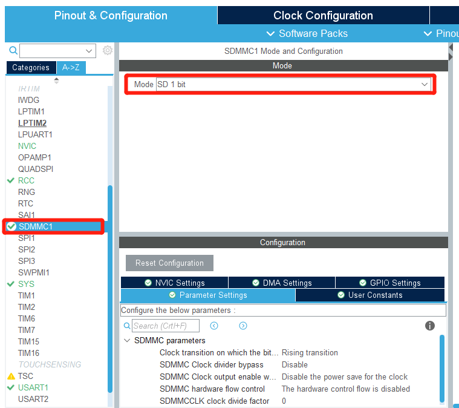
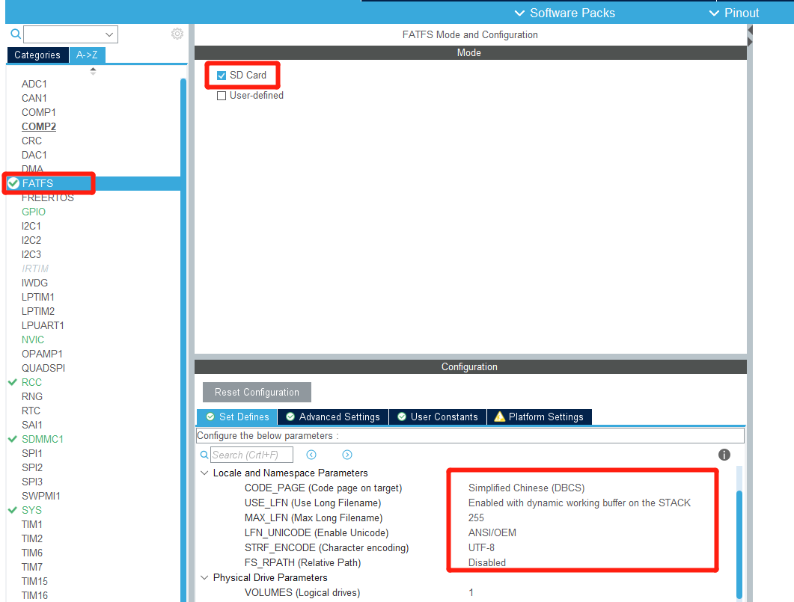
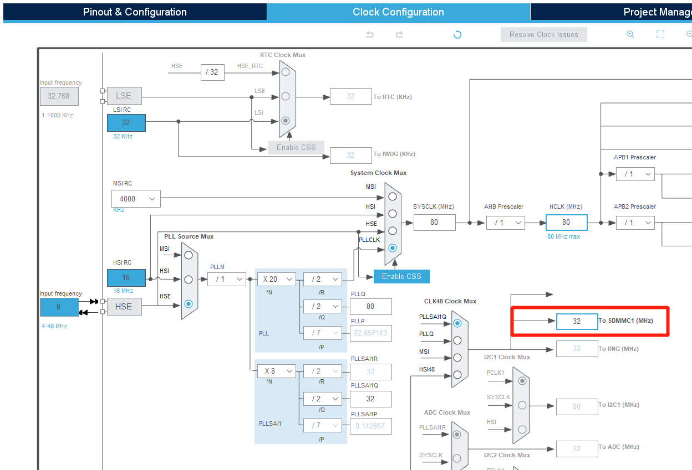
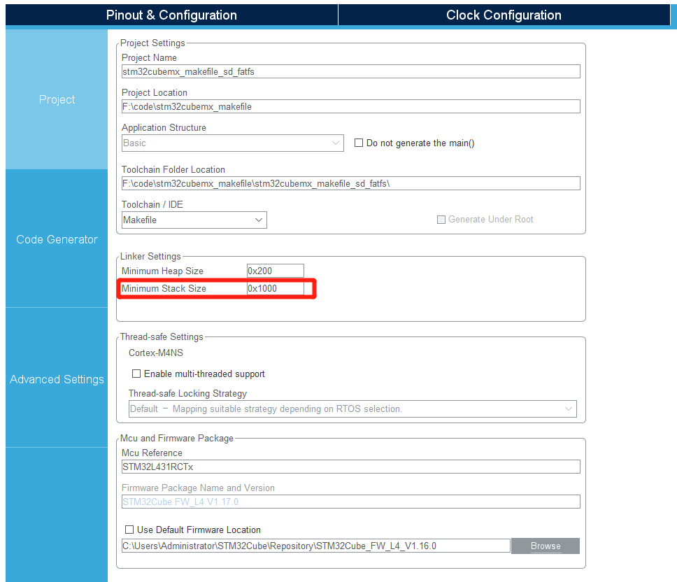
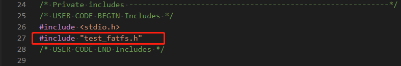
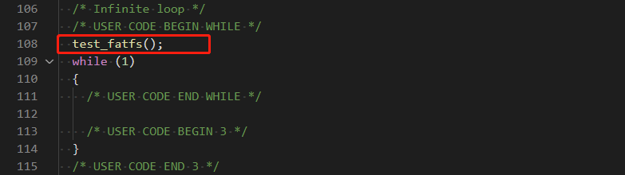
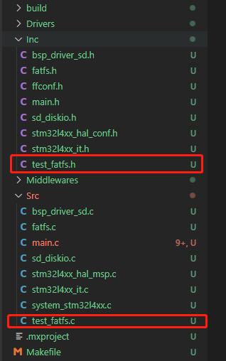
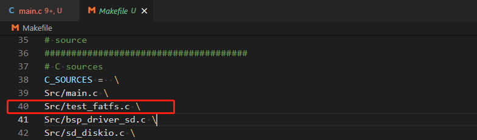
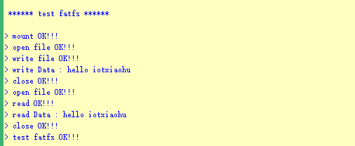

# `STM32CubeMx` `+` `makefile` --- 文件系统`fatfs`

---

<div align=center></div>

<div align=center>
    <a href="https://gitee.com/leafguo/stm32cubemx_makefile">
        
    </a>
</div>

---

[TOC]

---

## 环境

| 工具                  | 版本                                   | 说明           |
| --------------------- | -------------------------------------- | -------------- |
| `开发板`              | `小熊派IoT开发板`                      | `建议相同`     |
| `ubuntu`              | `16.04`                                | `版本关系不大` |
| `STM32CubeMX`         | `V6.3.0`                               | `建议相同`     |
| `L4软件包`            | `STM32Cube FW_L4 V1.16.0` | `建议相同`     |
| `STM32CubeProgrammer` | `v2.8.0`                               | `版本关系不大` |
| `交叉编译工具链`      | `gcc-arm-none-eabi-10.3-2021.07`       | `版本关系不大` |

---

## 添加串口打印printf

- 请看 `STM32CubeMx + makefile --- 添加串口打印printf` 章节

---

## STM32CubeMX 配置

### 配置 `SDMMC`

- 如下图所示:

<div align=left></div>

---

### 配置 `FATFS`

- 如下图所示:

<div align=left></div>

---

### 时钟配置

- 如下图所示:

<div align=left></div>

---

### 设置栈空间

- 需要增加栈空间的大小, 如下图所示:

<div align=left></div>

---

### 生成 `makefile` 项目

注意 : 如果警告配置有误, 请忽略提示, 直接选择 YES 生成

---

## 修改代码

> **思路:** 将生成的代码复制到ubuntu上面修改编译, 或者修改好了上传到ubuntu上编译

- 修改 `stm32cubemx_makefile_sd_fatfs\Src\main.c` 文件
- 添加 如下代码

```c
#include "test_fatfs.h"
```

```c
test_fatfs();
```

<div align=left></div>
<div align=left></div>

---

- 添加 `Src/test_fatfs.c` 和 `Inc/test_fatfs.h` 文件

<div align=left></div>

- `Makefile` 添加 `Src/test_fatfs.c \`

<div align=left></div>

- `Src/test_fatfs.h` 文件添加代码 `test_fatfs()` 声明

```c
#ifndef _TEST_FATFS_H
#define _TEST_FATFS_H

void test_fatfs(void);

#endif
```

- `Src/test_fatfs.c` 文件添加代码 `test_fatfs()` 实现

```c
#include "fatfs.h"

void test_fatfs(void)
{
    FATFS fs;
    FIL fil;

    uint32_t w_datas_num;                   // 写数据长度
    uint32_t r_datas_num;                   // 读数据长度
    uint8_t w_datas[] = "hello iotxiaohu";  // 写的数据
    uint8_t r_datas[100];                   // 存放读出来的数据
    char filen_name[] = "test_fatfs.txt";    // 文件名

    printf("\n ****** test fatfs ******\n\n");

    /* 注册文件系统*/
    retSD = f_mount(&fs, "", 0);
    if (retSD) {
        printf("> mount error : %d \n", retSD);
        return;
    }
    printf("> mount OK!!! \n");

    /* 创建并且打开文件 */
    retSD = f_open(&fil, filen_name, FA_CREATE_ALWAYS | FA_WRITE);
    if (retSD) {
        printf("> open file error : %d\n", retSD);
        return;
    }
    printf("> open file OK!!! \n");

    /* 写文件 */
    retSD = f_write(&fil, w_datas, sizeof(w_datas), (void *)&w_datas_num);
    if (retSD) {
        printf("> write file error : %d\n", retSD);
        return;
    }
    printf("> write file OK!!! \n");
    printf("> write Data : %s\n", w_datas);

    /* 关闭文件 */
    retSD = f_close(&fil);
    if (retSD) {
        printf("> close error : %d\n", retSD);
        return;
    }
    printf("> close OK!!! \n");

    /* 打开文件 */
    retSD = f_open(&fil, filen_name, FA_READ);
    if (retSD) {
        printf("> open file error : %d\n", retSD);
        return;
    }
    printf("> open file OK!!! \n");

    /* 读取文件 */
    retSD = f_read(&fil, r_datas, sizeof(r_datas), (UINT *)&r_datas_num);
    if (retSD) {
        printf("> read error!!! %d\n", retSD);
        return;
    }
    printf("> read OK!!! \n");
    printf("> read Data : %s\n", r_datas);

    /* 关闭文件 */
    retSD = f_close(&fil);
    if (retSD) {
        printf("> close error!!! %d\n", retSD);
        return;
    }
    printf("> close OK!!! \n");

    /* 比较读取的是否与写的一致 */
    if (r_datas_num == w_datas_num) {
        printf("> test fatfs OK!!!\n");
    }
}
```

---

## 编译 (略)

## 烧录 (略)

---

## 运行

- 连接串口, 打开串口调试工具
- 如下:

<div align=left></div>

---

## 备注

<div align=center></div>

---
