# `STM32CubeMx` `+` `makefile` --- 添加串口打印`printf`

---

<div align=center></div>

---

### <center>[ >> 本文已同步至码云 - 点此链接进入仓库 <<](https://gitee.com/leafguo/stm32cubemx_makefile)

---

## 环境

| 工具                  | 版本                                   | 说明           |
| --------------------- | -------------------------------------- | -------------- |
| `开发板`              | `小熊派IoT开发板`                      | `建议相同`     |
| `ubuntu`              | `16.04`                                | `版本关系不大` |
| `STM32CubeMX`         | `V6.3.0`                               | `建议相同`     |
| `L4软件包`            | `STM32Cube FW_L4 V1.16.0` | `建议相同`     |
| `STM32CubeProgrammer` | `v2.8.0`                               | `版本关系不大` |
| `交叉编译工具链`      | `gcc-arm-none-eabi-10.3-2021.07`       | `版本关系不大` |

---

## STM32CubeMX 配置

### 芯片选择

- `新建项目` - `选择对应的芯片`
- 我板子使用的芯片是 : `STM32L431RCT6`
- 大家可以根据自己的实际情况选择对应的芯片
- 如下:

<div align=center>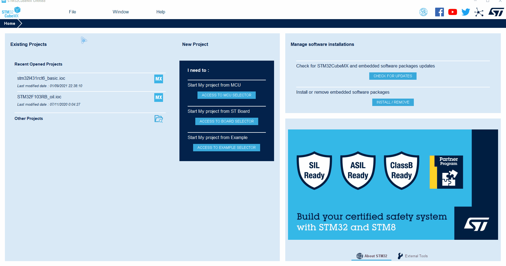</div>

---

### 时钟配置

- 配置 `RCC`
- 配置时钟树, 配制成最高速率 `80M Hz` `->` `回车`
- 如下:

<div align=center>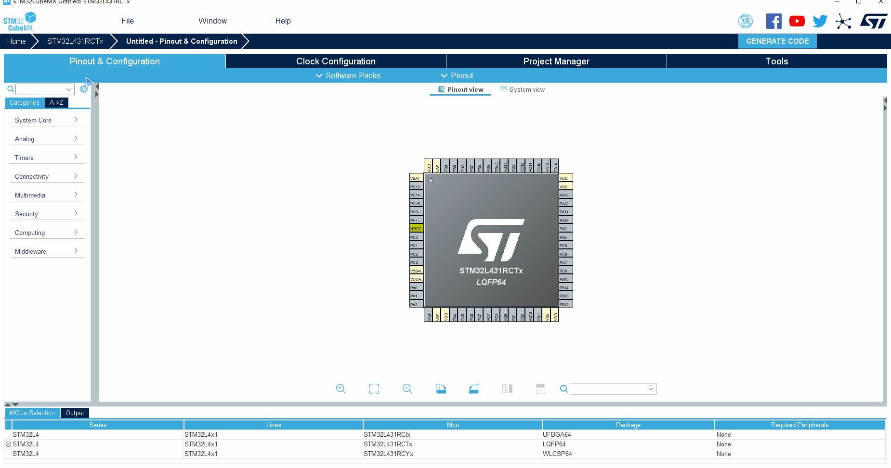</div>

---

### 配置烧录方式

- 配置烧录方式 `SYS` 为 `debug` 选项选择 `Serial Wire`(4线烧录 `CLK` `DIO` `VCC` `GND`)
- 如下:

<div align=center>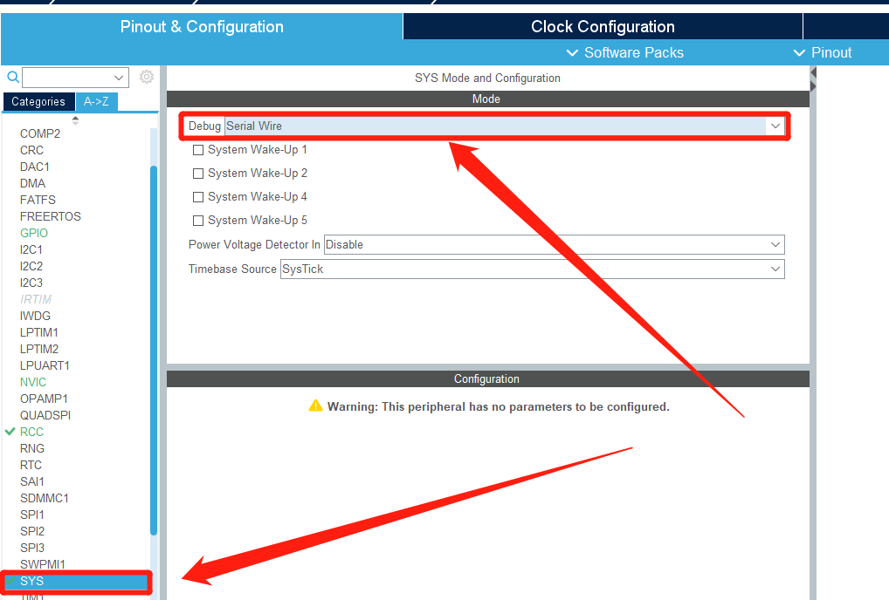</div>

---

### 配置 `USART` 串口

- 根据原理图确定自己对应的串口, 我的是 `USART1`
- 选择 `Asynchronous` 异步传输
- 下面的配置可以设置参数, 我这儿就是用默认的参数
- 如下:

<div align=center>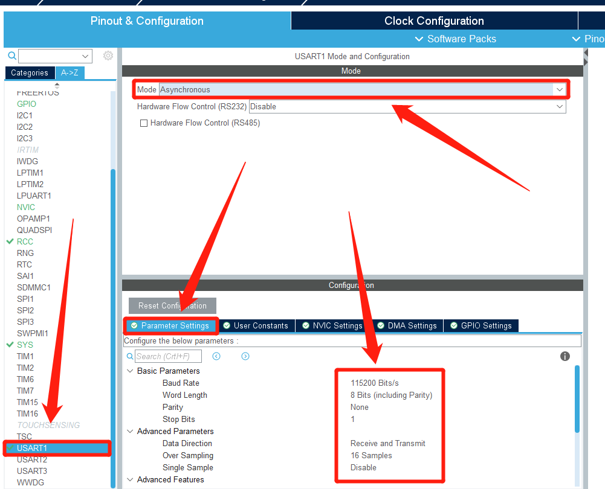</div>

---

### 生成 `makefile` 项目

- 选择 `Copy only the necessary library files` 只复制必要的库文件
- 配置好项目的名称以及位置
- 配置为 `Basic` 基本配置
- 选择生成 `Makefile` 项目
- 最后点击 `GENERATE CODE` 生成项目代码

<div align=center>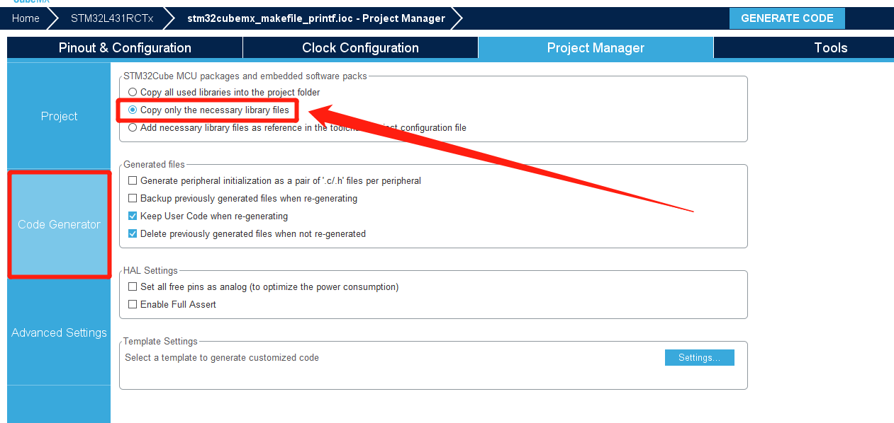</div>
<div align=center>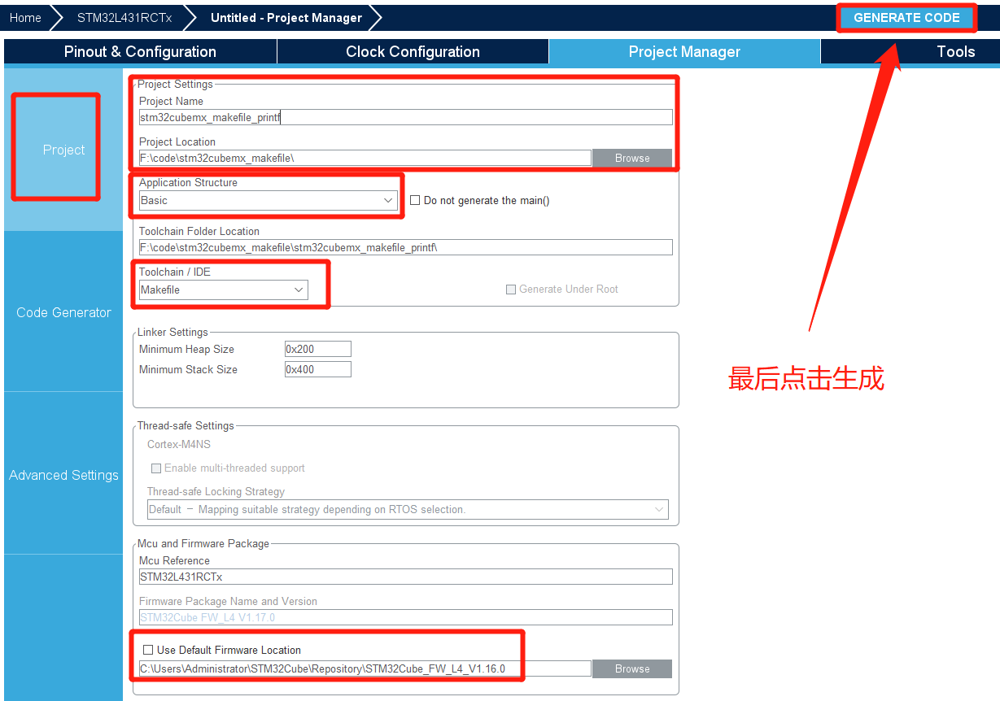</div>

---

## 修改代码

> **思路:** 将生成的代码复制到ubuntu上面修改编译, 或者修改好了上传到ubuntu上编译

- 修改 `stm32cubemx_makefile_printf\Src\main.c` 文件
- 添加 `#include <stdio.h>`
- 重新定义 `_write` 函数
- `main()` 函数主循环中 添加代码测试 `printf` 和 `USART` 功能

```c
#include <stdio.h>
```

```c
int _write(int fd, char *ch, int len)
{
  HAL_UART_Transmit(&huart1, (uint8_t*)ch, len, 0xFFFF);
  return len;
}
```

```c
    int num = 1024;
    char tx_buf[] = "Hello World1!";

    printf("\nnum = %d\n", num);
    HAL_UART_Transmit(&huart1, (unsigned char *)tx_buf, 11, 10);
    HAL_Delay(1000);
```

<div align=left>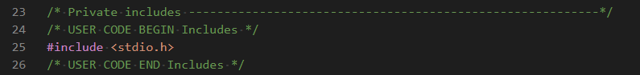</div>
<div align=left>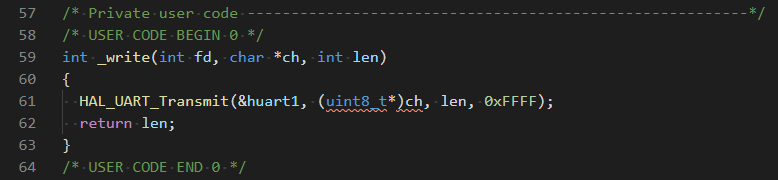</div>
<div align=left>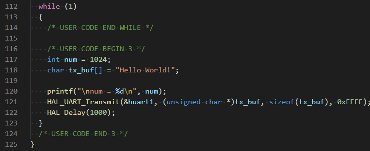</div>

---

## 编译

- 进入 `Makefile` 所在的目录
- 输入 `make` 进行编译
- 生成的三个文件 (`.bin` `.elf` `.hex`) 都可以用来烧录
- 如下

<div align=left>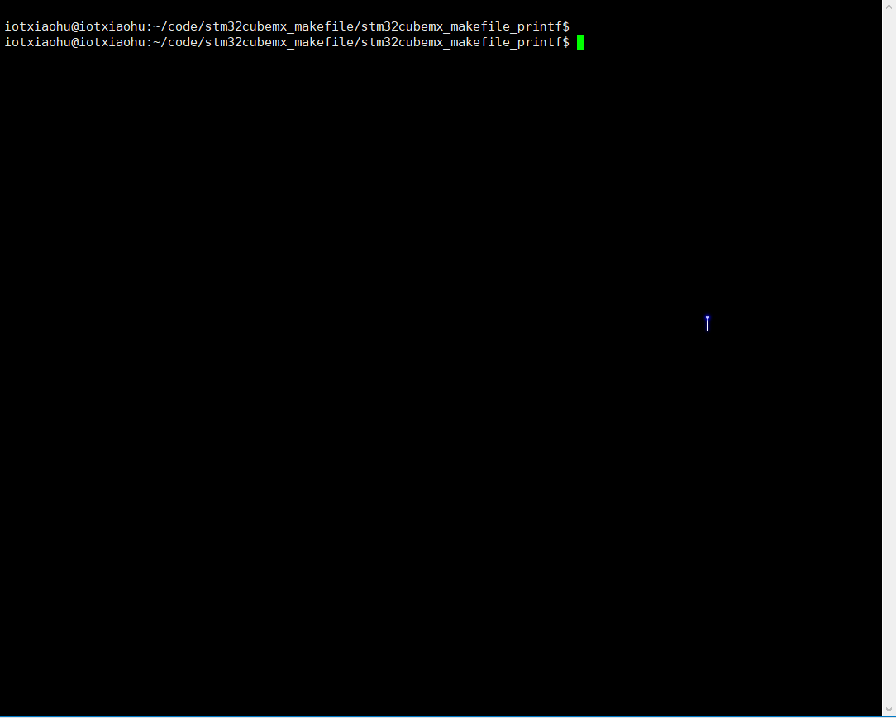</div>

---

## 烧录

- 打开 `STM32CubeProgrammer`
- 链接 `ST-LINK`
- 选择刚刚生成的文件进行烧录
- 如下:

<div align=left>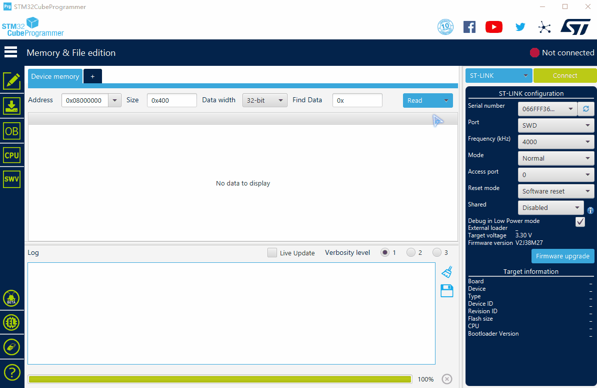</div>

---

## 运行

- 连接串口, 打开串口调试工具
- 如下:

<div align=left>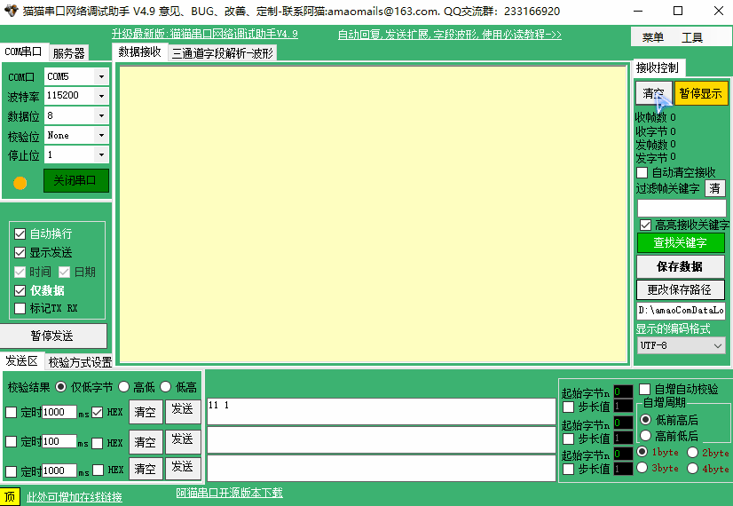</div>

---

## 备注

<div align=center></div>

---
