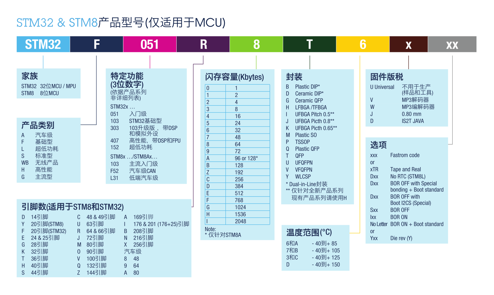
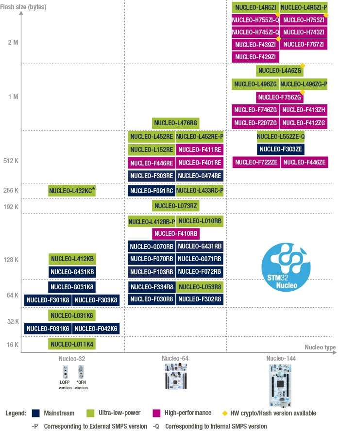
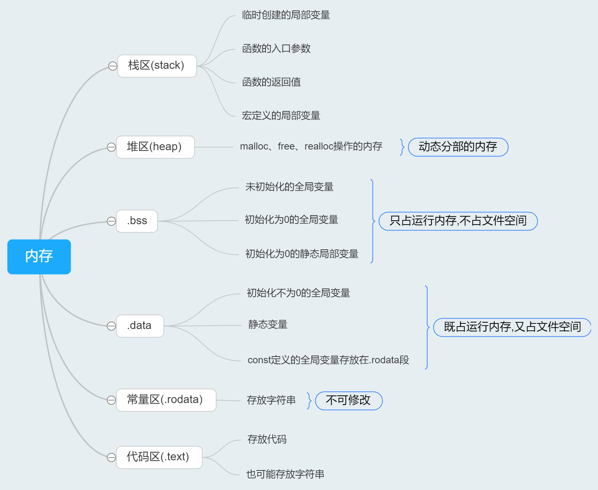

# STM32学习笔记之—芯片基础

- `STM32程序默认都是从0x08000000开始的`

## 命名规则

## ST官方开发板

## RAM大小

以下列举常见型号的RAM大小
| STM32C8T6 | STM32R8T6 | STM32RBT6 | STM32RCT6 | STM32ZET6 |
| --------- | --------- | --------- | --------- | --------- |
| 16K       | 20K       | 20K       | 48K       | 64K       |

## 常见型号的片内FLASH

小容量产品主存储块最大为4K×64位，每个存储块划分为32个1K字节的页。
中容量产品主存储块最大为16K×64位，每个存储块划分为128个1K字节的页。
大容量产品主存储块最大为64K×64位，每个存储块划分为256个2K字节的页。
互联型产品主存储块最大为32K×64位，每个存储块划分为128个2K字节的页。

### STM32F103CBT6、STM32F103C8T6(特殊的可以用128K Flash)

| 页码  | 起始地址    | 结束地址    | 页大小 |
| ----- | ----------- | ----------- | ------ |
| 页0   | 0x0800 0000 | 0x0800 03FF | 1K     |
| 页1   | 0x0800 0400 | 0x0800 07FF | 1K     |
| 页2   | 0x0800 0800 | 0x0800 0BFF | 1K     |
| 页3   | 0x0800 0C00 | 0x0800 0FFF | 1K     |
| ...   | ...         | ...         | 1K     |
| 页127 | 0x0801 FC00 | 0x0801 FFFF | 1K     |

### STM32F103RCT6

| 页码  | 起始地址    | 结束地址    | 页大小 |
| ----- | ----------- | ----------- | ------ |
| 页0   | 0x0800 0000 | 0x0800 07FF | 2K     |
| 页1   | 0x0800 0800 | 0x0800 0FFF | 2K     |
| 页2   | 0x0800 1000 | 0x0800 17FF | 2K     |
| 页3   | 0x0800 1800 | 0x0800 1FFF | 2K     |
| ...   | ...         | ...         | 2K     |
| 页127 | 0x0803 F800 | 0x0803 FFFF | 2K     |

### STM32F103ZET6

| 页码  | 起始地址    | 结束地址    | 页大小 |
| ----- | ----------- | ----------- | ------ |
| 页0   | 0x0800 0000 | 0x0800 07FF | 2K     |
| 页1   | 0x0800 0800 | 0x0800 0FFF | 2K     |
| 页2   | 0x0800 1000 | 0x0800 17FF | 2K     |
| 页3   | 0x0800 1800 | 0x0800 1FFF | 2K     |
| ...   | ...         | ...         | 2K     |
| 页255 | 0x0807 F800 | 0x0807 FFFF | 2K     |

## 嵌入式基础拓展

| Code    |                 | 用来存放代码的代码段 |                                   |
| ------- | --------------- | -------------------- | --------------------------------- |
| RO-data | Read Only       | 存放指令和常量       | 存储const常量和指令               |
| RW-data | Read/Write      | 存放已初始化的变量   | 存储初始化值不为0的全局变量       |
| ZI-data | Zero Initialize | 存放未初始化的变量   | 未初始化的或初始化值为0的全局变量 |

`Flash=Code + RO Data + RW Data`
`RAM= RW-data+ZI-data`

`C 语言上分为栈、堆、bss、data、code段`
`MDK 下分为：Code、RO-data、RW-data、ZI-data 这几个段`

## 内存段

