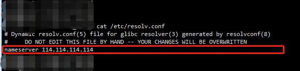

# ubuntu无法解析主机 `Could not resolve host`
> 能ping通IP地址, 但是ping不通域名. 提示: `Could not resolve host`

### 解决方法1
- 修改文件 `/etc/resolv.conf`
- 添加如下内容
~~~
nameserver 114.114.114.114
~~~

---

### 解决方法2
- 修改文件 `/etc/hosts`
- 添加需要解析的域名和IP
~~~
192.168.1.117 github.com
~~~
