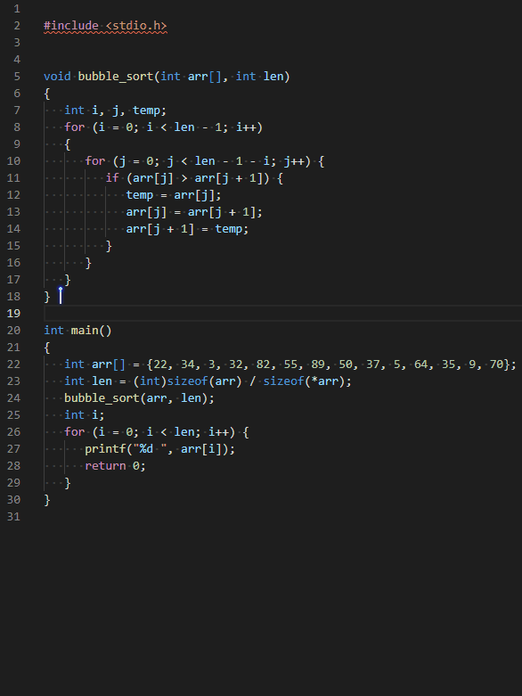

# vscode 插件 Doxygen Documentation Generator

> 这个插件是帮助我们快速进行添加注释的, 话不多说, 先看效果吧



---

## 安装

- 在插件市场下载 `Doxygen Documentation Generator` 插件
- `设置` `->` `settings.json` 编辑 `settings.json` 文件, 添加如下内容就好了
- 为了方便大家理解, 我已经添加了部分注释
- 大家可以根据自己的实际情况添加或者修改注释的内容
- [详情可参考官方文档](https://github.com/cschlosser/doxdocgen)

```shell
    // 注释
    "doxdocgen.c.triggerSequence": "/**",   // 触发自动注释的生成
    "doxdocgen.c.commentPrefix": " * ",     // 注释行的前缀
    "doxdocgen.c.firstLine": "/**",         // 注释行的首行
    "doxdocgen.c.lastLine": " */",          // 注释行的尾行

    // file注释顺序
    "doxdocgen.file.fileOrder": [
        "copyright",
        "empty",
        "file",
        "brief",
        "author",
        "version",
        "date",
        // "custom"    // 自定义选项
    ],
    // file自定义选项
    "doxdocgen.file.customTag": [
        "自定义选项",
    ],

    "doxdocgen.file.copyrightTag": [                                // file注释
        "@copyright Copyright (c) {year}.."
    ],
    "doxdocgen.generic.authorEmail":    "iotxiaohu@qq.com",         // {email}  样式
    "doxdocgen.generic.authorName":     "iotxiaohu",                // {author} 样式
    "doxdocgen.generic.dateFormat":     "YYYY-MM-DD",               // {date}   样式

    "doxdocgen.generic.dateTemplate":   "@date{indent:9}{date}",    // {date}   模板
    "doxdocgen.file.fileTemplate":      "@file{indent:9}{name}",    // {name}   模板
    "doxdocgen.generic.briefTemplate":  "@brief{indent:9}描述",
    "doxdocgen.file.versionTag":        "@version{indent:9}0.1",
    "doxdocgen.generic.authorTag":      "@author{indent:9}{author}({email})",

    // generic注释的内容和顺序
    "doxdocgen.generic.order": [
        "brief",
        "empty",
        "param",
        "return",
        // "empty",
        "author",
        "date",
        // "custom",       // 自定义选项
    ],
    // generic自定义选项
    "doxdocgen.generic.customTags": [
        "自定义选项",
    ],
    "doxdocgen.cpp.tparamTemplate": "@tparam {param} ", // ???
    "doxdocgen.generic.paramTemplate": "@param{indent:9}{param}{indent:21}参数描述",
    "doxdocgen.generic.returnTemplate": "@return{indent:9}{type} ",

    "doxdocgen.generic.includeTypeAtReturn": true,      // return 中包含类型信息
    "doxdocgen.generic.boolReturnsTrueFalse": false,    // bool 返回值拆分成 true 和 false 两种情况
    "doxdocgen.generic.linesToGet": 4,                  // 回车后最多向下多少行去找函数声明
    "doxdocgen.generic.useGitUserName": false,          // {author} 是都根据 git config --get user.name 替换
    "doxdocgen.generic.useGitUserEmail": false,
```

---

## 备注

<div align=center><a href="https://gitee.com/iotxiaohu/blog">
    
</a></div>

---
