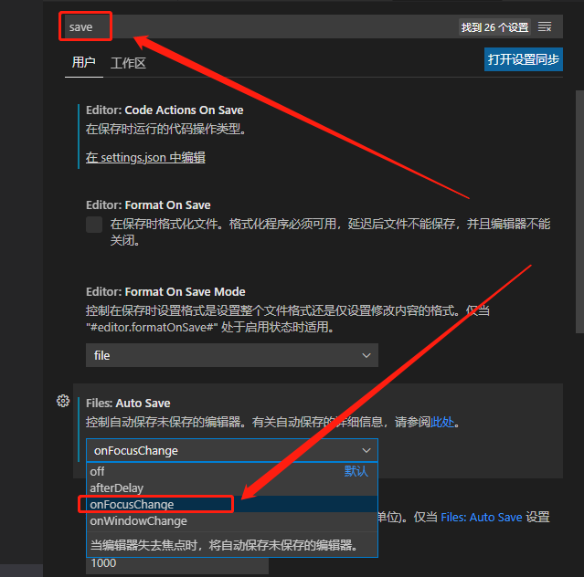

# vscode使用笔记

---

### 鼠标放大缩小字体
- `文件` `->` `首选项` `->` `setting.json` `->` `加入如下代码:`
```
"editor.mouseWheelZoom": true,
```

---

### SFTP插件的使用

- `Ctrl + Shift + P` 编辑 `sftp.json` 文件
```
{
    "name": "file",
    "host": "47.113.117.74",
    "username": "hlg",
    "password": "hlg",
    "protocol": "sftp",
    "port": 22,
    "remotePath": "/home/hlg/hlg/code",
    "context": "E:/code",
    "uploadOnSave": false,
    "ignore": [".vscode", ".git", ".DS_Store"]
}
```

---

### 保存时取消行尾的空格

- `设置` `->` `files.trimTrailingWhitespace` `->` `启用后, 将在保存文件时删除行尾的空格`

### `alt` `+` `z` 横拉条

---

### 显示空格为 `····`

`设置` `->` `搜索` `renderWhitespace` `->` 设置为 all

---

### 折叠 打开

`ctrl` + `k` + `ctrl` + `0`
`ctrl` + `k` + `ctrl` + `j`

---

### 添加字符辅助线

`文件` `–>` `首选项` `–>` `设置` `–>` 搜索 `"editor.rulers"` `->` 更改设置 `"editor.rulers": [120]`
如下图所示:


```
{
    .
    .
    .
    "editor.rulers": [
    120
    ]
}
```

---

### 设置自动保存

