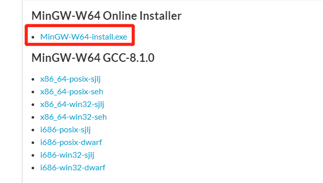

# 添加C_CPP跳转

> 本文讲解如何使用VSCode添加C/C++的仓库, 实现跳转功能.

## 下载一个C/C++的库并且安装

> 常见的C/C++的库有许多, 如OpenCV, Mingw64等

- 以 Mingw64为例, [下载链接](http://mingw-w64.org/doku.php)


---


---



## VSCode 添加配置

- 通下面的方式打开 `c_cpp_properties.json`


---

- 添加如下配置, 其中注释中的内容!!!
-
```
{
    "configurations": [
        {
            "name": "Win32",
            "includePath": [
                "${workspaceFolder}/**",
                "${workspaceRoot}",
                "C:\\Program Files\\mingw-w64\\x86_64-8.1.0-win32-seh-rt_v6-rev0\\mingw64\\include"  /*此处设置为库的include目录下*/
            ],
            "defines": [
                "_DEBUG",
                "UNICODE",
                "_UNICODE"
            ],
            "cStandard": "c17",
            "cppStandard": "c++17",
            "intelliSenseMode": "windows-msvc-x64"
        }
    ],
    "version": 4
}
```
