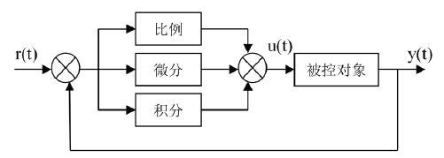

# PID算法

## 概述

所谓PID就是
P(比例Proportion)
I(积分Integral)
D(微分Derivative)
三个单词的缩写.


## 讲解

r(t) 是给定值
y(t) 是系统的实际输出值
给定值与实际输出值构成控制偏差e(t) = r(t) − y(t).

u(t) = Kp [ e(t) + $\frac{1}{Ti} \int_0^t e(t) {\rm d}t$ + Td $\frac{d e(t)}{dt}$ ]

Kp：控制器的比例系数.
Ti：控制器的积分时间，也称积分系数.
Td：控制器的微分时间，也称微分系数.

### P - 比例部分

比例环节的作用是对偏差瞬间作出反应。偏差一旦产生控制器立即产生控制作用， 使控制量向减少偏差的方向变化。 控制作用的强弱取决于比例系数Kp， 比例系数Kp越大，控制作用越强， 则过渡过程越快， 控制过程的静态偏差也就越小； 但是Kp越大，也越容易产生振荡， 破坏系统的稳定性。 故而， 比例系数Kp选择必须恰当， 才能过渡时间少， 静差小而又稳定的效果。

### I  - 积分部分

从积分部分的数学表达式可以知道， 只要存在偏差， 则它的控制作用就不断的增加； 只有在偏差e(t)＝0时， 它的积分才能是一个常数，控制作用才是一个不会增加的常数。 可见，积分部分可以消除系统的偏差。

积分环节的调节作用虽然会消除静态误差，但也会降低系统的响应速度，增加系统的超调量。积分常数Ti越大，积分的积累作用越弱，这时系统在过渡时不会产生振荡； 但是增大积分常数Ti会减慢静态误差的消除过程，消除偏差所需的时间也较长， 但可以减少超调量，提高系统的稳定性。

当 Ti 较小时， 则积分的作用较强，这时系统过渡时间中有可能产生振荡，不过消除偏差所需的时间较短。所以必须根据实际控制的具体要求来确定Ti 。

### D - 微分部分

实际的控制系统除了希望消除静态误差外，还要求加快调节过程。在偏差出现的瞬间，或在偏差变化的瞬间， 不但要对偏差量做出立即响应（比例环节的作用）， 而且要根据偏差的变化趋势预先给出适当的纠正。为了实现这一作用，可在 PI 控制器的基础上加入微分环节，形成 PID 控制器。

微分环节的作用使阻止偏差的变化。它是根据偏差的变化趋势（变化速度）进行控制。偏差变化的越快，微分控制器的输出就越大，并能在偏差值变大之前进行修正。微分作用的引入， 将有助于减小超调量， 克服振荡， 使系统趋于稳定， 特别对髙阶系统非常有利， 它加快了系统的跟踪速度。但微分的作用对输入信号的噪声很敏感，对那些噪声较大的系统一般不用微分， 或在微分起作用之前先对输入信号进行滤波。

## 位置式PID

u(k) = Kp·e(k) + Ki·$\sum_{i=0}e(i)$ + Kd·[ e(k) - e(k-1) ]

```c++
typedef struct
{
  float Kp;                       //比例系数Proportional
  float Ki;                       //积分系数Integral
  float Kd;                       //微分系数Derivative

  float Ek;                       //当前误差
  float Ek1;                      //前一次误差 e(k-1)
  float Ek2;                      //再前一次误差 e(k-2)
  float LocSum;                   //累计积分位置
}PID_LocTypeDef;

/************************************************
函数名称 ： PID_Loc
功    能 ： PID位置(Location)计算
参    数 ： SetValue ------ 设置值(期望值)
            ActualValue --- 实际值(反馈值)
            PID ----------- PID数据结构
返 回 值 ： PIDLoc -------- PID位置
作    者 ： strongerHuang
*************************************************/
float PID_Loc(float SetValue, float ActualValue, PID_LocTypeDef *PID)
{
  float PIDLoc;                                  //位置

  PID->Ek = SetValue - ActualValue;
  PID->LocSum += PID->Ek;                         //累计误差

  PIDLoc = PID->Kp * PID->Ek + (PID->Ki * PID->LocSum) + PID->Kd * (PID->Ek1 - PID->Ek);

  PID->Ek1 = PID->Ek;
  return PIDLoc;
}
```

## 增量式PID

将位置式带入进去得到
$\Delta$u(k) = u(k) - u(k-1)
$\Delta$u(k) = Kp·[e(k)-e(k-1)] + Ki·e(k) + Kd·[e(k-2e(k-1)+e(k-2)]

```
typedef struct
{
  float Kp;                       //比例系数Proportional
  float Ki;                       //积分系数Integral
  float Kd;                       //微分系数Derivative

  float Ek;                       //当前误差
  float Ek1;                      //前一次误差 e(k-1)
  float Ek2;                      //再前一次误差 e(k-2)
}PID_IncTypeDef;

/************************************************
函数名称 ： PID_Inc
功    能 ： PID增量(Increment)计算
参    数 ： SetValue ------ 设置值(期望值)
            ActualValue --- 实际值(反馈值)
            PID ----------- PID数据结构
返 回 值 ： PIDInc -------- 本次PID增量(+/-)
作    者 ： strongerHuang
*************************************************/
float PID_Inc(float SetValue, float ActualValue, PID_IncTypeDef *PID)
{
  float PIDInc;                                  //增量

  PID->Ek = SetValue - ActualValue;
  PIDInc = (PID->Kp * PID->Ek) - (PID->Ki * PID->Ek1) + (PID->Kd * PID->Ek2);

  PID->Ek2 = PID->Ek1;
  PID->Ek1 = PID->Ek;
  return PIDInc;
}
```
