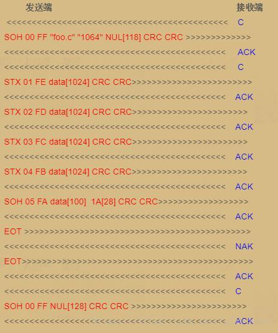

# YModem介绍

---

## 简介

> YModem是一种文件传输的协议, 可以参考百度百科 [YModem百度百科](https://baike.baidu.com/item/Ymodem), 本文主要讲解我个人对这个协议的理解.

---

## 协议传输的过程

* 流程如下图所示:

* 首先大家先了解几个字符的ASCII码

|字符|ASCII码16进制|
|:-:|:-:|
|`SOH`|`0x01`|
|`STX`|`0x02`|
|`ACK`|`0x06`|
|`NAK`|`0x15`|
|`EOT`|`0x04`|
|`C`|`0x43`|

* 这些控制字符和可显示字符在传输过程中就是通过ASCII码表示的.
* 整个过程比较简单, 就是按照格式一条一条的传输, 直到结束.
* 下面对传输过程中的帧进行分开讲一下

---

### 1 起始帧(133字节)

`SOH` + `00` + `FF` + `filename` + `filesize` + `NULL` + `CRCH` + `CRCL`

* 起始帧是文件传输发送端发的第一条重要消息.
* `filename`表示传输文件的文件名.
* `filesize`表示需要传输文件的大小.
* `CRCH` + `CRCL` 表示整条帧(去掉前三个字节)的CRC16校验.

---

### 2 数据帧格式

`STX`/`SOH` + `[编号]` + `编号的反码` + `data[0]` + `data[1]` + `data[2]` + ... + `CRCH` + `CRCL`

`SOH` 表示有128个字节, 有的也只用`SOH`传输数据.
`STX` 表示有1024个字节.
* `CRCH` + `CRCL` 表示整条帧(去掉前三个字节)的CRC16校验.
* 如果传输最后一条字节不足128个字节, 则用`1A`填充

---

### 3 结束帧的数据格式

`SOH` + `00` + `FF` + `NULL` + `NULL` + ... + `NULL` + `CRCH` + `CRCL`

---

## 总结

这个协议常用于文件传输, 比如在线升级过程中传输的`.bin文件` 或者传输一些码库文件. 在`Xshell软件`中的串口传输过程中就有这种传输方式, 后面在讲在线升级的过程中就会用到它, 所以还是有必要了解以下的.

---

## 备注

---
