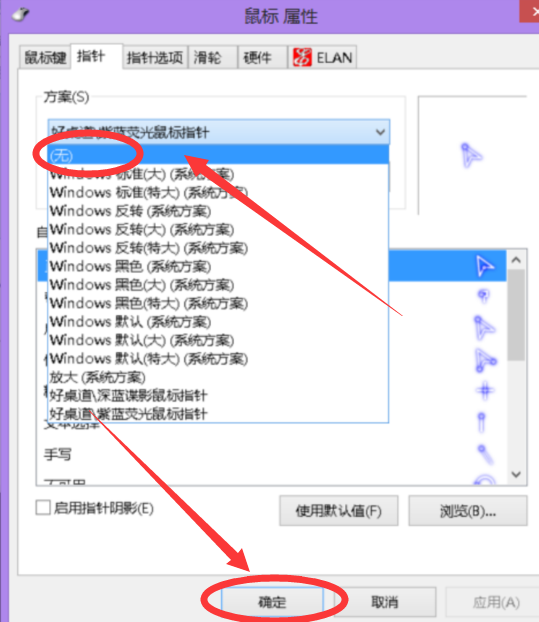

# 如何修改鼠标指针的样式

## 概要

- 不知道经常使用电脑的你有没有遇到过这样的问题，使用电脑的时候经常找不到自己的”鼠标指针”(就是当你挪动鼠标电脑屏幕上像箭头一样会动的东西)
- 或者有时候感觉自己的鼠标指针太小了看不清楚，又或者太白了和白色背景融为一体根本不好区分。
- 如果有，那可能你应该改变一下自己的自己鼠标指针的风格，选择适合自己指针不仅能够容易找到它们，并且能够提高自己的工作效率。

## 效果展示
下图面两张图第一张是系统默认的鼠标指针，另一张是我本人正在使用的鼠标指针

---

---

---

有没有感觉我的比系统默认的好看那么一点点呢？(如果没有就忽略前面这句话吧=_=)
那下面我教大家一下怎样改变鼠标指针吧！

## 开始

- 第一步当然是下载一套自己心仪的鼠标指针啦 ( 文末有提供连接 )
- 之前有人反馈提供的网站有病毒 ( 因此这儿不再单独提供网站, 其他人可以投稿, 我将分享给大家 )

## 安装

---

- 将下载好的文件解压掉（这一步就不用讲了吧）
- 打开后就可以看到下面这些文件（你的文件可能会没有后缀，不过没关系）
- 找到AotuSetup.inf（你的可能是AotuSetup），反正就是这个.inf安装文件啦
- 点击鼠标右键，然后点击安装（切记，不是双击！不是双击！不是双击！）
- (如下图)

---

---

---

- 点击"确定"，或者"应用"这样就将你的鼠标指针改好啦！是不是很神奇^_^

---

### 说明

- 如果使用一段时间想改回来怎么办呢？
- 返回到电脑桌面，单击鼠标右键>>>点击”个性化”
- （如下图）

---

---

- 然后你就进入了控制面板，点击 ”更改鼠标指针”
 **备注：** 当然你也可以通过其他方式找到更改鼠标指针的界面。

---

---

- 你就能进入刚刚那个熟悉的界面（见下图）
- 在”鼠标 属性”的窗口
- 点击上面的下拉框选择 ”无” 就是你之前默认的鼠标指针类型，再点击确定键就好啦！
- 当然你也可以选择里面其他的指针
- 你可能会发现我们刚刚添加的指针，随便你选哪一个吧，自己喜欢就好^_^）

---

---

如果有什么疑问，或者有什么好的建议，可在评论区一起交流讨论^_^

###  
指针主题下载链接 ( 欢迎投稿 )

- [紫蓝荧光鼠标指针](https://gitee.com/iotxiaohu/blog/raw/master/%E5%85%B6%E5%AE%83/%E5%A6%82%E4%BD%95%E4%BF%AE%E6%94%B9%E9%BC%A0%E6%A0%87%E6%8C%87%E9%92%88%E7%9A%84%E6%A0%B7%E5%BC%8F/%E7%B4%AB%E8%93%9D%E8%8D%A7%E5%85%89%E9%BC%A0%E6%A0%87%E6%8C%87%E9%92%88.zip)

- [深蓝谍影鼠标指针](https://gitee.com/iotxiaohu/blog/raw/master/%E5%85%B6%E5%AE%83/%E5%A6%82%E4%BD%95%E4%BF%AE%E6%94%B9%E9%BC%A0%E6%A0%87%E6%8C%87%E9%92%88%E7%9A%84%E6%A0%B7%E5%BC%8F/%E6%B7%B1%E8%93%9D%E8%B0%8D%E5%BD%B1%E9%BC%A0%E6%A0%87%E6%8C%87%E9%92%88.zip)

## 备注

---
