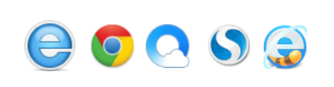

# 安装谷歌浏览器

> 在众多电脑软件中浏览器应该是每台电脑的必备软件，如何选择浏览器，选择哪一款浏览器对于好多电脑小白来说可能不是那么在意，但事实上有一款合适的浏览器是相当重要的。

> 曾经我看过一个人的电脑，着实让我有些发疯，一台电脑上面竟然装了4、5个浏览器，类似下面这些

---

## 推荐谷歌浏览器
> 一台电脑其实根本不用装这么多浏览器，占了内存不说，还把电脑弄得非常卡，和好多软件一样，他们可能是一些恶心软件在不经意间给你自动装上去的，但是个人感觉现在你可以把不常用的浏览器给卸载掉了。

> 话说这么多回到正题，怎样选择一款合适的软件，本人是学计算机的，曾经玩过一些WEB开发，很多计算机同学会选谷歌或者火狐浏览器，因为方便调试。对于大众上网的话个人推荐谷歌浏览器。下面介绍一下它的优点吧。

---

## 优点

- 启动速度快，加载网页的速度快。（这应该是最大的有点啦）
- 扩展性，方便安装插件，可以扩展方便自己的插件（一般人可能不太会用，我安装了有道词典的插件，可以直接翻译英语的网页）。

- 支持谷歌的许多服务，毕竟是有大公司在后面支持的嘛。

- 不会像很多恶心软件强行安装到你的电脑上面。（这应该不算优点，哈哈，不过好的软件一般不会做违背用户意愿的事情）

---

## 下载安装

> 那么我们就去下载它吧！（个人建议去百度软件中心下载，很多软件都能够直接就能够下载）
- 直接去腾讯软件中心下载 [点击进入](https://pc.qq.com/)

- 输入 "谷歌" 就可以点击下载啦（见下图）（网站有时候会更新，具体步骤不会太难，按照习惯一步步进行就行了）

- 下载好就可以去安装啦，这一步就不具体说啦，可以不用安装默认的C盘，这样也能减少系统盘的压力，这都看自己的爱好啦。

- 到此为止你就安装好一个谷歌浏览器啦，好多人可能不会太习惯通过输入网址的形式浏览网站，可以进行一下简单的后续操作-------设置默认网页

---

## 后续操作

- 找到右上方的这个东西，然后点击"设置"进入设置页面

---

---

 - 找到下面这个 "启动时" ——>添加新网页——>输入默认的网址（我用的是百度主页）点击"添加"就好啦

> 好啦，到现在为止你就设置好自己的浏览器啦！打开浏览器之后就会自动跳到刚刚设置的百度搜索主页。(用了之后你真的会发现这个这个浏览器的好用之处)

---

## 备注

---
