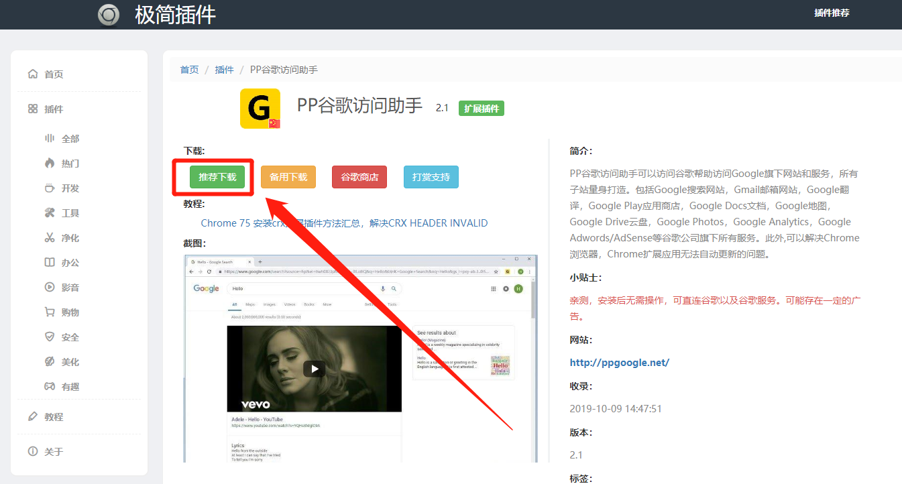
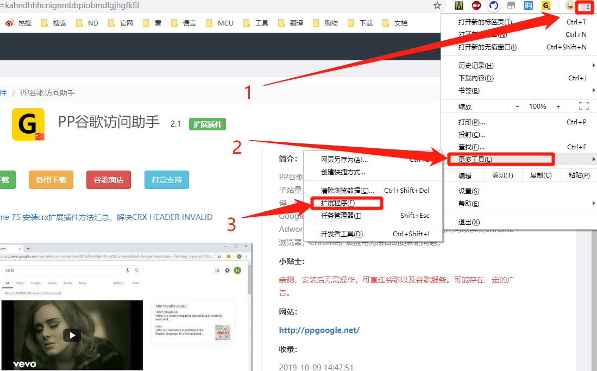
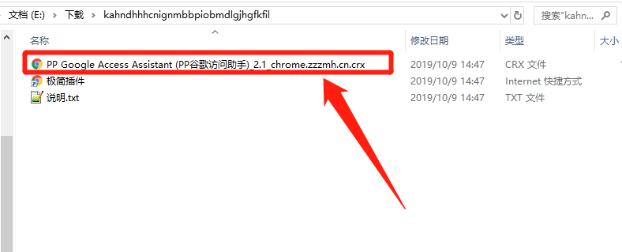
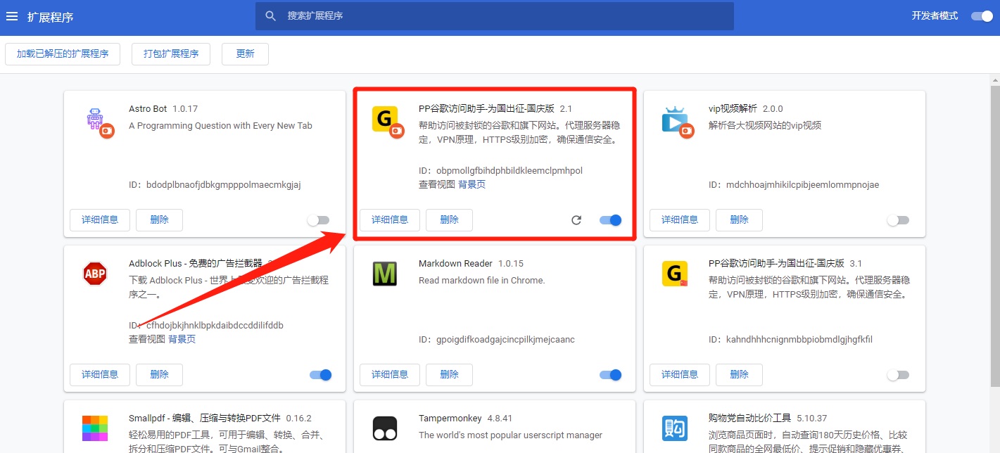
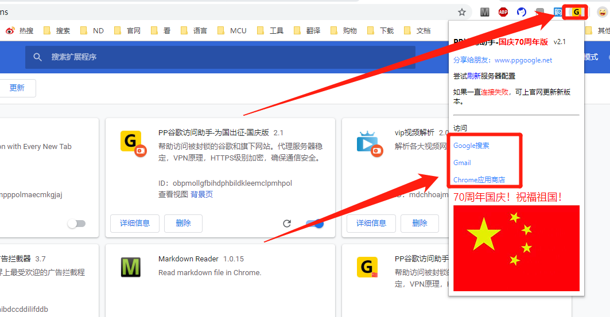
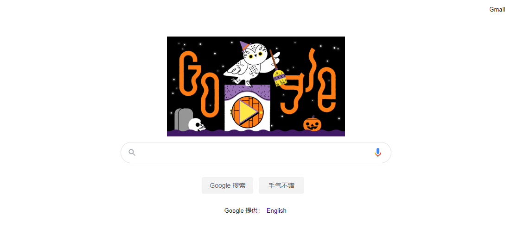

# 谷歌浏览器使用技巧—安装插件

- #### [安装谷歌浏览器](https://blog.csdn.net/weixin_41294615/article/details/102851579)

## 介绍

> 使用谷歌浏览器不适用插件就相当于大材小用，因此不得不说一下谷歌浏览器怎么使用插件。

## 选择插件网站

> 谷歌插件的商城有很多但不是所有的网站都能进去,原因是因为有"墙",所以我这儿提供几个
- [极简插件](https://chrome.zzzmh.cn/)
- [chrome网上商城(可能会进去不了)](https://chrome.google.com/webstore/category/extensions?hl=zh-CN)

---

## 下载安装

> 这儿以 [极简插件](https://chrome.zzzmh.cn/) 为例,其他的也差不多,就不一一讲述.

---

### 安装PP访问助手

> 这个插件的作用是让你能够访问Google，Gmail邮箱，Chome商城.
##### 下载
- 打开[极简插件](https://chrome.zzzmh.cn/)
- 进入后先择```推荐下载```如下图



---

##### 安装
- 下载好之后得到一个压缩包，解压后得到里面的```xxx.crx```文件
- 打开扩展程序页面,如下图所示:
- 将之前解压的```xxx.crx```的文件,拖进去就好了,如下图所示:


---


---



---

- 如果安装失败，建议把```xxx.crx```文件 后缀 改成```xxx.zip```文件再脱进去.
- 如果还安装失败请参考 [安装失败解决方法](https://chrome.zzzmh.cn/help?token=setup)

---

### 使用PP访问助手



---



---

## 结束

> 到此为止就安装好了一个插件，谷歌浏览器的插件有很多,大家可以慢慢探索.
