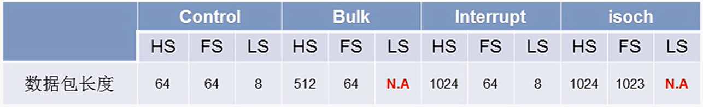
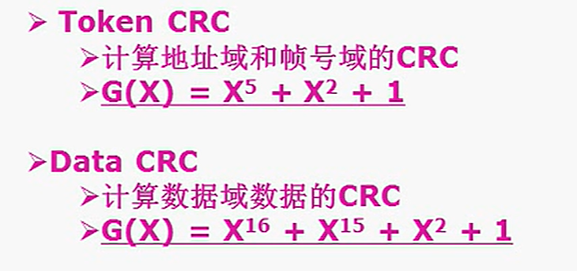
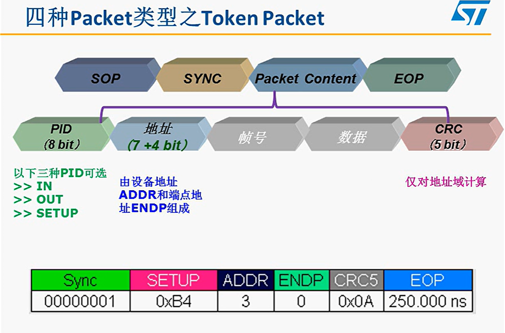
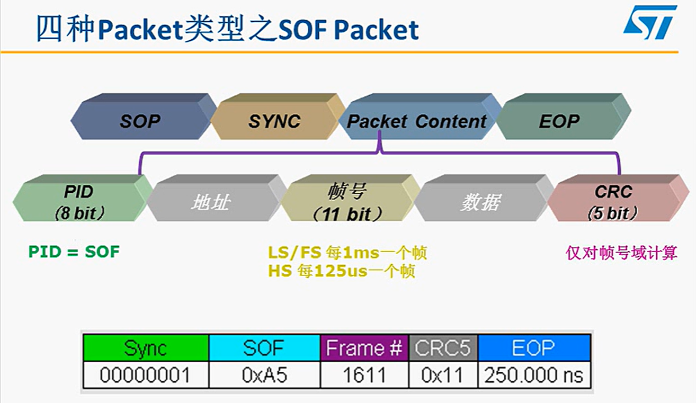
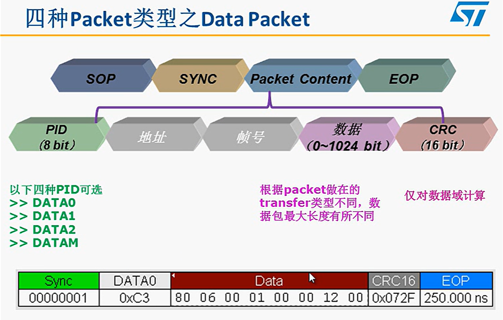
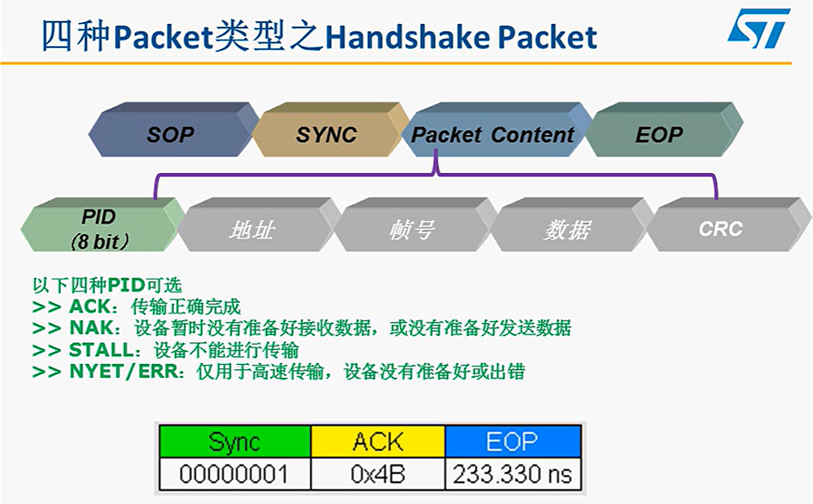

# USB笔记

|SOP|SYNC|Packet Content|EOP|
|:-:|:-:|:-:|:-:|
|开始|同步|内容|结束|

## Packet Content分四大类

|PID|地址|帧号|数据|CRC|
|:-:|:-:|:-:|:-:|:-:|:-:|

* **Packet Content分为**
* 命令(Token)
* 帧首(Start of Frame)Packet
* 数据(Data)
* 握手(Handshake)

LSB-----------MSB

### PID

|PID类型|PID名称|对于Packet种类|
|:-:|:-:|:-:|
|令牌(Token)|OUT/INT/SETUP/SOF|令牌包,SOF包|
|数据(Data)|DATA0/DATA1/DATA2/MDATA|数据包|
|握手(Handshake)|ACK/NAK/STALL/NYET|握手包|
|特殊(Special)|PRE/ERR/SPLIT/PING||

### 地址
* 设备地址

|LSB||||||MSB|
|:-:|:-:|:-:|:-:|:-:|:-:|:-:|
|Addr0|Addr1|Addr2|Addr3|Addr4|Addr5|Addr6|

* 端点地址( `LS最多3端点` , `FS/HS最多16端点` )

|LSB|-|-|MSB|
|:-:|:-:|:-:|:-:|
|Endp0|Endp1|Endp2|Endp3|

### 帧号

* 11位
* 主机每发以为,帧号就会加1
* 当帧号到达7FFH时,将重头开始
* 仅在每个帧的帧首传输一次SOF包

### 数据

* 根据传输类型不同,数据域的数据长度从0到1024字节不等

### CRC

### 四种Packet类型之TokenPacket

