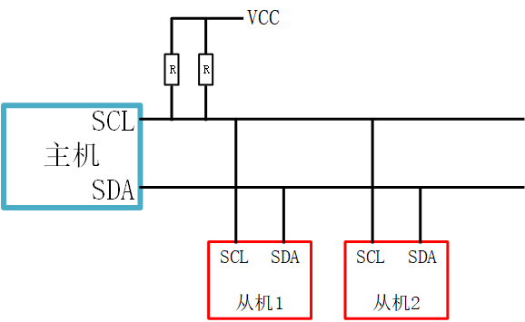
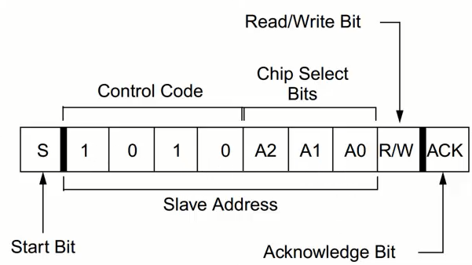
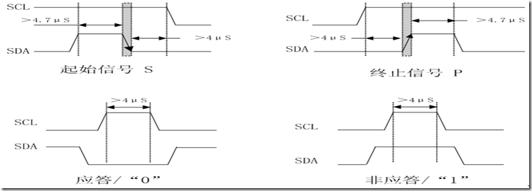
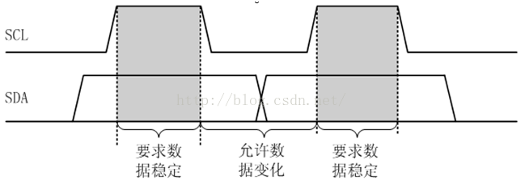

# 嵌入式之IIC

---

## 硬件

---

| 开始位 | 1-7位  | 8位        | 9位              |
| ------ | ------ | ---------- | ---------------- |
| S      | 地址位 | 1-读, 0-写 | 确认位, 等待回应 |

- **数据信号**: 8个数据位, 1-8表示数据位, 第9位为确认位（低电平）, 等待回应
- **结束位P**: 在数据位尾部

---

## 信号时序

---

## 详情

---
