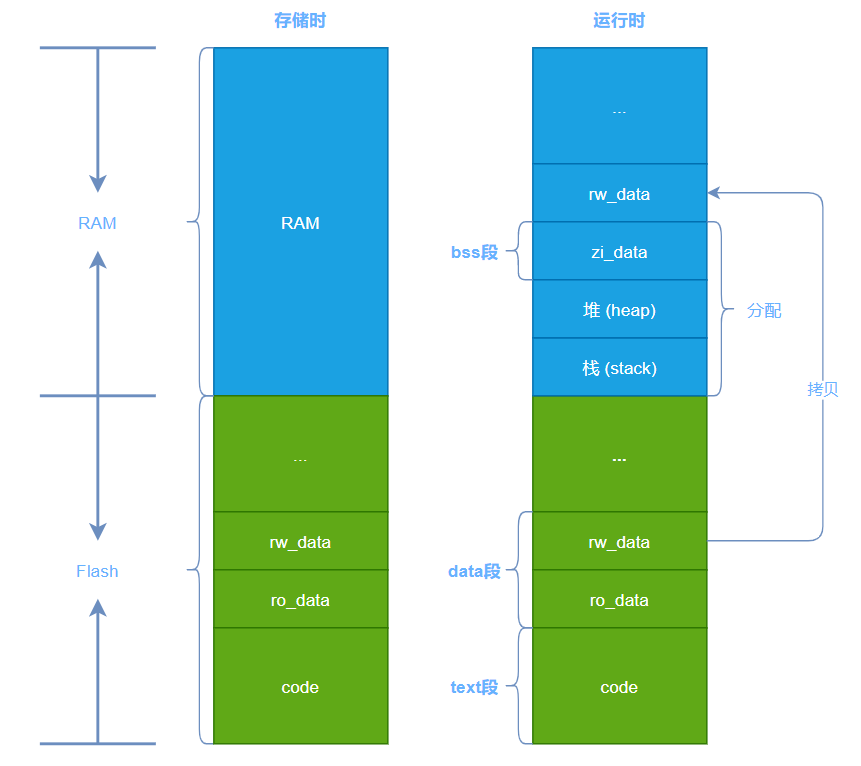

# 数据段代码段等

---

程序本质 :  `bss段` + `data段` + `text`



---

|        名字        | 说明                                           |
| :----------------: | ---------------------------------------------- |
|  `code` \| `text`  | 代码段, 机器指令                               |
|     `ro_data`      | 只读数据, 如 `const 全局变量`                  |
|     `rw_data`      | 读写变量,  `全局变量`, `static修饰的局部变量`  |
| `zi_data` \| `bss` | `未初始化的全局变量`                           |
|                    | `初始化为 0 的全局变量`                        |
|                    | `初始化为 0 的静态局部变量`                    |
|        `堆`        | 由 `malloc` `remalloc` `free` 等动态分配的空间 |
|        `栈`        | `临时创建的局部变量`                           |
|                    | `函数的入口参数`                               |
|                    | `函数的返回值`                                 |
|                    | `宏定义的局部变量`                             |

---

```c
// 宏定义一天的时长------------------------代码段(.text段)
#define DAY_HOUR 24

// 未初始化的全局变量----------------------(.bss段)
int max;

// 初始化为0的全局变量---------------------(.data段)
int min = 0;

// 初始化不为0的全局变量
int start = 5;

// const 修饰的全局变量--------------------(.rodata段)
const float Pai = 3.14;

// 静态全局变量----------------------------(.data段)
static int reg = 100;

/* 计算和 */
int sum(int a, int b) // 函数参数----------(栈stack)
{
    // 静态局部变量------------------------(.data段)
    static int price_sum = 0;

    // 临时变量----------------------------(栈stack)
    int sum = 0;

    // malloc动态申请的内存----------------(堆heap)
    int *temp = (int*)malloc(sizeof(int));

    sum = a + b;

    free(temp);

    return sum;
}
```

---

