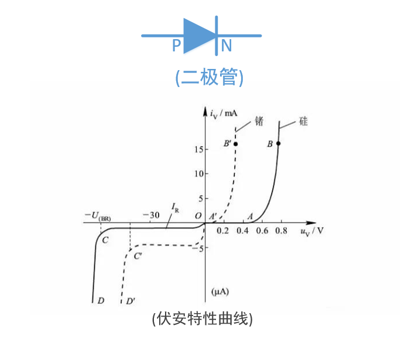

# 二极管

<font color=#ff0000>温馨提示 : 博主软件出生, 以下纯属个人的学习笔记. 如果有误导, 还望不吝赐教!</font>

* 参考下面伏安特性曲线:
* P为正极, N为负极
* (硅管) 当 ```P端电压``` - ```N端电压``` >= ```0.7V``` 时二极管导通
* (锗管) 当 ```P端电压``` - ```N端电压``` >= ```0.2V``` 时二极管导通
* X负半轴为反向击穿电压(了解),当电压过高就会被击穿.
* 一般情况下默认为硅管



---

## 备注

<div align=center><a href="https://gitee.com/iotxiaohu/blog">
    
</a></div>

---
