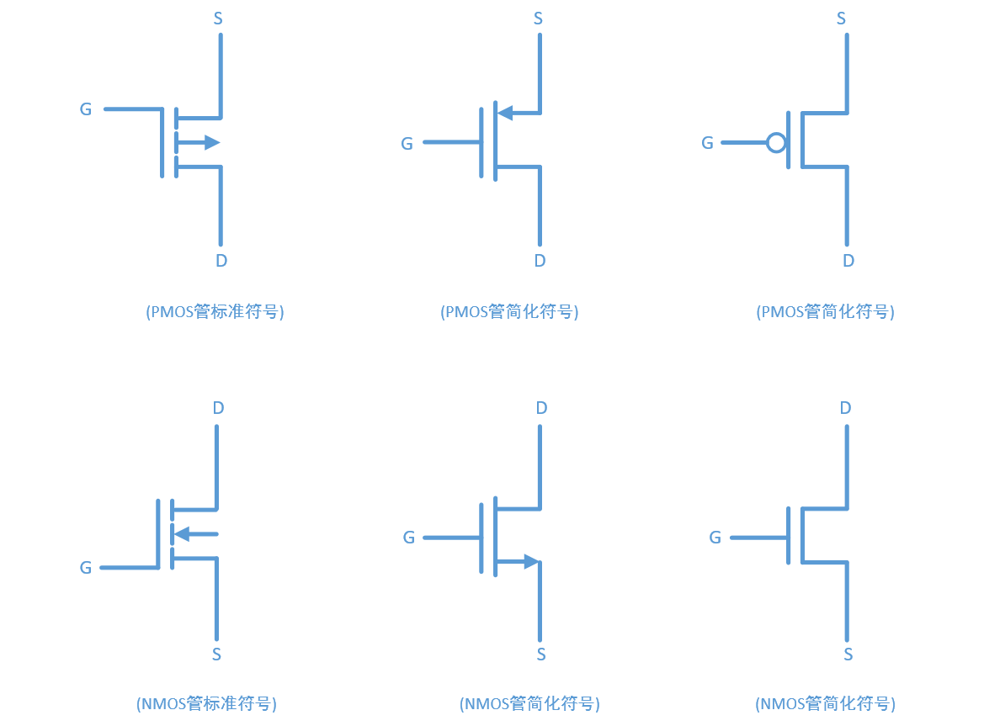

# MOS管

提示 : 博主软件出生, 以下纯属个人的学习笔记. 如果有误导, 还望不吝赐教!

* 下图为N-MOS和P-MOS的标准符号和简化符号
* 常用作门电路分析

---

## 分析

* 分析标准符号, 如果遇到简化符号, 化成标准符号
* 一般用来分析高低电平就够了
* 高电平 = $V_{DD}$ = 1 、低电平 = $V_{SS}$ = 0
* 比较 S 和 G 的电平, 如果箭头指向电平高的方向 S 和 D 导通, 否则 S 和 D 断开
* 如下图所示:

---

## 备注

---
