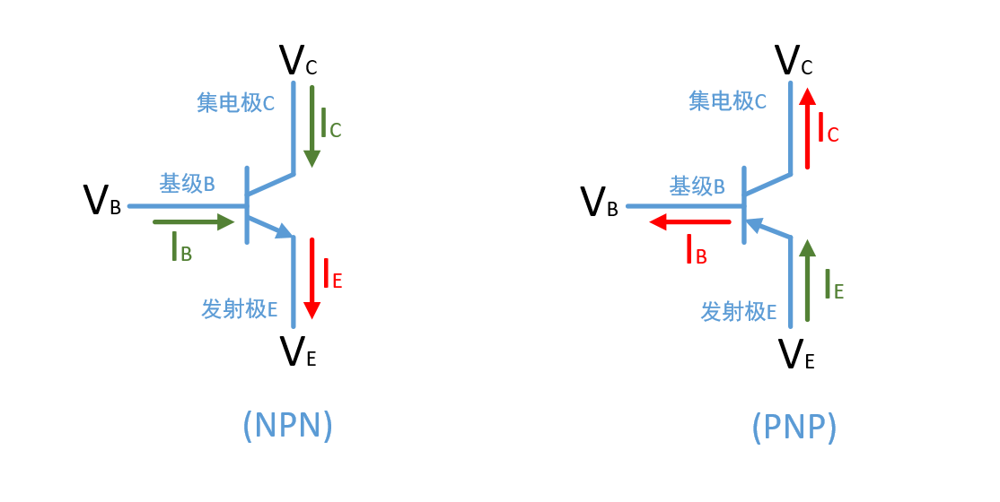

# 三极管

温馨提示 : 博主软件出生, 以下纯属个人的学习笔记. 如果有误导, 还望不吝赐教!

* 下图为三级管图, 通常NPN使用得比较多, 以下图中的 (NPN) 为例, 简述常见的三种状态:

## 饱和区

* **条件:**$V_C < V_B$, 且 $βI_B > I_C$ , $V_{CE} ≈ 0.3V$
* C,E呈现低阻态, 相当于开关闭合

## 截止区

* **条件:**$V_{BE} <= 死区电压(硅0.7, 锗0.3)$, $I_B = 0$ , $I_C = I_{CEO} ≈ 0$
* `集电区的空穴`和`基区的电子`将相对运动形成一个小得通常不计的电流$I_{CEO}$
* 图上的$I_C$为集电极的主要电流部分(还存在一个$I_{CEO}$)
* C,E呈现高阻态, 相当于开关断开

## 放大区

* **条件:**$I_C = βI_B$ , 且 $\Delta I_C = β\Delta I_B$. `(β很大, 这样就放大了电流)`
* 这是最常用的

---

## 备注

---
